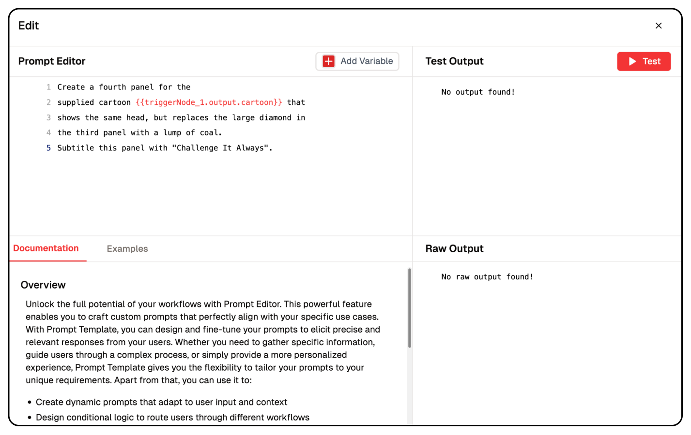

# LLM Prompting Techniques

Large Language Models are AI systems that understand and generate text. How you ask questions matters a lot for getting good answers! This concept covers various prompting techniques with practical examples to help you get the most out of LLMs.

## Effective Ways to Talk to AI

### 1. Zero-Shot Prompting
Zero-shot prompting involves asking the LLM to perform a task without any examples.

<br/>
Example
```text
Summarize the following paragraph:

Climate change is accelerating at an unprecedented rate. Global temperatures have increased by approximately 1.1°C since pre-industrial times, primarily due to human activities. This warming is causing more frequent and severe weather events, rising sea levels, and disruptions to ecosystems worldwide. Immediate and coordinated action is essential to mitigate these effects and prevent catastrophic outcomes for future generations.
```

### 2. Few-Shot Prompting

Few-shot prompting provides the LLM with a few examples before asking it to complete a similar task.

<br/>
Example

```text
Convert these sentences to past tense:

Original: I walk to the store.
Past Tense: I walked to the store.

Original: She runs every morning.
Past Tense: She ran every morning.

Original: They build sandcastles at the beach.
Past Tense:
```

### 3. Chain-of-Thought (CoT) Prompt
Chain-of-thought prompting encourages the LLM to break down complex problems into logical steps.

<br/>
Example

```text
Problem: If a shirt originally costs $50 and is on sale for 30% off, then there's an additional 15% discount at checkout, what is the final price?

Let's think through this step by step:
```

### 4. Self-Consistency Prompting
This technique involves generating multiple independent responses and then selecting the most consistent answer.

<br/>
Example
```text
Generate three different solutions to this math problem, then determine which answer is correct:

If a rectangle has a length that is twice its width, and its perimeter is 36 cm, what is the area of the rectangle?
```

### 5. Role-Based Prompting
In role-based prompting, you ask the LLM to assume a specific role or perspective.

<br/>
Example
```text
You are an experienced data scientist with expertise in machine learning. Explain how to handle imbalanced datasets to a junior programmer who has basic knowledge of classification algorithms.
```

### 6. Template-Based Prompting
Template-based prompting uses a consistent structure for similar tasks.

<br/>
Example
```text
Article Title: {The Rise of Sustainable Fashion}
Audience: {Environmentally conscious young adults}
Tone: {Informative and inspiring}
Word Count: {800}

Write a blog post following the above parameters.
```

### 7. Instruction-Based Prompting
This approach provides clear, explicit instructions for the LLM to follow.

<br/>
Example
```text
Create a product description for a wireless noise-canceling headphone. Follow these instructions:
1. Begin with an attention-grabbing headline
2. Include 3-5 key features and benefits
3. Mention battery life and connectivity options
4. End with a clear call-to-action
5. Keep the description under 200 words
6. Use a professional but enthusiastic tone
```

### 8. Persona-Based Prompting
Persona-based prompting defines both who the LLM is and who it's talking to.

<br/>
Example
```text
You are a financial advisor with 15 years of experience talking to a 28-year-old who has just received their first promotion and salary increase. Provide advice on how they should adjust their financial planning.
```

### 9. Constraint-Based Prompting
This technique clearly defines limitations or requirements for the response.

<br/>
Example
```text
Write a short story about an unexpected friendship with the following constraints:
- Maximum 250 words
- Set in a post-apocalyptic world
- No human characters
- Must include the themes of trust and sacrifice
- Should end on a hopeful note
```

### 10. Output Format Specification
This approach explicitly defines how you want the output structured.

<br/>
Example
```text
Analyze the strengths and weaknesses of using renewable energy sources. Present your analysis in this format:

Introduction: (brief overview)

Strengths:
- [Strength 1]
- [Strength 2]
- [Strength 3]

Weaknesses:
- [Weakness 1]
- [Weakness 2]
- [Weakness 3]

Conclusion: (summary and future outlook)
```

### 11. System Prompting
System prompts set the overall behavior and capabilities of the LLM for the entire interaction.

<br/>
Example
```text
You are a patient, encouraging math tutor who specializes in making algebra accessible to students with math anxiety. You break down complex problems into simple steps, use encouraging language, and provide multiple approaches to solving problems.
```

### 12. Recursive Prompting
This technique involves using the output of one prompt as input for another.

<br/>
Example
```text
Step 1: Generate five potential titles for an article about sustainable urban gardening.

Step 2: For each title, write a compelling opening paragraph that would grab a reader's attention.

Step 3: Select the best title and opening paragraph combination, then outline the main sections for the complete article.
```
## Lamatic Prompt Editor

In Lamatic Studio, you can implement different types of prompts with Dynamic variables.

## Best Practices for Effective Prompting
1. Be specific: The more precise your instructions, the better the results.
1. Provide context: Give the LLM relevant background information.
1. Use clear structure: Organize your prompt logically.
1. Iterate and refine: If the first attempt doesn't give desired results, refine your prompt.
1. Control the length: Specify how detailed you want the response to be.
1. Set the tone: Indicate the desired writing style or tone.
1. Use delimiters: Separate different parts of your prompt with markers like triple quotes or brackets.
