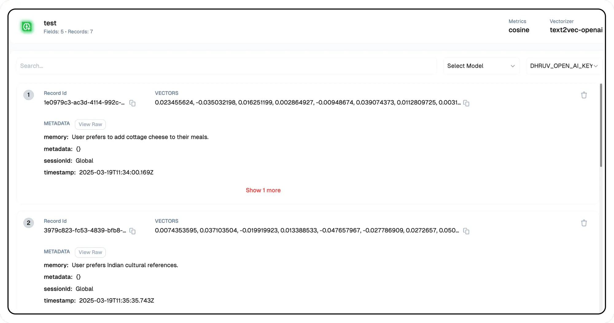

# Memory Store

Lamatic's Memory Store is designed to store and manage contextual information efficiently, enabling persistent memory collections tied to unique users and sessions. This feature enhances large language models (LLMs) by providing long-term memory capabilities, allowing for more personalized and context-aware interactions.

## Key Features
1. Persistent Memory Collections: Store contextual data linked to users and sessions to improve continuity.
1. Scalability: Efficiently manage memory across multiple interactions without performance degradation.
1. Efficient Querying: Retrieve relevant contextual data quickly using optimized indexing.

## Use Cases
1. Conversational AI: Maintain session continuity for chatbots and virtual assistants.
1. Personalized Recommendations: Store user preferences to improve AI-driven suggestions.
1. Enterprise Knowledge Management: Retain historical context for collaborative applications.
1. Developer Customization: Enable developers to define custom schemas for specific use cases.

## Implementation 
1. **Initialize the Memory Store:** Go to Context and select Create New Memory Store.
1. **Define a Unique Identifier:** Use a User ID, Session ID, or another unique key to link stored information.
1. **Store Contextual Data:** Utilize the [Memory Add Node](/docs/nodes/memory-add-node) to save relevant data.
1. **Retrieve Data Efficiently:** Use the [Memory Retrieve Node](/docs/nodes/memory-retrieve-node) to access stored information when needed.
1. **Access the Memory Store:** Navigate to Context and select Memory Store.
    
