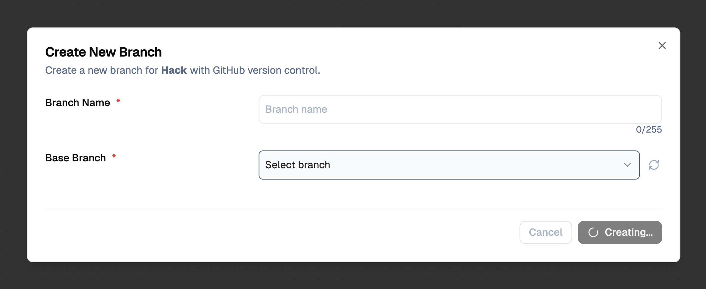
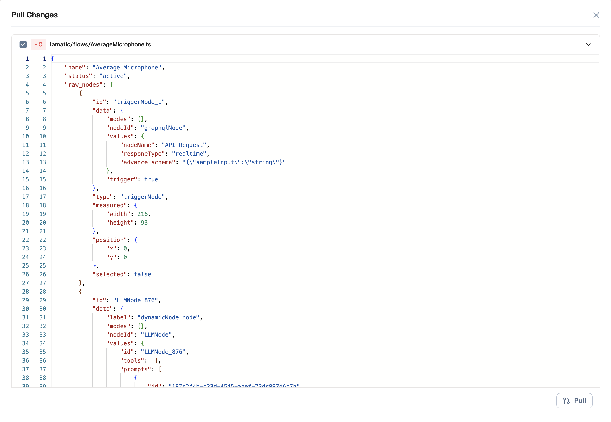

# Environments in Lamatic AI

Environments in Lamatic AI allow you to create isolated workspaces for your flows, enabling you to develop, test, and deploy changes safely. Built on top of Version Control System (VCS) functionality, environments use branching and merging to help you manage different stages of your workflow—from development to staging to production—without affecting your live flows.

Each environment is represented by a branch, allowing you to work on multiple versions of your flows simultaneously and merge changes between environments when ready.

## Setup Environments with GitHub

Before you can create environments, you need to set up Version Control with GitHub:

1. Navigate to the Flow Editor and click **Connect with GitHub**.
1. Alternatively, you can go to the **Integrations** section under your project settings.
1. Choose an existing repository or create a new one.
1. Select the desired branch for your production environment, and optionally enable auto-deployment on commit.
1. Click **Save** to complete the setup.

## Working with Environments

Environments in Lamatic AI are managed through branches. The production branch serves as your main environment, and you can create additional environments (development, staging, etc.) by creating new branches.

### Accessing Environments

1. Open the desired Flow.
1. From the top navigation bar, click on the **Select Branch** dropdown. The production branch (your main environment) is selected by default.
1. From here, you can switch between environments, create new environments, or merge changes between environments.

### Create a New Environment

To create a new environment (e.g., development or staging) for your flow:

1. Click on the **Select Branch** dropdown in the top navigation bar.
1. Click on **Create New Branch** or the **+** icon.
1. Enter a descriptive name for your new environment (e.g., `development`, `staging`, `feature/new-integration`, or `bugfix/fix-validation`).
1. Optionally, select a base branch to branch from (defaults to the current environment/branch).
1. Click **Create** to create the new environment.

Once created, you can switch to the new environment and make changes without affecting your production environment. This allows you to test new features, configurations, or integrations in isolation.

### Merge Changes Between Environments

To merge changes from one environment into another (e.g., from development to production):

1. Ensure you're on the source environment (the branch you want to merge from).
1. Click on the **Select Branch** dropdown in the top navigation bar.
1. Click on **Merge Icon Button** or the merge icon.
1. Select the target environment (branch) you want to merge into.
1. Review the changes that will be merged.
1. Click **Confirm Merge** to complete the merge.

Your changes will now be available in the target environment. This workflow allows you to promote changes from development → staging → production, ensuring a controlled deployment process.

### Pull Changes from Another Environment

To pull the latest changes from another environment (e.g., pulling production changes into your development environment):

1. Ensure you're on the environment where you want to pull changes (not the source environment).
1. Click on the **Select Branch** dropdown in the top navigation bar.
1. Click on **Pull Icon Button** or the pull icon.
1. Select the source environment you want to pull from.
1. Review any potential conflicts that may arise from the merge.
1. If there are conflicts, resolve them in the Flow Editor.
1. Click **Confirm Pull** to complete the pull operation.

This ensures your environment stays up-to-date with the latest changes from another environment, reducing the likelihood of merge conflicts and keeping your environments synchronized.

## Best Practices for Environments

- **Use descriptive names**: Name your environments clearly (e.g., `development`, `staging`, `production`) to avoid confusion.
- **Keep environments in sync**: Regularly pull changes from production into your development and staging environments to stay current.
- **Test before merging**: Always test changes in a development or staging environment before merging to production.
- **Use feature branches**: Create separate environments for specific features or bug fixes to isolate work and make reviews easier.
