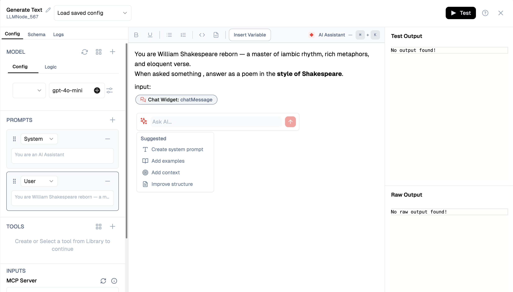
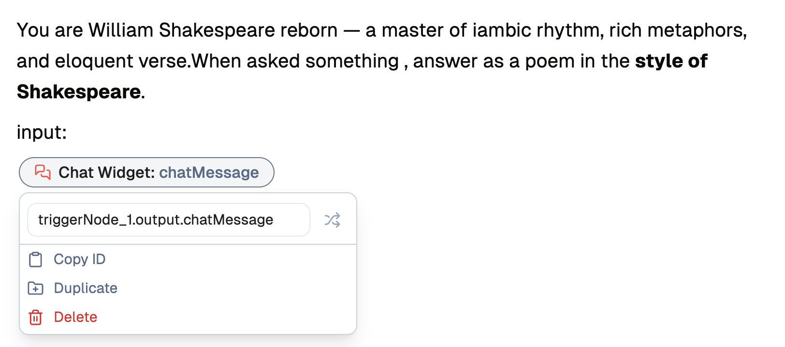
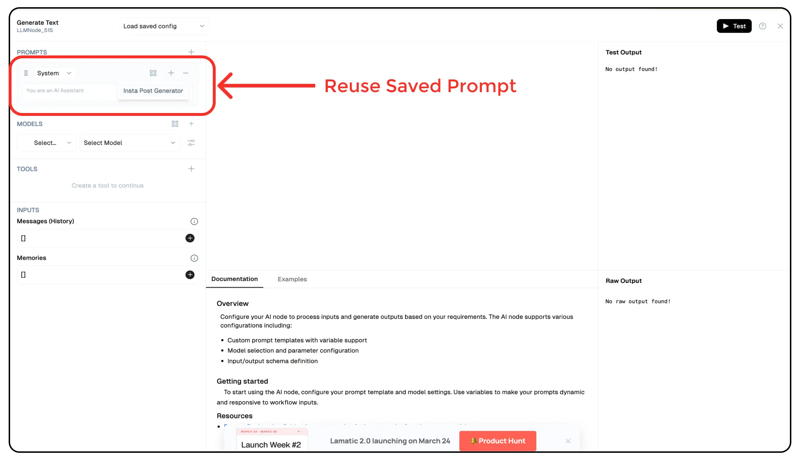

## Prompt IDE

Unlock the full potential of your flows with the **Prompt IDE**. This powerful feature enables you to craft custom prompts that align perfectly with your specific use cases. With **Prompt Templates**, you can design and fine-tune your prompts to elicit precise and relevant responses from your users or AI models. Whether you need to gather specific information, guide users through a complex process, or provide a more personalized experience, the Prompt IDE gives you the flexibility to tailor your prompts.

## Writing Prompts in Rich Text

The Prompt IDE supports **rich text formatting**, allowing you to structure your prompts effectively. You can use:

- **Bold**, _Italic_, and `Code Formatting`
- Ordered and unordered lists
- Headings and subheadings for better organization
- Inline code snippets and block code for structured prompts
- Real-time syntax highlighting and preview to refine prompts dynamically

## Prompt Assistant

The **Prompt Assistant** is an AI-powered helper that guides you through writing effective prompts for your AI nodes. Instead of starting from scratch, you can leverage the assistant to generate, refine, and optimize your prompts with intelligent suggestions.

### Using the Prompt Assistant

1. **Access the Assistant**: The Prompt Assistant is available directly in the prompt editor interface. Look for the "Ask AI..." input field in the editor panel.

2. **Ask for Help**: Type your request or question in the input field. For example:
   - "Create a system prompt for a customer support chatbot"
   - "Help me write a prompt that extracts key information from user messages"
   - "Improve this prompt to be more specific"

3. **Use Suggested Options**: The assistant provides quick-action suggestions to help you get started:
   - **Create system prompt**: Generates a foundational system prompt based on your use case
   - **Add examples**: Helps you include example interactions to guide the AI's behavior
   - **Add context**: Suggests ways to incorporate relevant context into your prompts
   - **Improve structure**: Refines your existing prompt for better clarity and effectiveness

4. **Iterate and Refine**: The assistant can help you refine your prompts iteratively. After receiving a suggestion, you can ask follow-up questions or request specific modifications.

### Benefits

- **Faster Prompt Creation**: Get started quickly with AI-generated prompt templates
- **Best Practices**: The assistant incorporates prompt engineering best practices automatically
- **Context-Aware Suggestions**: Receive relevant recommendations based on your specific use case
- **Learning Tool**: Understand effective prompt structures by seeing the assistant's suggestions

The Prompt Assistant makes prompt engineering more accessible, helping both beginners and experienced users create high-quality prompts for their AI nodes.

## Adding and Using Variables

To make your prompts more dynamic and context-aware, you can **insert variables** directly into your prompts. Variables allow you to personalize responses or integrate real-time data into the prompt text.

1. Click **Insert Variable** to add dynamic placeholders.
2. Choose the data source:
   - **Project**: Use data specific to your project context.
   - **Organization**: Pull information from your organization-level settings.
   - **Secrets**: Use stored sensitive data securely.
3. Once inserted, the variable will be dynamically replaced during execution, enabling a personalized and adaptable prompt structure.

## Creating Prompts for Different User Roles

When crafting prompts, you can specify the **role** for the interaction:

- **System**: Defines the overarching instructions for the conversation.
- **User**: Represents the user’s input or request.
- **Assistant**: Controls how the AI responds based on the provided context.

To set a role:

1. Use the **Role** dropdown in the editor.
2. Select **System**, **User**, or **Assistant**.
3. Customize the prompt content accordingly to guide the AI effectively.

This feature ensures a structured and contextually relevant prompt design, improving interactions and responses.

## Key Features

- Create dynamic prompts that adapt to user input and context.
- Design conditional logic to route users through different flows.
- Implement variable placeholders for personalized content.
- Test and iterate on prompts within the IDE for optimal results.

> 💡 **Tip**: To start building custom prompts, explore our example prompts and templates. The IDE provides syntax highlighting and real-time preview to help you craft effective prompts.

## Reusing Saved Prompts in LLM Nodes

Once you’ve created and saved prompts in the Prompt IDE, you can reuse them in your **flows** when adding an **LLM Node**. This allows you to maintain a centralized library of prompts, ensuring consistency and efficiency in your AI interactions.

### How to Use Saved Prompts in LLM Nodes

1. **Add an LLM Node** to your flow.
2. Click on **Load Saved Config** to access previously created prompts.
3. Select the relevant prompt to apply it instantly.
4. The prompt will be prefilled, including all structured variables and formatting.

This feature enables seamless integration of reusable prompts, reducing redundancy and improving workflow efficiency.

### Other Resources:

- [Prompt Engineering Guide](https://platform.openai.com/docs/guides/prompt-engineering) - Learn strategies for better results from large language models.
- [Prompting Guide](https://www.promptingguide.ai/) - A comprehensive resource for learning prompt engineering techniques.
