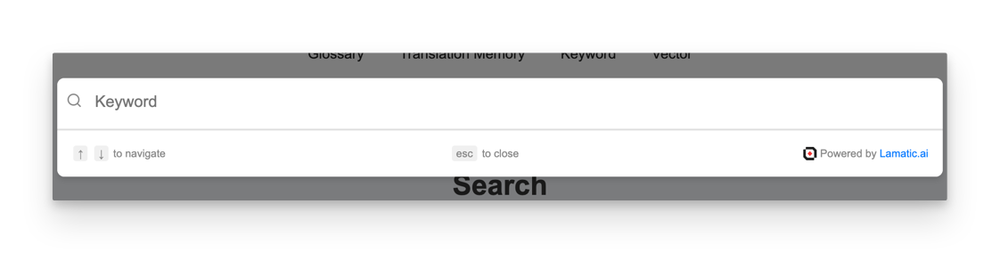
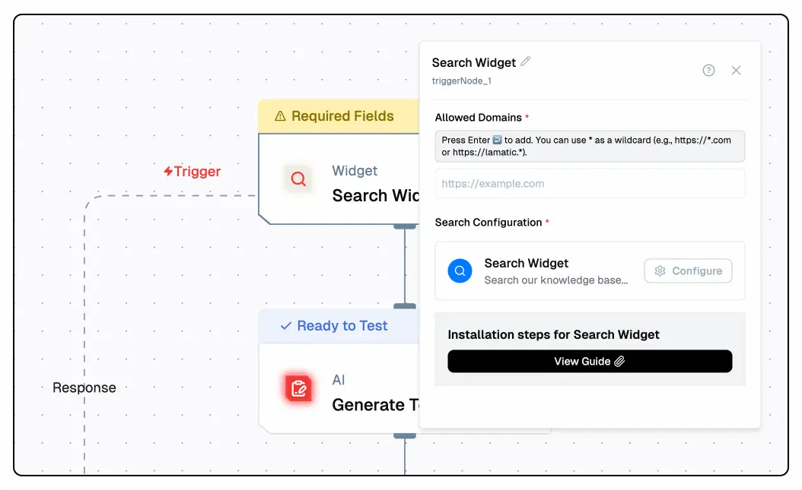

# Search Widget

Integrate our powerful search widget into your website using the search nodes. This widget leverages AI driven search technology to provide more accurate and relevant search results by understanding the context and meaning of the queries rather than just matching keywords. Now, you can offer this advanced search functionality directly on your site.
<br />



## Steps to Integrate the Search Widget

Follow these steps to integrate the search widget into your site using the provided CDN script:

### 1. Whitelist Your Domains

To use the Search Widget, you need to whitelist the domains where you will deploy the widget. This ensures that the widget is only used on approved domains.

- **Update your `searchTrigger` settings** to include the domains you plan to use.
- This configuration is typically done through your admin panel or server settings.

### 2. Configure the Search Widget

Click the Configure button in the search widget to customize settings such as the bot name, position, image, policy URL, appearance, and messages.

## 🛠 General Configuration

#### 1. **Search Placeholder**
- **Field:** `Search Placeholder`
- **Description:** The placeholder text that appears in the search bar before a user types.
- **Example:** `Search our knowledge base…`

#### 2. **Search Debounce (ms)**
- **Field:** `Search Debounce (ms)`
- **Description:** Controls the delay (in milliseconds) before triggering a search after typing stops.
- **Recommended Value:** `200`

#### 3. **Link Target**
- **Field:** `Link Target`
- **Options:**
  - `Same Tab`
  - `New Tab` (Recommended)
- **Effect:** Determines how links from the search results open.

#### 4. **Toggle Options**
- `Show Navigation Helper Text` — Enables arrow key navigation tips.
- `Show Escape Helper Text` — Displays `esc to close` text.
- `Show Lamatic Banner` — Shows the "Powered by Lamatic.ai" badge.

---

#### 🎨 Appearance Configuration

##### 1. **Primary Color**
- **Field:** `Primary Color`
- **Purpose:** Sets the highlight color used for active items, selected results, and other primary UI elements.
- **Example Value:** `#007bff` (Blue)

##### 2. **Secondary Color**
- **Field:** `Secondary Color`
- **Purpose:** Sets the text and icon color for secondary UI elements.
- **Example Value:** `#666` (Dark Gray)

##### Preview Panel
- Displays a live preview of the search widget with applied settings.
- Tabs include: `All`, `Documentation`, `API`, `Pricing`.

---

#### ✅ Saving Your Settings
- After configuring your widget, click **Save** (top-right) to apply changes.


### 2. Include the CDN Script and Configure the Widget

Add the CDN script to your HTML file and configure the widget using the provided options.

Here’s how to include the CDN script and configure the widget:

```html
<script async>
    (function () {
        // Wait for DOM to be fully loaded
        document.addEventListener("DOMContentLoaded", function () {
            const PROJECT_ID = '42*********************************c';
            const FLOW_ID = 'bf*********************************c';
            const API_URL = 'https://***.lamatic.ai';
            
            // Create the root element
            const root = document.createElement("div");
            root.id = "lamatic-search-root";
            root.dataset.apiUrl = API_URL;
            root.dataset.flowId = FLOW_ID;
            root.dataset.projectId = PROJECT_ID;
            document.body.appendChild(root);

            // Load the script
            const script = document.createElement("script");
            script.type = "module";
            script.src = `https://widget.lamatic.ai/search-v2?projectId=${PROJECT_ID}`;
            document.body.appendChild(script);
        });
    })();
</script>
```

### Props

Below is the documentation for the props used in the search widget configuration:

| Parameter               | Type     | Description                                                                                                                                                        |
|-------------------------|----------|--------------------------------------------------------------------------------------------------------------------------------------------------------------------|
| `PROJECT_ID` (required) | `string` | The project ID where the chat widget is deployed. This is mandatory for the widget to function correctly.                                                          |
| `FLOW_ID` (required)| `string` | The workflow ID where you have set up your chat configuration. This is also mandatory.                                                                            |
| `API_URL` (required)    | `string` | The base URL of your project endpoint. This is mandatory for the widget to function correctly.                                                                    |

### Schema 
The search widget/flows would take the input parameters as below:
```json
{
  "searchQuery": string,
}
```

The output schema of the search widget would be as below:
```json
{
  "output": [
    {
      "content": string,
    }
  ],
  "input": {
    "link": string,
    "title": string,,
    "content": string,
    "nodeName": string,
    "breadcrumpsField": string
  },
  "logs": null,
  "status": string
}
```