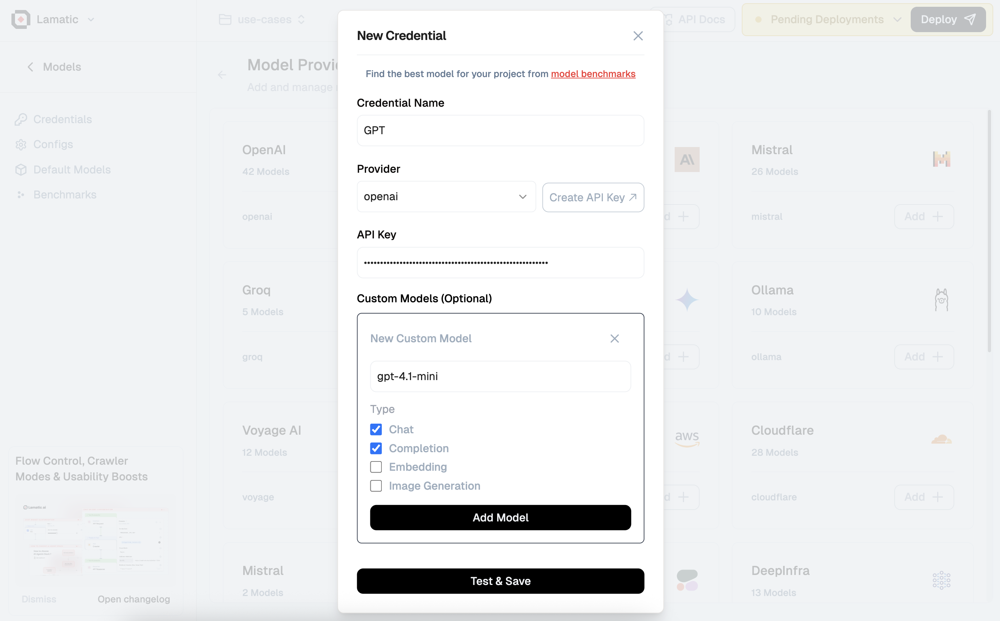

import { Callout } from 'nextra/components'

# Custom Model Integration 

With Lamatic, you can define custom models per provider — this doc walks through how to add, override, and control model behavior across different AI backends.

---

<Callout type="info">
Custom models offer control and flexibility, enabling better experimentation and enterprise-level customization.
</Callout>
  
We introduced this feature to:

- Support **internal/fine-tuned models** hosted privately
- Allow per-provider **override of default logic**
- Improve **model testing and validation** with custom credentials
- Support **multi-tenant use cases** with separate model handling

---

## Add Custom Models

To add a model:

1. Select a **provider** (e.g. `OpenAI`, `Orai`, `Lamatic`)
2. Click **Add Custom Model**
3. Enter:
   - **Model Name** (e.g., `gpt-4.1A-private`)
   - **Model Type** (Chat, Completion, Embeddings, or Image Generation)
4. Save

If added, this model will be used for:
- Credential validation
- Inference calls
- Testing

---

## Update Custom Models

You can modify:
- **Model Name**
- **API Key**

> 🛑 Note: The **Provider** field cannot be edited once set.

---

## Delete Custom Models
You can remove a model by clicking **Delete**.  
If no custom model exists, the platform uses **provider defaults**.

---

## Use Cases
| Use Case              | Description                                 |
|-----------------------|---------------------------------------------|
| Enterprise override   | Use internal model deployments securely     |
| Staging test          | Try new models without changing production  |
| Multi-provider fallback | Combine OpenAI + Orai with routing logic  |
| Fine-tuned models     | Specialized logic for narrow domains        |

<Callout type="tip"> You can use custom models across any supported provider without altering your primary config. </Callout>