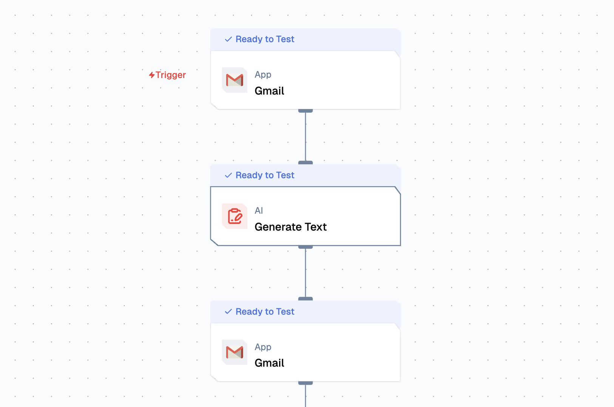

import { NodeOverview } from "@/components/NodeOverview";
import { NodeTypeInfo } from "@/components/NodeTypeInfo";

# Gmail Node

<NodeOverview slug="gmail-node" type="apps" />

## Overview

The Gmail Node is an email automation component that provides both event triggering and action capabilities for Gmail integration. This node enables automated email monitoring, sending, and management within flows, supporting real-time email processing and automated email operations.



<NodeTypeInfo
  batchTrigger={false}
  eventTrigger={true}
  action={true}
  description="This node is both an Event Trigger and Action node that provides email automation capabilities for monitoring, sending, and managing emails."
/>

This node combines **Event Trigger** and **Action** capabilities to provide comprehensive email automation within your workflows.

## Features

<details>
  <summary>**Key Functionalities**</summary>

1. **Event Trigger - On New Email**: Automatically triggers workflows when new emails are received, enabling real-time email processing and automation.
2. **Action - Send Email**: Composes and sends emails with customizable content, recipients, and attachments (including URL-based attachments).
3. **Action - Create Email Draft**: Creates email drafts with support for attachments via URL, CC/BCC, and extra recipients.
4. **Action - Fetch Email**: Retrieves specific emails or email threads based on search criteria and filters with enhanced options including composite queries, max results, and page tokens.
5. **Action - List Labels**: Retrieves all Gmail labels for the authenticated account.
6. **Action - Fetch Message by Thread ID**: Retrieves a specific message by its thread ID.
7. **Action - List Threads**: Lists email threads with filtering and pagination support.
8. **Action - Reply to Thread**: Replies to an existing email thread with support for attachments via URL, CC/BCC, and extra recipients.

</details>

<details>
  <summary>**Benefits**</summary>

1. **Real-time Email Monitoring**: Automatically responds to incoming emails without manual intervention.
2. **Automated Email Communication**: Streamlines email sending processes with customizable templates and dynamic content.
3. **Advanced Email Management**: List and filter threads, fetch messages by thread ID, and manage Gmail labels programmatically.
4. **Thread-based Conversations**: Reply to threads to maintain conversation context and continuity.
5. **Flexible Attachments**: Support for URL-based attachments in sends, drafts, and replies with name and MIME type specification.
6. **Enhanced Email Retrieval**: Composite queries, pagination, and filtering options for efficient email data extraction.
7. **Calendar Integration**: Seamlessly converts email content into calendar events for better scheduling.

</details>

## Prerequisites

Before using Gmail Node, ensure the following:

- **Gmail Account**: A valid Gmail account with proper authentication setup.

## Setup

### Step 1: Set Up Gmail API Access

1. Set Up Google Drive Access
   - Set up Google OAuth credentials for Gmail access |

### Step 2: Set Up Lamatic Flow

1. **Create a Custom Flow** for Gmail automation:
   - Configure the Gmail node based on your use case
   - Set up event triggers for email monitoring
   - Define action parameters for email operations

## Configuration Reference

### Event Trigger Configuration

| **Parameter**    | **Description**                                             | **Required** | **Example**            |
| ---------------- | ----------------------------------------------------------- | ------------ | ---------------------- |
| **Name**         | Display name for the node                                   | ✅           | `Gmail Monitor`        |
| **Credentials**  | Gmail authentication details required to access the account | ✅           | `my-gmail-credentials` |
| **Trigger Type** | Type of email event to monitor                              | ✅           | `On New Email`         |

### Action Configuration

#### Send Email Action

| **Parameter**        | **Description**                                                                 | **Required** | **Example**                                                                 |
| -------------------- | ------------------------------------------------------------------------------- | ------------ | --------------------------------------------------------------------------- |
| **Name**             | Display name for the action                                                     | ✅           | `Send Email`                                                                |
| **Credentials**      | Gmail authentication details required to send emails                             | ✅           | `my-gmail-credentials`                                                      |
| **Action**           | Actions for Gmail                                                                | ✅           | `Send Email`, `Create Email Draft`, `Fetch Email`, `List Labels`, etc.     |
| **Recipient Email**  | Recipient email addresses (comma-separated)                                      | ✅           | `recipient@example.com`                                                     |
| **Subject**          | Email subject line                                                               | ✅           | `Automated Response`                                                        |
| **Body**             | Email body content (supports HTML and plain text)                                 | ✅           | `Hello, this is an automated email.`                                        |
| **CC**               | CC recipient email addresses (comma-separated)                                   | ❌           | `cc@example.com`                                                             |
| **BCC**              | BCC recipient email addresses (comma-separated)                                  | ❌           | `bcc@example.com`                                                            |
| **Is Content HTML?** | Set to true if the email body is HTML.                                           | ❌           | `true`, `false`                                                              |
| **Attachment URLs**  | Array of attachment objects with `url`, `name`, and `mimeType` (comma-separated) | ❌           | `https://example.com/file.pdf, document.pdf, application/pdf`               |

#### Fetch Email Action

| **Parameter**           | **Description**                                                                                                   | **Required** | **Example**                  |
| ----------------------- | ----------------------------------------------------------------------------------------------------------------- | ------------ | ---------------------------- |
| **Name**                | Display name for the action                                                                                       | ✅           | `Fetch Email`                |
| **Credentials**         | Gmail authentication details required to fetch emails                                                             | ✅           | `my-gmail-credentials`       |
| **Max Results**         | Maximum number of emails to retrieve                                                                              | ❌           | `10`                         |
| **From User**           | If provided, only emails from the specified user(s) will be fetched. If not provided, all emails will be fetched. | ❌           | `user1@example.com`          |
| **To User**             | If provided, only emails to the specified user(s) will be fetched. If not provided, all emails will be fetched.   | ❌           | `user2@example.com`          |
| **Query**               | Composite Gmail search query (supports Gmail search syntax)                                                       | ❌           | `from:example.com is:unread` |
| **Page Token**          | Token for pagination to retrieve next page of results                                                              | ❌           | `CAESFQoI...`                |

#### Create Email Draft Action

| **Parameter**        | **Description**                                                                 | **Required** | **Example**                                                                 |
| -------------------- | ------------------------------------------------------------------------------- | ------------ | --------------------------------------------------------------------------- |
| **Name**             | Display name for the action                                                     | ✅           | `Create Email Draft`                                                        |
| **Credentials**      | Gmail authentication details required to create drafts                           | ✅           | `my-gmail-credentials`                                                      |
| **Action**           | Actions for Gmail                                                                | ✅           | `Create Email Draft`                                                         |
| **Recipient Email**  | Recipient email addresses (comma-separated)                                      | ✅           | `recipient@example.com`                                                     |
| **Subject**          | Email subject line                                                               | ✅           | `Draft Email`                                                               |
| **Body**             | Email body content (supports HTML and plain text)                                 | ✅           | `This is a draft email.`                                                     |
| **CC**               | CC recipient email addresses (comma-separated)                                   | ❌           | `cc@example.com`                                                             |
| **BCC**              | BCC recipient email addresses (comma-separated)                                   | ❌           | `bcc@example.com`                                                            |
| **Is Content HTML?** | Set to true if the email body is HTML.                                           | ❌           | `true`, `false`                                                              |
| **Attachment URLs**  | Array of attachment objects with `url`, `name`, and `mimeType` (comma-separated) | ❌           | `https://example.com/file.pdf, document.pdf, application/pdf`               |

#### List Labels Action

| **Parameter**   | **Description**                                       | **Required** | **Example**            |
| --------------- | ----------------------------------------------------- | ------------ | ---------------------- |
| **Name**        | Display name for the action                          | ✅           | `List Labels`          |
| **Credentials** | Gmail authentication details required to list labels   | ✅           | `my-gmail-credentials` |
| **Action**      | Actions for Gmail                                     | ✅           | `List Labels`          |

#### Fetch Message by Thread ID Action

| **Parameter**   | **Description**                                           | **Required** | **Example**                  |
| --------------- | --------------------------------------------------------- | ------------ | ---------------------------- |
| **Name**        | Display name for the action                              | ✅           | `Fetch Message by Thread ID` |
| **Credentials** | Gmail authentication details required to fetch messages    | ✅           | `my-gmail-credentials`       |
| **Action**      | Actions for Gmail                                         | ✅           | `Fetch Message by Thread ID` |
| **Thread ID**   | The Gmail thread ID to fetch messages from                | ✅           | `18c0f0a1a2b3c4d5`           |

#### List Threads Action

| **Parameter**   | **Description**                                                                                                   | **Required** | **Example**                  |
| --------------- | ----------------------------------------------------------------------------------------------------------------- | ------------ | ---------------------------- |
| **Name**        | Display name for the action                                                                                       | ✅           | `List Threads`               |
| **Credentials** | Gmail authentication details required to list threads                                                              | ✅           | `my-gmail-credentials`       |
| **Action**      | Actions for Gmail                                                                                                 | ✅           | `List Threads`               |
| **Query**       | Gmail search query to filter threads (supports Gmail search syntax)                                               | ❌           | `from:example.com is:unread` |
| **Max Results** | Maximum number of threads to retrieve                                                                              | ❌           | `10`                         |
| **Page Token**  | Token for pagination to retrieve next page of results                                                              | ❌           | `CAESFQoI...`                |

#### Reply to Thread Action

| **Parameter**        | **Description**                                                                 | **Required** | **Example**                                                                 |
| -------------------- | ------------------------------------------------------------------------------- | ------------ | --------------------------------------------------------------------------- |
| **Name**             | Display name for the action                                                     | ✅           | `Reply to Thread`                                                            |
| **Credentials**      | Gmail authentication details required to reply to threads                       | ✅           | `my-gmail-credentials`                                                      |
| **Action**           | Actions for Gmail                                                                | ✅           | `Reply to Thread`                                                            |
| **Thread ID**        | The Gmail thread ID to reply to                                                 | ✅           | `18c0f0a1a2b3c4d5`                                                           |
| **Body**             | Reply body content (supports HTML and plain text)                                 | ✅           | `Thank you for your email.`                                                  |
| **CC**               | CC recipient email addresses (comma-separated)                                   | ❌           | `cc@example.com`                                                             |
| **BCC**              | BCC recipient email addresses (comma-separated)                                   | ❌           | `bcc@example.com`                                                            |
| **Is Content HTML?** | Set to true if the reply body is HTML.                                           | ❌           | `true`, `false`                                                              |
| **Attachment URLs**  | Array of attachment objects with `url`, `name`, and `mimeType` (comma-separated) | ❌           | `https://example.com/file.pdf, document.pdf, application/pdf`               |

## Low-Code Example

### Event Trigger Example

```yaml
triggerNode:
  nodeId: triggerNode_1
  nodeType: gmailNode
  nodeName: Gmail
  values:
    credentials: Gmail OAuth VJS
    action: GMAIL_NEW_GMAIL_MESSAGE
  modes: {}
```

### Action Examples

#### Send Email Action

```yaml
nodes:
  - nodeId: gmailNode_397
    nodeType: gmailNode
    nodeName: Gmail
    values:
      credentials: Gmail OAuth VJS
      action: GMAIL_SEND_EMAIL
      recipient_email: ''
      cc: ''
      bcc: ''
      subject: ''
      body: ''
      is_html: false
      attachment_urls: ''
    modes: {}
    needs:
      - triggerNode_1
```

#### Create Email Draft Action

```yaml
nodes:
  - nodeId: gmailNode_397
    nodeType: gmailNode
    nodeName: Gmail
    values:
      credentials: Gmail OAuth VJS
      action: GMAIL_CREATE_EMAIL_DRAFT
      recipient_email: ''
      cc: ''
      bcc: ''
      subject: ''
      body: ''
      is_html: false
      attachment_urls: ''
    modes: {}
    needs:
      - triggerNode_1
```

#### Fetch Email Action

```yaml
nodes:
  - nodeId: gmailNode_397
    nodeType: gmailNode
    nodeName: Gmail
    values:
      credentials: Gmail OAuth VJS
      action: GMAIL_FETCH_EMAILS
      recipient_email: ''
      cc: ''
      bcc: ''
      subject: ''
      body: ''
      is_html: false
      max_results: 10
      from_user: ''
      to_user: ''
      query: 'from:example.com is:unread'
      page_token: ''
    modes: {}
    needs:
      - triggerNode_1
```

#### List Labels Action

```yaml
nodes:
  - nodeId: gmailNode_398
    nodeType: gmailNode
    nodeName: Gmail
    values:
      credentials: Gmail OAuth VJS
      action: GMAIL_LIST_LABELS
    modes: {}
    needs:
      - triggerNode_1
```

#### Fetch Message by Thread ID Action

```yaml
nodes:
  - nodeId: gmailNode_399
    nodeType: gmailNode
    nodeName: Gmail
    values:
      credentials: Gmail OAuth VJS
      action: GMAIL_FETCH_MESSAGE_BY_THREAD_ID
      thread_id: '18c0f0a1a2b3c4d5'
    modes: {}
    needs:
      - triggerNode_1
```

#### List Threads Action

```yaml
nodes:
  - nodeId: gmailNode_400
    nodeType: gmailNode
    nodeName: Gmail
    values:
      credentials: Gmail OAuth VJS
      action: GMAIL_LIST_THREADS
      query: 'from:example.com is:unread'
      max_results: 10
      page_token: ''
    modes: {}
    needs:
      - triggerNode_1
```

#### Reply to Thread Action

```yaml
nodes:
  - nodeId: gmailNode_401
    nodeType: gmailNode
    nodeName: Gmail
    values:
      credentials: Gmail OAuth VJS
      action: GMAIL_REPLY_TO_THREAD
      thread_id: '18c0f0a1a2b3c4d5'
      body: 'Thank you for your email.'
      cc: ''
      bcc: ''
      is_html: false
      attachment_urls: ''
    modes: {}
    needs:
      - triggerNode_1
```


## Output

### Event Trigger Output

- `emailId`: String identifier for the email
- `from`: String containing the sender's email address
- `to`: String containing the recipient's email address
- `subject`: String containing the email subject
- `body`: String containing the email body content
- `timestamp`: String containing the email timestamp
- `labels`: Array of strings containing Gmail labels
- `attachments`: Array of attachment objects (if any)

### Action Output

#### Send Email Output

- `messageId`: String identifier for the sent email
- `threadId`: String identifier for the email thread
- `success`: Boolean indicating if the email was sent successfully
- `timestamp`: String containing the send timestamp

#### Create Event Draft Output

- `eventId`: String identifier for the created event
- `eventLink`: String containing the link to the event
- `success`: Boolean indicating if the event was created successfully
- `attendees`: Array of attendee objects with their response status

#### Fetch Email Output

- `emails`: Array of email objects containing:
  - `emailId`: String identifier for the email
  - `from`: String containing the sender's email address
  - `to`: String containing the recipient's email address
  - `subject`: String containing the email subject
  - `body`: String containing the email body content
  - `timestamp`: String containing the email timestamp
  - `labels`: Array of strings containing Gmail labels
  - `attachments`: Array of attachment objects (if any)
- `totalCount`: Number indicating the total number of emails found
- `nextPageToken`: String token for pagination (if applicable)

#### Create Email Draft Output

- `draftId`: String identifier for the created draft
- `messageId`: String identifier for the draft message
- `threadId`: String identifier for the email thread (if replying)
- `success`: Boolean indicating if the draft was created successfully
- `timestamp`: String containing the draft creation timestamp

#### List Labels Output

- `labels`: Array of label objects containing:
  - `id`: String identifier for the label
  - `name`: String containing the label name
  - `type`: String indicating the label type (system, user)
  - `messageListVisibility`: String indicating message list visibility
  - `labelListVisibility`: String indicating label list visibility
  - `color`: Object containing label color information (if applicable)

#### Fetch Message by Thread ID Output

- `threadId`: String identifier for the thread
- `messages`: Array of message objects containing:
  - `messageId`: String identifier for the message
  - `threadId`: String identifier for the thread
  - `from`: String containing the sender's email address
  - `to`: Array of strings containing recipient email addresses
  - `subject`: String containing the email subject
  - `body`: String containing the email body content
  - `timestamp`: String containing the email timestamp
  - `labels`: Array of strings containing Gmail labels
  - `attachments`: Array of attachment objects (if any)
- `historyId`: String containing the history ID for the thread

#### List Threads Output

- `threads`: Array of thread objects containing:
  - `threadId`: String identifier for the thread
  - `historyId`: String containing the history ID
  - `snippet`: String containing a preview snippet of the thread
  - `messages`: Array of message objects (if expanded)
- `totalCount`: Number indicating the total number of threads found
- `nextPageToken`: String token for pagination (if applicable)

#### Reply to Thread Output

- `messageId`: String identifier for the reply message
- `threadId`: String identifier for the email thread
- `success`: Boolean indicating if the reply was sent successfully
- `timestamp`: String containing the reply send timestamp

## Troubleshooting

### Common Issues

| **Problem**                | **Solution**                                                                    |
| -------------------------- | ------------------------------------------------------------------------------- |
| **Authentication Errors**  | Verify that the Gmail OAuth credentials are valid and have the correct scopes   |
| **Permission Denied**      | Ensure the Gmail API is enabled and the account has proper permissions          |
| **Email Not Triggering**   | Check the filter criteria and ensure the monitored label exists                 |
| **Send Email Fails**       | Verify recipient email addresses and ensure the account has sending permissions |
| **Calendar Access Issues** | Confirm that Calendar API is enabled and the account has calendar permissions   |
| **Rate Limiting**          | Implement appropriate delays between API calls to avoid hitting rate limits     |

### Debugging

- Check Gmail API logs for detailed error messages
- Verify OAuth token validity and refresh if necessary
- Test email filters using Gmail's search syntax
- Monitor API quota usage to avoid rate limiting
- Validate email addresses and calendar event parameters
- Check network connectivity and firewall settings
- Review Gmail API documentation for specific error codes

