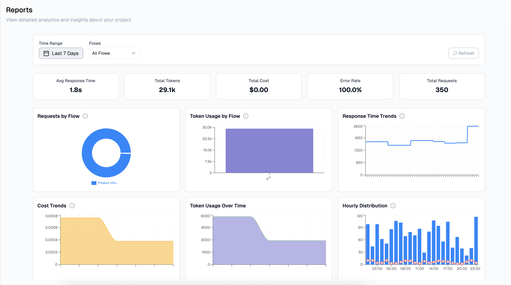

# Reports

<Callout type="warning" emoji="🧪">
    **Reports are in alpha**  
    Reports is currently an alpha feature, and not publicly available. If you see inaccuracies please report to support.

</Callout>

Gain comprehensive insights into your project's performance with our centralized reporting system. Access critical project metrics and analytics all in one convenient location, enabling you to make data-driven decisions efficiently.

---

The **Reports Dashboard** provides detailed analytics and insights into your project usage in Lamatic.  
It helps you track tokens, costs, response times, and error rates across different flows.

---

## Overview

At the top of the dashboard, you’ll find quick stats:

- **Avg Response Time** → Average time taken to respond (e.g., `1.8s`)  
- **Total Tokens** → Total tokens consumed across flows (e.g., `29.1k`)  
- **Total Cost** → Total cost calculated based on token usage (e.g., `$0.00`)  
- **Error Rate** → Percentage of requests that resulted in errors (e.g., `100%`)  
- **Total Requests** → Number of total requests processed (e.g., `350`)  

You can filter the reports by **Time Range** and **Flows**.

---

## Report Widgets

| Widget               | Description                                                                 |
|-----------------------|-----------------------------------------------------------------------------|
| **Requests by Flow**  | Pie chart showing the distribution of requests across flows. Helps identify which flow is used most frequently. |
| **Token Usage by Flow** | Bar graph showing how many tokens each flow consumed. Useful for understanding resource-heavy flows. |
| **Response Time Trends** | Line graph tracking average response times over the selected period. Helps detect performance degradation. |
| **Cost Trends**       | Chart showing token cost trends over time. Useful for monitoring budget and cost efficiency. |
| **Token Usage Over Time** | Line chart showing how token usage changes throughout the selected timeframe. |
| **Hourly Distribution** | Bar chart showing requests distribution per hour. Useful for identifying peak usage times. |
| **Error Trends**      | Chart showing error rate trends over time. Helps debug recurring issues. |
| **Token Costs by Flow** | Breakdown of token costs per flow. Identifies the most expensive flows. |

---

## Usage

Use this dashboard to:

- Track performance across different flows  
- Monitor errors and optimize flows accordingly  
- Analyze token usage and cost trends  
- Understand when your project is most active  

---

> ℹ️ **Tip:** Use filters (`Time Range`, `Flows`) to narrow down the insights for specific scenarios.
