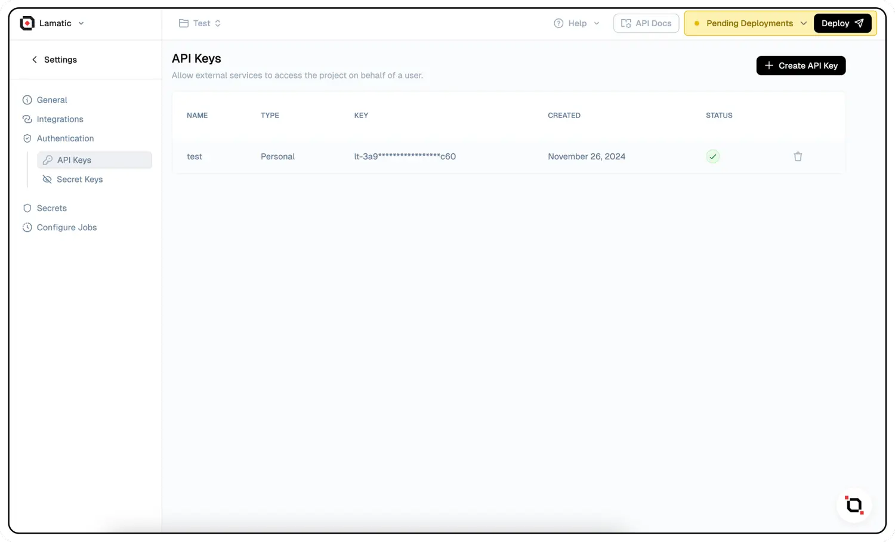

# Lamatic SDK

The [Lamatic SDK](https://github.com/Lamatic/lamatic-sdk) provides a simple way to interact with the Lamatic AI platform, allowing you to execute flow and integrate AI capabilities into your applications.

## Installation

Install the Lamatic SDK using npm:

```bash
npm install lamatic
```

## Getting Started

To use the Lamatic SDK, you'll need:

- An API key or access token
- Your project ID
- The Lamatic API endpoint

Initialize the SDK like this:

```typescript
import { Lamatic } from "lamatic";

const lamatic = new Lamatic({
  // Config
});
```

## Authentication

The SDK supports two authentication methods:

import { Tabs, Tab } from 'nextra-theme-docs'

<Tabs items={['API Key', 'Access Token']}>
  <Tab>
```typescript
const lamatic = new Lamatic({
  apiKey: "your-api-key",
  projectId: "your-project-id",
  endpoint: "your-endpoint",
});
```
  </Tab>
  <Tab>
```typescript
const lamatic = new Lamatic({
  accessToken: "your-access-token",
  projectId: "your-project-id",
  endpoint: "your-endpoint",
});
```
  </Tab>
</Tabs>

You must provide either an API key or an access token, but not both.

### How to obtain your API Key/Secret

1. Navigate to Project Settings in your Lamatic dashboard
2. Locate and copy your API Key/Secret from the credentials section

## Executing Flow

One of the main functionality of the SDK is to execute flow (flows) that you've created on the Lamatic platform.

<Tabs items={['With API Key', 'With Access Token']}>
  <Tab>
```typescript
import { Lamatic } from "lamatic";

const lamatic = new Lamatic({
  apiKey: "your-api-key",
  projectId: "your-project-id",
  endpoint: "your-endpoint",
});

async function main() {
  const flowId = "your-flow-id";
  // sample payload
  const payload = {
    prompt: "hey, how are you?"
  }
  try {
    const response = await lamatic.executeFlow(flowId, payload);
    console.log(response);
  } catch (error) {
    console.error(error);
  }
}

main();
```
  </Tab>
  <Tab>
```typescript
import { Lamatic } from "lamatic";

const lamatic = new Lamatic({
  accessToken: "your-access-token",
  projectId: "your-project-id",
  endpoint: "your-endpoint",
});

async function main() {
  const flowId = "your-flow-id";
  // sample payload
  const payload = {
    prompt: "hey, how are you?",
  };
  const response = await lamatic.executeFlow(flowId, payload);
  console.log(response);
}

main();
```
  </Tab>
</Tabs>

## Executing Agents

Another powerful feature of the SDK is the ability to execute agents.

<Tabs items={['With API Key', 'With Access Token']}>
  <Tab>
```typescript
import { Lamatic } from "lamatic";

const lamatic = new Lamatic({
  apiKey: "your-api-key",
  projectId: "your-project-id",
  endpoint: "your-endpoint",
});

async function main() {
  const agentId = "your-agent-id";
  // sample payload
  const payload = {
    prompt: "write a poem about robots"
  }
  try {
    const response = await lamatic.executeAgent(agentId, payload);
    console.log(response);
  } catch (error) {
    console.error(error);
  }
}

main();
```
  </Tab>
  <Tab>
```typescript
import { Lamatic } from "lamatic";

const lamatic = new Lamatic({
  accessToken: "your-access-token",
  projectId: "your-project-id",
  endpoint: "your-endpoint",
});

async function main() {
  const agentId = "your-agent-id";
  // sample payload
  const payload = {
    prompt: "write a poem about robots",
  };
  const response = await lamatic.executeAgent(agentId, payload);
  console.log(response);
}

main();
```
  </Tab>
</Tabs>

### Handling Expired Access Tokens

import { Callout } from 'nextra-theme-docs'

<Callout type="info">
  This example shows how to handle an expired access token by fetching a new one
  and updating the SDK.
</Callout>

```typescript
import { Lamatic } from "lamatic";

const lamatic = new Lamatic({
  accessToken: "your-access-token",
  projectId: "your-project-id",
  endpoint: "your-endpoint",
});

async function getAccessToken() {
  const response = await fetch("your-server-endpoint/get-access-token", {
    method: "GET",
  });
  const data = await response.json();
  return data.accessToken;
}

async function main() {
  const flowId = "your-flow-id";
  // sample payload
  const payload = {
    prompt: "hey, how are you?",
  };
  const response = await lamatic.executeFlow(flowId, payload);
  console.log(response);
  if (response.statusCode === 403) {
    // Get the new access token
    const accessToken = await getAccessToken();
    // Update the access token for the Lamatic SDK
    lamatic.updateAccessToken(accessToken);

    // Execute the flow again
    const response = await lamatic.executeFlow(flowId, payload);
    console.log(response);
  }
}

main();
```

Here, you are supposed to have a server endpoint that returns a new access token when called. This works for both flow and agent executions.
The server should handle the authentication and return the new access token from the same secret generated from Lamatic Studio.

### Generating an Access Token Using JWT Sign

Here's a method to create an access token using jsonwebtoken (JWT) with and without an expiration time:

```javascript
import jwt from 'jsonwebtoken';

const secretKey = 'KEY'; // Secret key generated from Lamatic Studio

// Generate token without expiry
const accessToken = jwt.sign({ project_id: 'PROJECT_ID' }, secretKey, {
  algorithm: 'HS256',
});

console.log('Access Token (without expiry):', accessToken);

// Generate token with expiry (e.g., 1 hour)
const accessTokenWithExpiry = jwt.sign({ project_id: 'PROJECT_ID' }, secretKey, {
  algorithm: 'HS256',
  expiresIn: '1h', // Change this to '1s' for testing or adjust as needed
});

console.log('Access Token (with expiry):', accessTokenWithExpiry);
```

## Response Structure

The `executeFlow` and `executeAgent` method returns a promise that resolves to a `LamaticResponse` object with the following structure:

```typescript
{
  status: "success" | "error",  // Status of the workflow execution
  result: object | null,        // The result data from the workflow (if successful)
  message?: string,             // Error message (if status is "error")
  statusCode?: number           // HTTP status code
}
```

### Example with Error Handling

Here's an example of how you might handle the response from a workflow execution:
```typescript
async function runWorkflow() {
  const flowId = "your-flow-id";
  const payload = {
    input: "Generate a creative story about robots",
    parameters: {
      temperature: 0.7,
      maxTokens: 500,
    },
  };

  try {
    const response = await lamatic.executeFlow(flowId, payload);

    if (response.status === "success") {
      console.log("Workflow executed successfully!");
      console.log("Result:", response.result);
      return response.result;
    } else {
      console.error("Workflow execution failed:", response.message);
      return null;
    }
  } catch (error) {
    console.error("Exception occurred:", error);
    return null;
  }
}
```

Here we have an example of handling with agent execution:
```typescript
async function runAgent() {
  const agentId = "your-agent-id";
  const payload = {
    input: "Generate a linkedin post about AI",
    parameters: {
      temperature: 0.7,
      maxTokens: 500,
    },
  };

  try {
    const response = await lamatic.executeAgent(agentId, payload);

    if (response.status === "success") {
      console.log("Agent executed successfully!");
      console.log("Result:", response.result);
      return response.result;
    } else {
      console.error("Agent execution failed:", response.message);
      return null;
    }
  } catch (error) {
    console.error("Exception occurred:", error);
    return null;
  }
}
```

## Updating Access Token

If you're using access token authentication, you can update the token during runtime, if the need be:

```typescript
// Initialize with an access token
const lamatic = new Lamatic({
  accessToken: "initial-access-token",
  projectId: "your-project-id",
  endpoint: "your-endpoint",
});

// Later, update the access token
lamatic.updateAccessToken("new-access-token");
```

## Advanced Usage

### Customizing Payloads

<Callout>
  The payload structure depends on the specific workflow/agent you're executing. Make
  sure to check the documentation for your workflow/agent to understand what
  parameters it expects.
</Callout>

<Tabs items={['Text Generation', 'Tweet Generation', 'Classification','Image Analysis']}>
  <Tab>
```typescript
// Example for a text generation workflow
const textGenPayload = {
  prompt: "Write a poem about artificial intelligence",
  options: {
    temperature: 0.8,
    topP: 0.95,
    maxLength: 200
  }
};
```
  </Tab>
  <Tab>
```typescript
// Example for a tweet generation agent
const tweetPayload = {
  prompt: "Write a tweet about the future of technology",
  options: {
    maxLength: 280
  }
};
```
  </Tab>
  <Tab>
```typescript
// Example for a classification workflow
const classifyPayload = {
  text: "This is a sample text to classify",
  categories: ["technology", "science", "art"]
};
```
  </Tab>
  <Tab>
```typescript
// Example for an image analysis agent
const imageAnalysisPayload = {
  imageUrl: "https://example.com/image.jpg",
  analysisTypes: ["objects", "faces", "text"]
};
```
  </Tab>
</Tabs>

### Handling Responses

Different flow/agents may return different result structures. Here's how you might handle responses from different types of flow/agents:

```typescript
// Text generation workflow response
const textResponse = await lamatic.executeFlow(
  "text-gen-flow-id",
  textGenPayload
);
if (textResponse.status === "success" && textResponse.result) {
  const generatedText = textResponse.result.text;
  console.log("Generated text:", generatedText);
}

// Tweet Generation agent response
const tweetResponse = await lamatic.executeAgent("tweet-gen-agent-id", tweetPayload);
if (tweetResponse.status === "success" && tweetResponse.result) {
  const tweet = tweetResponse.result.tweet;
  console.log("Generated tweet:", tweet);
}

// Classification workflow response
const classificationResponse = await lamatic.executeFlow(
  "classify-flow-id",
  classifyPayload
);
if (
  classificationResponse.status === "success" &&
  classificationResponse.result
) {
  const category = classificationResponse.result.category;
  const confidence = classificationResponse.result.confidence;
  console.log(`Classification: ${category} (confidence: ${confidence})`);
}

// Image analysis agent response
const imageAnalysisResponse = await lamatic.executeAgent("image-analysis-agent-id", imageAnalysisPayload);
if (imageAnalysisResponse.status === "success" && imageAnalysisResponse.result) {
  const objects = imageAnalysisResponse.result.objects;
  const faces = imageAnalysisResponse.result.faces;
  const text = imageAnalysisResponse.result.text;
  console.log("Analysis results:", { objects, faces, text });
}
```

## TypeScript Support

The SDK is written in TypeScript and provides type definitions for all its functionality:

### Workflow Execution Example
```typescript
import { Lamatic, LamaticResponse, LamaticConfig } from "lamatic";

// Custom payload type
interface TextGenerationPayload {
  prompt: string;
  maxTokens?: number;
  temperature?: number;
}

// Custom response type
interface TextGenerationResult {
  text: string;
  usedTokens: number;
}

async function generateText(
  prompt: string
): Promise<TextGenerationResult | null> {
  const payload: TextGenerationPayload = {
    prompt,
    maxTokens: 1000,
    temperature: 0.7,
  };

  const response = await lamatic.executeFlow<TextGenerationResult>(
    "text-gen-flow",
    payload
  );

  if (response.status === "success" && response.result) {
    return response.result;
  }

  return null;
}
```

### Agent Execution Example
```typescript
import { Lamatic, LamaticResponse, LamaticConfig } from "lamatic";

// Custom payload type
interface ImageAnalysisPayload {
  imageUrl: string;
  analysisTypes: string[];
}

// Custom response type
interface ImageAnalysisResult {
  objects: string[];
  faces: string[];
  text: string;
}

async function analyzeImage(imageUrl: string): Promise<ImageAnalysisResult | null> {
  const payload: ImageAnalysisPayload = {
    imageUrl,
    analysisTypes: ["objects", "faces", "text"]
  };
  
  const response = await lamatic.executeAgent<ImageAnalysisResult>("image-analysis-agent", payload);
  
  if (response.status === "success" && response.result) {
    return response.result;
  }
  
  return null;
}
```

## Error Handling

<Callout type="warning">
  The SDK throws errors in case of configuration issues or network problems.
  It's recommended to always wrap SDK calls in try-catch blocks.
</Callout>

### Workflow Execution Example
```typescript
try {
  const response = await lamatic.executeFlow(flowId, payload);
  // Process response
} catch (error) {
  if (error instanceof Error) {
    // Log the error
    console.error("SDK Error:", error.message);

    // Handle specific error scenarios
    if (error.message.includes("timeout")) {
      // Handle timeout
    } else if (error.message.includes("network")) {
      // Handle network error
    }
  }
}
```

### Agent Execution Example
```typescript
try {
  const response = await lamatic.executeAgent(agentId, payload);
  // Process response
} catch (error) {
  if (error instanceof Error) {
    // Log the error
    console.error("SDK Error:", error.message);
    
    // Handle specific error scenarios
    if (error.message.includes("timeout")) {
      // Handle timeout
    } else if (error.message.includes("network")) {
      // Handle network error
    }
  }
}
```

## Environment Variables

For better security, consider using environment variables for sensitive information:

```typescript
// Using environment variables
const lamatic = new Lamatic({
  apiKey: process.env.LAMATIC_API_KEY,
  projectId: process.env.LAMATIC_PROJECT_ID,
  endpoint: process.env.LAMATIC_ENDPOINT,
});
```

## Support

For help and support, visit our [documentation](https://docs.lamatic.ai) or contact [support@lamatic.ai](mailto:support@lamatic.ai).