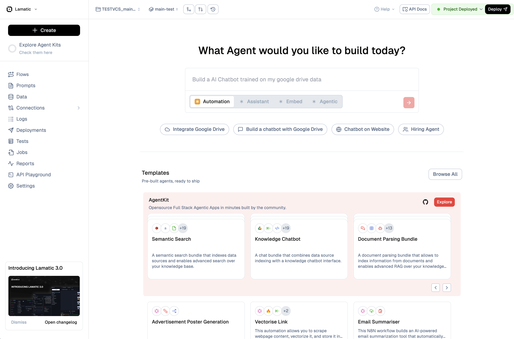

# Build With Vibe

The Vibe Build surface is the fastest way to spin up a new Lamatic agent. From a single screen you can describe what you want to build, choose the interaction style, connect data, and start from curated templates.

## 1. Describe the agent you need

1. Start with the prompt at the top of the page and describe your goal (e.g., “Build an AI chatbot trained on my Google Drive data”).
1. Use the mode toggles (`Automation`, `Assistant`, `Embed`, `Agentic`) to hint at how the agent should behave. These presets auto-adjust the scaffolding when you create the flow.

## 2. Pick a launch shortcut

- **Integrate Google Drive** – OAuth into Drive and immediately index files for retrieval.
- **Build a chatbot with Google Drive** – Combines the Drive data source with the chatbot scaffold so you can deploy faster.
- **Chatbot on Website** – Generates an embeddable widget with starter copy and styling hooks.
- **Hiring Agent** – Loads a workflow tuned for screening candidates with resume parsing.

These shortcuts appear as pills under the prompt and can be triggered before or after editing the description.

## 3. Explore templates

Templates live in the AgentKit carousel just below the hero. Each card shows:

- The template name and quick success metrics from the community.
- A summary of what the template does (e.g., `Semantic Search`, `Knowledge Chatbot`, `Document Parsing Bundle`).
- Icons indicating the data sources or automations bundled in.

Click **Explore** or the card itself to open a preview, review the ingredients, and clone it into your workspace.

## 4. Navigate the creation workspace

The left sidebar keeps global navigation close by:

- `Flows` for editing the new agent once it’s created.
- `Prompts`, `Data`, and `Connections` to iterate on knowledge sources and prompt engineering.
- `Deployments`, `Jobs`, `Reports`, and the `API Playground` for testing and shipping.

Use the **Create** button at the top of the sidebar whenever you want to start from scratch instead of a template.

## 5. Deploy when ready

After selecting a template or shortcut, Lamatic opens the Flow Editor preloaded with the necessary blocks. From there you can:

1. Adjust the stages in the flow builder.
1. Add or remove data sources from the right rail.
1. Test the agent in the inline console before hitting **Deploy**.

Once deployed, the green `Project Deployed` badge in the header confirms the latest version is live. You can redeploy as you iterate—the Vibe Build entry point is always a click away for starting additional agents.
