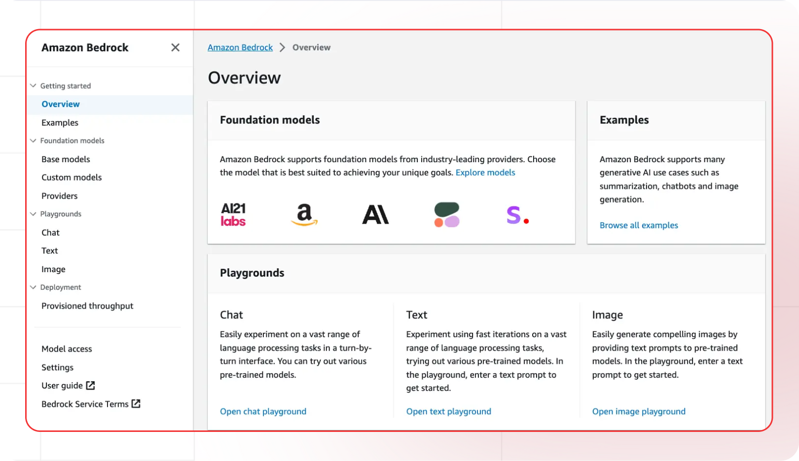

[AWS console]: https://aws.amazon.com/bedrock
[AWS Bedrock]: https://console.aws.amazon.com/bedrock
[AWS credentials]: https://console.aws.amazon.com/iam/home#/security_credentials
[AWS docs]: https://docs.aws.amazon.com/bedrock/
[AWS pricing]: https://aws.amazon.com/bedrock/pricing/
[AWS models]: https://docs.aws.amazon.com/bedrock/latest/userguide/models.html

[Lamatic.ai studio]: https://studio.lamatic.ai
[Lamatic support]: https://lamatic.ai/docs/slack

import { IntegrationOverviw } from "@/components/IntegrationOverviw"

# Amazon Bedrock
<IntegrationOverviw slug="bedrock" type="models" />
Amazon Bedrock is a fully managed service by Amazon Web Services (AWS) that simplifies the creation and scaling of generative AI applications. It provides access to a variety of high-performing foundation models (FMs) from leading AI companies such as AI21 Labs, Anthropic, Cohere, Meta, Mistral AI, Stability AI, and Amazon's own models, all through a single API.

<Callout type="info">Provider Slug: `bedrock`</Callout>

## Setup

### Step 1: Create AWS Account
1. Log into the [AWS console][AWS console]
2. Sign up for a new AWS account or use your existing account
3. Complete the account verification process

### Step 2: Access Bedrock Service
1. Navigate to the [Bedrock service][AWS Bedrock] in your AWS console
2. Enable Bedrock service for your account
3. Configure necessary permissions and access

### Step 3: Generate Access Credentials
1. Visit [Security credentials][AWS credentials] in your AWS console
2. Create an IAM user with Bedrock permissions
3. Generate Access Key ID and Secret Access Key
4. Copy both credentials (you'll need them for configuration)

*AWS Bedrock Security Credentials Screen*

### Step 4: Configure in Lamatic
1. Open your [Lamatic.ai studio]
2. Navigate to **Models** section
3. Select **Amazon Bedrock** from the provider list
4. Paste your Access Key ID and Secret Access Key in the designated fields
5. Save your changes

## Key Features

- **Multiple Model Providers**: Access to models from AI21 Labs, Anthropic, Cohere, Meta, Mistral AI, Stability AI, and Amazon
- **Fully Managed Service**: AWS handles infrastructure, scaling, and maintenance
- **Enterprise Security**: Built on AWS security and compliance standards
- **Cost Effective**: Pay-per-use pricing with no upfront costs
- **Scalable**: Automatic scaling based on demand
- **Developer Friendly**: Simple API integration with comprehensive documentation
- **AWS Integration**: Seamless integration with other AWS services
- **Compliance Ready**: Meets enterprise compliance and security requirements

## Available Models

Amazon Bedrock provides access to models from multiple providers:

- **Anthropic Models**: Claude models for advanced reasoning and creative tasks
- **AI21 Labs Models**: Jurassic models for text generation and analysis
- **Cohere Models**: Command models for text generation and embeddings
- **Meta Models**: Llama models for various language tasks
- **Mistral AI Models**: Mistral models for efficient text processing
- **Stability AI Models**: Models for image generation and creative tasks
- **Amazon Models**: Titan models for text generation and embeddings

Check the [AWS Bedrock Models][AWS models] documentation for the complete list of available models and their specifications.

## Configuration Options

- **Access Key ID**: Your AWS Access Key ID for authentication
- **Secret Access Key**: Your AWS Secret Access Key for authentication
- **Region Selection**: Choose the appropriate AWS region for your use case
- **Model Selection**: Choose from available Bedrock models
- **Custom Parameters**: Configure temperature, max_tokens, top_p, and other generation parameters
- **Streaming**: Enable real-time text generation streaming
- **IAM Permissions**: Configure appropriate permissions for Bedrock access

## Best Practices

- **Credential Security**: Keep your AWS credentials secure and never share them publicly
- **IAM Best Practices**: Use least-privilege access and rotate credentials regularly
- **Rate Limiting**: Be aware of Bedrock's rate limits and implement appropriate throttling
- **Model Selection**: Choose the appropriate model based on your use case and requirements
- **Error Handling**: Implement proper error handling for API failures and rate limits
- **Cost Optimization**: Monitor your usage and optimize prompts to reduce costs
- **Region Selection**: Choose the region closest to your users for better performance
- **Security Configuration**: Configure appropriate IAM roles and permissions

## Troubleshooting

**Invalid Credentials:**
- Verify your Access Key ID and Secret Access Key are correct
- Check if your IAM user has the necessary Bedrock permissions
- Ensure your AWS account is active and verified

**Access Denied:**
- Verify your IAM user has Bedrock permissions
- Check if Bedrock service is enabled in your region
- Ensure proper IAM policies are attached to your user

**Rate Limit Exceeded:**
- Implement exponential backoff in your requests
- Consider upgrading your AWS plan for higher limits
- Monitor your usage in the AWS console

**Model Not Available:**
- Check if the model is available in your selected region
- Verify your account has access to the specific model
- Contact AWS support for model availability issues

**Region Issues:**
- Ensure Bedrock is available in your selected region
- Check if your credentials are valid for the selected region
- Verify region-specific model availability

## Important Notes

- Keep your AWS credentials secure and never share them
- Check provider's pricing before generating credentials: [AWS pricing][AWS pricing]
- Regularly rotate your AWS credentials for enhanced security
- Monitor your usage and costs in the AWS console
- Test your integration after adding each credential
- Some models may require additional setup or approval
- Be aware of AWS Bedrock's terms of service and usage policies
- Consider AWS compliance and security requirements for enterprise use
- Ensure proper IAM configuration for secure access

## Additional Resources

- [AWS Bedrock Documentation][AWS docs]
- [Model Documentation][AWS models]
- [Pricing Information][AWS pricing]
- [AWS Support](https://aws.amazon.com/support/)

Need help? Contact [Lamatic support]