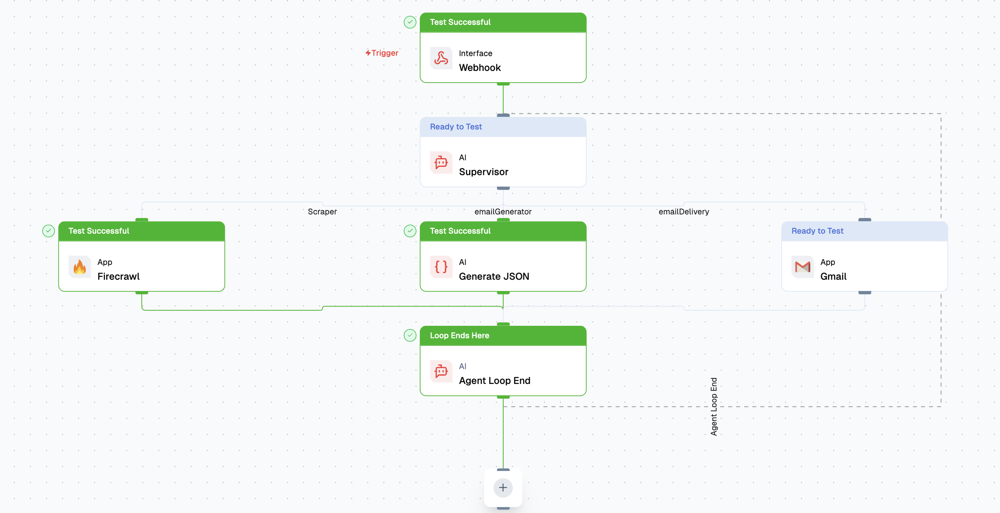

# Lamatic Agents

Agents are AI-powered components in Lamatic that handle different types of tasks, such as generating text, processing structured data, and orchestrating multi-agent flow. This guide introduces the different agent types and how they function within the Lamatic ecosystem.

## Prerequisites

- Basic understanding of [Flows](/docs/flows) and [Nodes](/docs/nodes)
- A Lamatic Project in Studio

## What are Agents?

Agents are specialized AI entities that execute specific tasks based on input and predefined logic. They can work independently or as part of a larger workflow inside **Flows**. After deployment, you can interact with these agents via **API Endpoints** in a flow or execute them directly.

## Types of Agents

### **1. Supervisor Agent**
A **Supervisor Agent** orchestrates multiple AI agents, ensuring structured flow by dynamically routing tasks based on input conditions.

- **Key Features:**
  - Multi-agent coordination for structured execution.
  - Memory retention for context-aware interactions.
  - Adaptive execution paths based on agent responses.
  - Check out the [Supervisor Agent](./agents/supervisor-agent.mdx) for more details.

### **2. Generate Text Agent**
A **Text Generation Agent** produces AI-generated content based on prompts. This agent is ideal for generating responses, summarizing content, or creative writing.

- **Key Features:**
  - Supports advanced language models for text generation.
  - Configurable temperature and response length.
  - Ideal for chatbots, content generation, and summarization.
  - Check out the [Text Agent](./agents/text-agent.mdx) for more details.

### **3. Generate JSON Agent**
A **JSON Agent** structures AI-generated responses into JSON format, making it useful for APIs and automated processing pipelines.

- **Key Features:**
  - Generates structured JSON outputs.
  - Useful for integrating AI with databases or APIs.
  - Ensures predictable response formats.
  - Check out the [JSON Agent](./agents/json-agent.mdx) for more details.

### **4. Multi-Modal Agent**
A **Multi-Modal Agent** processes and generates outputs across different data types, including text, images, and structured data.

- **Key Features:**
  - Supports vision-language models.
  - Processes multiple data types simultaneously.
  - Useful for applications like AI-powered design assistants.
  - Check out the [Multi-Modal Agent](./agents/multi-modal-agent.mdx) for more details.

## Best Practices

- **Choose the Right Agent:** Select the agent type that best suits your task requirements.
- **Optimize Prompts:** Well-structured prompts lead to better AI outputs.
- **Use Memory Wisely:** Enable memory retention for agents that need contextual awareness.
- **Test & Iterate:** Experiment with different configurations for the best results.

By leveraging these agent types effectively, you can build powerful AI-driven applications inside Lamatic.ai. 🚀

## Troubleshooting

- **Agent not responding**: Check that the agent is deployed and the project is active
- **Unexpected output format**: Verify the agent type matches your use case (e.g., use JSON Agent if you need structured output)
- **Memory issues**: Review memory configuration if the agent isn't retaining context between calls

## Next steps

- Learn how to create agents: [Getting Started with Agents](/docs/agents/getting-started)
- Explore specific agent types:
  - [Supervisor Agent](/docs/agents/supervisor-agent)
  - [Text Agent](/docs/agents/text-agent)
  - [JSON Agent](/docs/agents/json-agent)
  - [Multi-Modal Agent](/docs/agents/multi-modal-agent)
- Integrate agents into your application: [Authentication with API Keys](/docs/studio-keys)