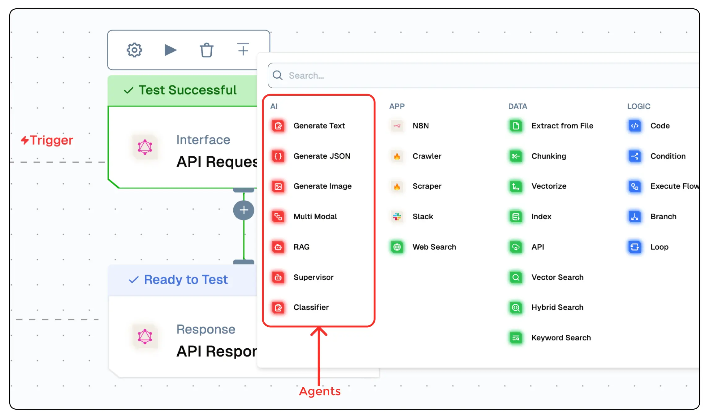

# Getting Started with Agents  

Agents in Lamatic.ai are AI-driven components designed to automate flow, process data, and generate intelligent responses. Whether you're building a chatbot, structuring data, or orchestrating multiple AI models, agents provide a flexible and efficient way to handle tasks.  You can create agents in two ways: **via the Flow Editor** (for seamless integration into flow) or **via the Agent Dashboard** (for standalone configuration and management). Follow the steps below to get started.

## Creating an Agent via Flow Editor

To create an agent via the flow editor :

1. **Navigate to the Flow Editor:** Click on the "Add Node" button.
2. **Select an Agent Node:** Choose the appropriate agent type based on your requirements.
3. **Configure Parameters:** Customize agent settings, such as model selection, prompt templates, agent paths, and output formats.
4. **Connect Nodes:** Link the agent node to other nodes in the flow for data exchange.
5. **Deploy the Flow:** Save and deploy the flow to activate the agent.

