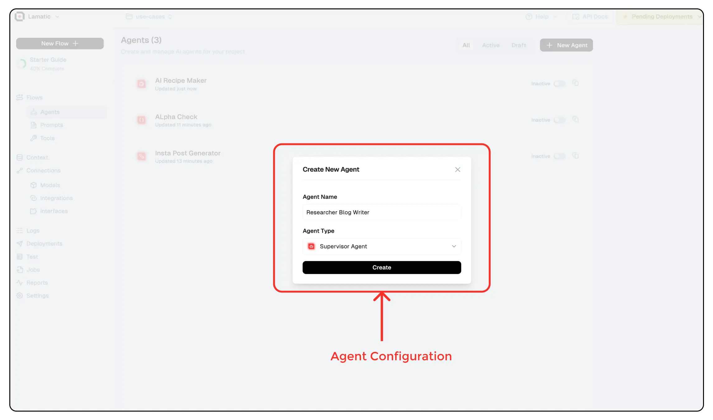

# Getting Started with Agents  

Agents in Lamatic.ai are AI-driven components designed to automate flow, process data, and generate intelligent responses. Whether you're building a chatbot, structuring data, or orchestrating multiple AI models, agents provide a flexible and efficient way to handle tasks.  You can create agents in two ways: **via the Flow Editor** (for seamless integration into flow) or **via the Agent Dashboard** (for standalone configuration and management). Follow the steps below to get started.

## Creating an Agent via Flow Editor

To create an agent via the flow editor :

1. **Navigate to the Flow Editor:** Click on the "Add Node" button.
2. **Select an Agent Node:** Choose the appropriate agent type based on your requirements.
3. **Configure Parameters:** Customize agent settings, such as model selection, prompt templates, agent paths, and output formats.
4. **Connect Nodes:** Link the agent node to other nodes in the flow for data exchange.
5. **Deploy the Flow:** Save and deploy the flow to activate the agent.

## Creating an Agent via Agent Dashboard

To create an agent:

1. **Navigate to the Agents Page:** Click on the "New Agent" button.
2. **Enter a Name:** Provide a meaningful name for your agent.
3. **Select an Agent Type:** Choose the appropriate agent type based on your use case and create the agent.
4. **Configure Settings:** Customize parameters, such as memory retention, iteration limits, and model selection.
5. **Save and Deploy:** Save the agent configuration and deploy it to start processing requests.

## Reusability of Agents

Once a Lamatic agent is created, it can be reused across multiple flow and projects. This reusability feature allows you to leverage the same agent for different tasks without the need for redundant configurations.
By creating agents with specific functionalities and parameters, you can build a library of reusable components that streamline your AI development process.
Any agent configuration saved can be accessed via the 'Load saved configuration' option, enabling quick deployment and integration into new flow.