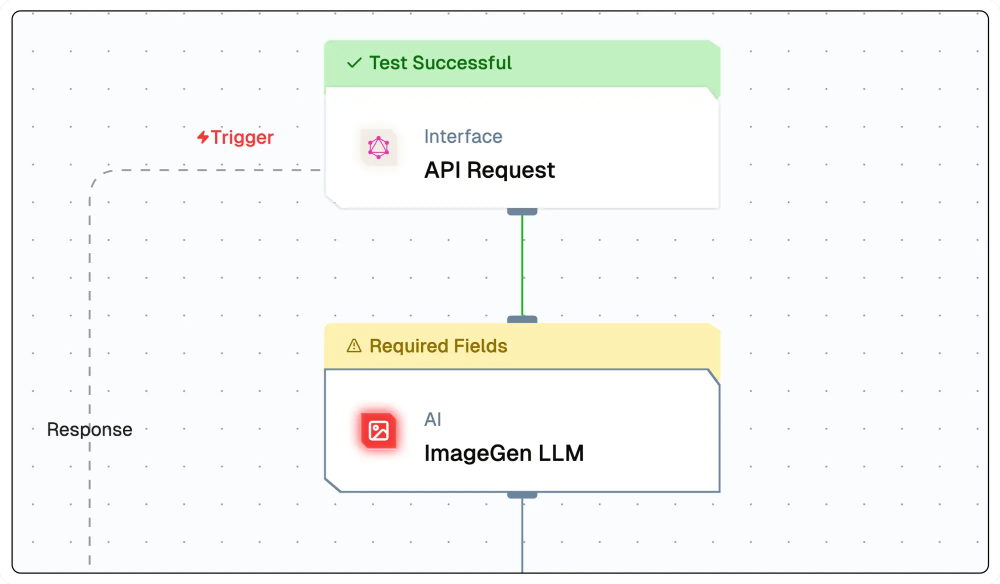

# **Image Agent**

The **Image Agent** is an AI-powered image generator that creates images programmatically based on user-defined prompts and parameters. It integrates seamlessly into workflows and supports generative AI models like OpenAI’s DALL·E. This agent is useful for applications requiring automated visual content creation, such as marketing, e-commerce, and personalized graphics.




## **Why Use the Image Agent?**

- **AI-Generated Visuals:** Automatically generate images using state-of-the-art models.  
- **Customizable Prompts:** Define prompts to create images tailored to specific needs.  
- **Workflow Integration:** Seamlessly connect image generation to automated processes.  
- **Flexible Model Selection:** Choose from multiple AI models for diverse visual outputs.  


## **Key Features**

<details>
<summary>**Core Functionalities**</summary>

1. **AI-Powered Image Generation** – Generate images based on custom prompts.  
2. **Customizable Prompt Templates** – Define input instructions to control image style and content.  
3. **Generative Model Selection** – Select the AI model and configure API credentials.  
4. **Scalability** – Automate image creation within workflows for efficiency.  

</details>

<details>
<summary>**Advantages**</summary>

1. **Flexibility** – Supports multiple AI models, enabling a wide range of visual styles.  
2. **User-Friendly Design** – Intuitive interface for prompt customization and model selection.  
3. **Time-Saving Automation** – Generate images on demand without manual intervention.  
4. **Enhanced Creativity** – Explore unique visual outputs for various applications.  

</details>


## **What Can I Build?**

- **Marketing & Advertising Visuals** – AI-generated graphics for campaigns and branding.  
- **E-commerce Product Visualization** – Dynamic images tailored to product descriptions.  
- **Personalized Artwork** – Custom AI-generated graphics for social media and web design.  
- **Adaptive Website Visuals** – Dynamic, user-driven visual elements for websites.  


## **How to Use the Image Agent?**

### **Creating an Image Agent via Flow Editor**
1. **Add an Image Agent Node** – Select the **Image Agent** from the node list.  
2. **Configure Prompts** – Define text prompts for generating specific visuals.  
3. **Select an AI Model** – Choose a generative model such as DALL·E.  
4. **Customize Output Settings** – Adjust resolution, style, and other parameters.  
5. **Connect & Deploy** – Integrate the Image Agent into your workflow and execute.  

### **Creating an Image Agent via Agent Dashboard**
1. **Go to the Agents Page** – Click **New Agent**.  
2. **Choose Image Agent** – Select from available agent types.  
3. **Configure Model & Prompts** – Set up AI credentials and image generation parameters.  
4. **Deploy & Integrate** – Save and start using the agent in your application.  


## **Configuration Options**

| **Parameter**             | **Description**                                                                                                | **Example Value** |
|---------------------------|----------------------------------------------------------------------------------------------------------------|-------------------------------|
| **Prompts**               | Define the prompts for system, user and assistant to be used for the LLM                                        | `System Prompt, User Prompt` | 
| **Models**                | Selects the AI model for text generation.                                                                       | `GPT-4 Turbo` |


## **Low-Code Example**

```yaml
nodes:
  - nodeId: ImageAgent_135
    nodeType: ImageAgent
    nodeName: AI Image Generator
    values:
      promptTemplate: "Create an image of ${{triggerNode_1.output.topic}}"
      imageGenModelName:
        provider_name: openai
        type: generator/image
        credential_name: OpenAI_Key
        credentialId: b552a29b-69b6-4951-84c3-a6555bb132d1
        model_name: hd/1024-x-1024/dall-e-3
    needs:
      - triggerNode_1
  - nodeId: plus-node-addNode_401321
    nodeType: addNode
    nodeName: ""
    values: {}
    needs:
      - ImageAgent_135
```

## Troubleshooting

### Common Issues

| **Problem**                    | **Solution**                                                 |
| ------------------------------ | ------------------------------------------------------------ |
| **Invalid API Key**            | Ensure the API key is correct and has not expired.           |
| **Dynamic Content Not Loaded** | Increase the `Wait for Page Load` time in the configuration. |

### Debugging

1. Check Lamatic Flow logs for error details.
1. Verify API Key.