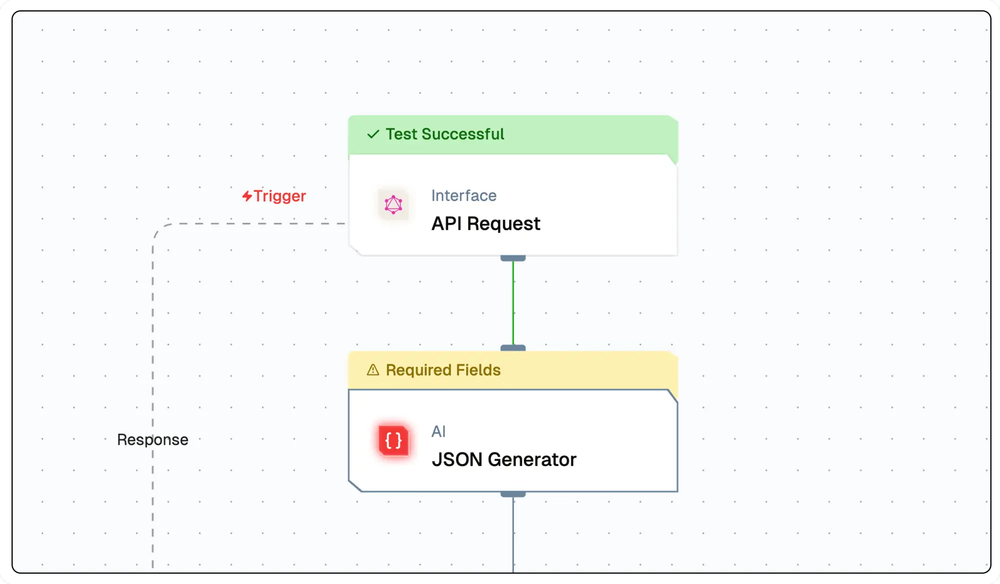
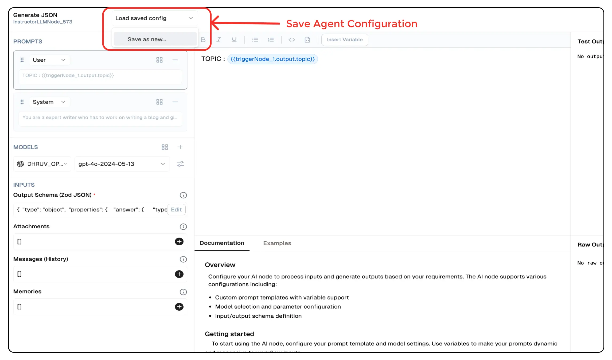

# **JSON Agent**

The **JSON Agent** is designed to produce structured JSON outputs from AI-generated responses, ensuring consistency and precision in data formatting. It enables users to define output schemas, making it ideal for structured data generation, such as API responses, automated reports, and knowledge extraction.

This agent is essential for applications where AI needs to provide responses in a predictable, structured format, integrating seamlessly into workflows.




## **Why Use the JSON Agent?**

- **Structured AI Outputs** – Generate well-formatted JSON data from AI responses.  
- **Customizable Schemas** – Define output structures for consistent data formatting.  
- **Workflow Integration** – Automate structured data generation within business processes.  
- **Multi-Model Compatibility** – Works with various AI models for enhanced flexibility.  


## **Key Features**

<details>
<summary>**Core Functionalities**</summary>

1. **AI-Powered JSON Generation** – Produces structured JSON responses from natural language prompts.  
2. **Customizable Prompt Templates** – Enables fine-tuned AI instructions for tailored JSON outputs.  
3. **Schema Definition** – Allows users to define JSON structures for precise formatting.  
4. **Scalability** – Supports large-scale automated data extraction and structuring.  

</details>

<details>
<summary>**Advantages**</summary>

1. **Predictability** – Ensures consistent JSON output for seamless integration with systems.  
2. **User-Friendly Design** – Intuitive interface for defining prompts and schemas.  
3. **Automated Data Structuring** – Eliminates manual formatting, reducing errors.  
4. **Cross-Platform Usability** – Generates JSON for APIs, reports, analytics, and more.  

</details>


## **What Can I Build?**

- **API Response Formatting** – Generate structured JSON data for APIs.  
- **Automated Data Extraction** – Convert unstructured text into JSON for data pipelines.  
- **Dynamic Report Generation** – Generate JSON-based reports from AI insights.  
- **Knowledge Graphs** – Transform AI-generated knowledge into structured formats.  


## **How to Use the JSON Agent?**

### **Creating a JSON Agent via Flow Editor**
1. **Add a JSON Agent Node** – Select the **JSON Agent** from the node list.  
2. **Define Output Schema** – Configure JSON format and expected properties.  
3. **Select an AI Model** – Choose a model like GPT-4, Gemini, or Mistral.  
4. **Customize Prompt & System Instructions** – Define clear input queries.  
5. **Connect & Deploy** – Integrate the JSON Agent into workflows and execute.  

### **Creating a JSON Agent via Agent Dashboard**
1. **Go to the Agents Page** – Click **New Agent**.  
2. **Choose JSON Agent** – Select from available agent types.  
3. **Configure Schema & Prompts** – Set up output structures and AI instructions.  
4. **Deploy & Integrate** – Save and start using the agent in your application.  

## **Configuration Options**

| **Parameter**             | **Description**                                                                                                | **Example Value** |
|---------------------------|----------------------------------------------------------------------------------------------------------------|-------------------------------|
| **Prompts**               | Define the prompts for system, user and assistant to be used for the LLM                                        | `System Prompt, User Prompt` | 
| **Models**                | Selects the AI model for text generation.                                                                       | `GPT-4 Turbo` |
| **Inputs**                 | Input schema given in Zod format.                                                                               | `{"type": "string"}` |
| **Attachments**           | Attachments to be sent with the prompt.                                                                         | `{"file": "data.csv"}` |
| **Messages**              | History of messages exchanged between the user and the assistant.                                               | `[{"message": "give me a email for followup to client"}]` |    
| **Memories**             | Memories of the user and the assistant.                                                                         | `[{"memory": "user wants an email to followup with their client"}]` |

## Save Agent Configuration



You can save the configuration of any agent by clicking on the `Load Save Config` button and selecting `Save as New`. 
This will save the configuration of the agent and you can use it later by clicking on the `Load Configuration` button in other agents.


## **Low-Code Example**

```yaml
nodes:
  - nodeId: JSONAgent_774
    nodeType: JSONAgent
    nodeName: Structured JSON Generator
    values:
      schema: |-
        {
          "type": "object",
          "properties": {
            "destination": {
              "type": "string"
            },
            "description": {
              "type": "string"
            },
            "recommended_activities": {
              "type": "array",
              "items": { "type": "string" }
            }
          }
        }
      promptTemplate: "Generate structured JSON for ${{triggerNode_1.output.topic}}"
      generativeModelName:
        provider_name: mistral
        type: generator/text
        credential_name: Mistral API
        credentialId: 32bf5e3b-a8fc-4697-b95a-b1af3dcf7498
        model_name: mistral/mistral-large-2402
    needs:
      - triggerNode_1
```

## Output Schema
#### `_meta`
- A nested object containing metadata about the processing of the generation request.

#### Token Usage Details
- **`prompt_tokens`**: Number of tokens in the input prompt provided to the model.
- **`completion_tokens`**: Number of tokens in the generated output.
- **`total_tokens`**: Sum of `prompt_tokens` and `completion_tokens`.

#### `prompt_tokens_details`
- A nested object providing a breakdown of token usage in the prompt.
  - **`cached_tokens`**: Number of tokens reused from a cache.
  - **`audio_tokens`**: Number of tokens associated with audio input (if applicable).

#### `completion_tokens_details`
- A nested object detailing token usage in the generated output.
  - **`reasoning_tokens`**: Number of tokens used for reasoning processes (if applicable).
  - **`audio_tokens`**: Number of tokens associated with audio output (if applicable).
  - **`accepted_prediction_tokens`**: Number of tokens from accepted predictions (if applicable).
  - **`rejected_prediction_tokens`**: Number of tokens from rejected predictions (if applicable).

#### Model Information
- **`model_name`**: The name of the AI model used for generation.
- **`model_provider`**: The provider or organization supplying the model.

### Example Output

```json
{
    "name": "Adelaide",
    "_meta": {
      "prompt_tokens": 56,
      "completion_tokens": 7,
      "total_tokens": 63,
      "prompt_tokens_details": {
        "cached_tokens": 0,
        "audio_tokens": 0
      },
      "completion_tokens_details": {
        "reasoning_tokens": 0,
        "audio_tokens": 0,
        "accepted_prediction_tokens": 0,
        "rejected_prediction_tokens": 0
      },
      "model_name": "gpt-4-turbo",
      "model_provider": "openai"
    }
  }
```

## Troubleshooting

### Common Issues

| **Problem**                    | **Solution**                                                 |
| ------------------------------ | ------------------------------------------------------------ |
| **Invalid API Key**            | Ensure the API key is correct and has not expired.           |
| **Dynamic Content Not Loaded** | Increase the `Wait for Page Load` time in the configuration. |

### Debugging

1. Check Lamatic Flow logs for error details.
1. Verify API Key.