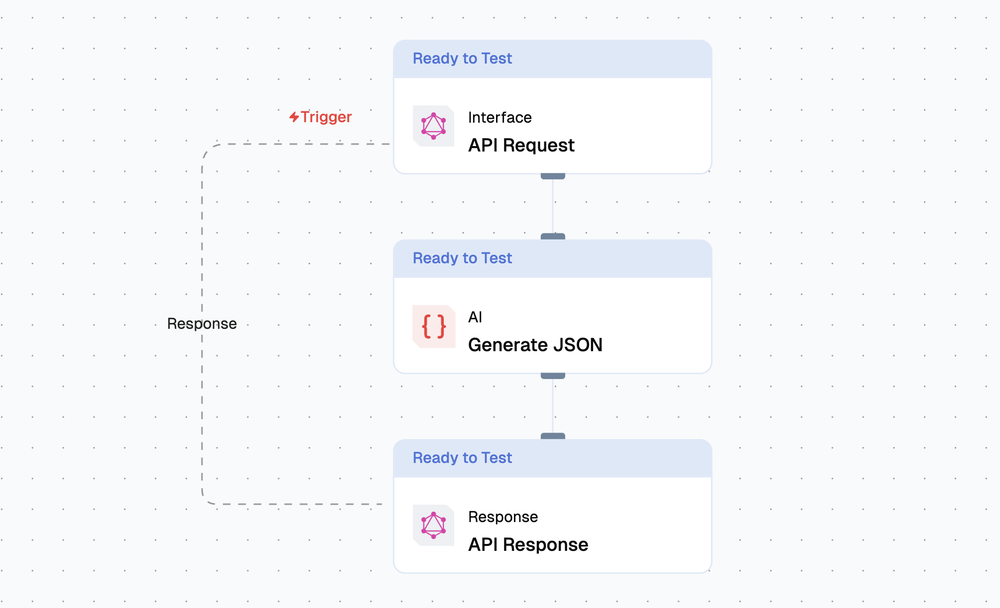
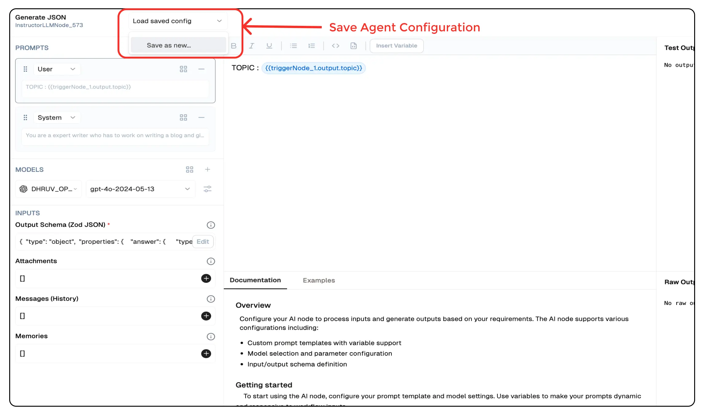

# JSON Agent

The **JSON Agent** calls an LLM and returns structured JSON that matches a schema you define. Use it when you need predictable, typed output (e.g. for APIs, data pipelines, or reports) instead of free-form text.



## When to use this

| Use the **JSON Agent** when… | Use the **Generate JSON** node instead when… |
|------------------------------|----------------------------------------------|
| You want an agent you can reuse across Flows (shared config, saved configs) | You only need one LLM step inside a single Flow that outputs JSON |
| You're building from the Agent dashboard and wiring it into multiple Flows | You're building everything in the Flow Editor and want a single node to produce JSON |

Both can produce schema-bound JSON; the JSON Agent is an agent abstraction with its own config and templates.

## Quickstart

1. Add a **JSON Agent** node to your Flow (or create a JSON Agent from the Agents page).
2. Define the **output schema** (JSON Schema) so the model knows the exact shape (e.g. `{ "destination": "string", "activities": ["string"] }`).
3. Set the **prompt** (and optional system instructions) so the model gets clear instructions.
4. Select the **model** and credentials.
5. Connect the node to your trigger and run the Flow.

<Callout type="info" title="Tip">
Save the agent config (Load/Save Config) to reuse the same schema and prompts in other Flows.
</Callout>

## Configuration reference

| Parameter   | Description | Example |
|------------|--------------|---------|
| **Prompts** | System, user, and assistant prompts for the LLM | `System Prompt`, `User Prompt` |
| **Models** | AI model used for generation | `GPT-4 Turbo` |
| **Inputs** | Input schema (Zod format) | `{"type": "string"}` |
| **Attachments** | Files sent with the prompt | `{"file": "data.csv"}` |
| **Messages** | Conversation history (user/assistant) | `[{"message": "…"}]` |
| **Memories** | User/assistant memories | `[{"memory": "…"}]` |

## Common patterns

- **API response shaping** — Map user input to a fixed JSON response (e.g. form extraction, search filters).
- **Data extraction** — Turn unstructured text (emails, docs) into JSON for pipelines.
- **Structured reports** — Generate JSON blobs (e.g. summaries, recommendations) for dashboards or downstream systems.

## Troubleshooting

| Problem | What to do |
|--------|------------|
| **Output doesn’t match schema** | Tighten the prompt (e.g. “Return only valid JSON with these keys”) and confirm the schema matches the keys you expect. Re-run and check logs. |
| **Invalid or truncated JSON** | Increase max tokens if the response is cut off; ask the model to return only the JSON object, no markdown or extra text. |
| **Wrong model or credentials** | In the node config, verify the selected model and that the linked credential (e.g. OpenAI key) is valid and has access. |

## Save agent configuration



Click **Load Save Config → Save as New** to save the agent’s configuration. Use **Load Configuration** in another agent or Flow to reuse it.

## Low-code example

```yaml
nodes:
  - nodeId: JSONAgent_774
    nodeType: JSONAgent
    nodeName: Structured JSON Generator
    values:
      schema: |-
        {
          "type": "object",
          "properties": {
            "destination": { "type": "string" },
            "description": { "type": "string" },
            "recommended_activities": {
              "type": "array",
              "items": { "type": "string" }
            }
          }
        }
      promptTemplate: "Generate structured JSON for ${{triggerNode_1.output.topic}}"
      generativeModelName:
        provider_name: mistral
        type: generator/text
        credential_name: Mistral API
        credentialId: 32bf5e3b-a8fc-4697-b95a-b1af3dcf7498
        model_name: mistral/mistral-large-2402
    needs:
      - triggerNode_1
```

## Output schema

The node returns your custom fields plus a `_meta` object with token usage and model info.

- **`_meta`** — Metadata for the request: `prompt_tokens`, `completion_tokens`, `total_tokens`, `model_name`, `model_provider`, and optional `prompt_tokens_details` / `completion_tokens_details`.

### Example output

```json
{
  "name": "Adelaide",
  "_meta": {
    "prompt_tokens": 56,
    "completion_tokens": 7,
    "total_tokens": 63,
    "model_name": "gpt-4-turbo",
    "model_provider": "openai"
  }
}
```

For full token-detail fields, see the [GraphQL response](/docs/interface/graphql) docs.

## Debugging

- Check **Flow logs** in Studio for the run and the failing node.
- Verify the **API key** (or model credential) used by the node is valid and has access to the chosen model.
