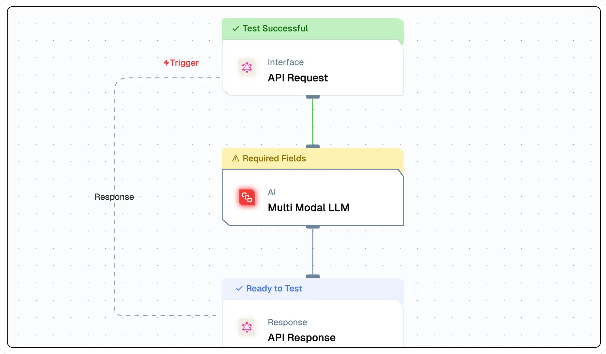
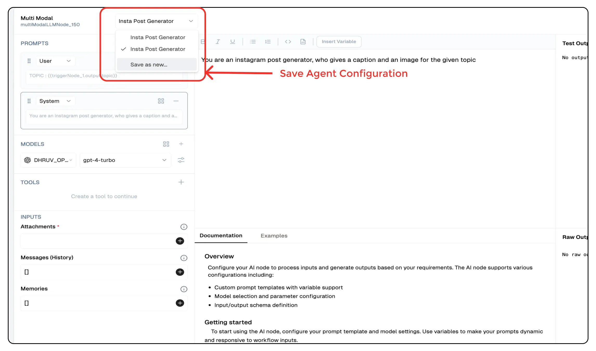

# **Multi Modal Agent**

The **Multi Modal Agent** is an AI-powered multi modal content generator that creates text and images programmatically based on user-defined prompts and parameters. 
It integrates seamlessly into flow and supports generative AI models like OpenAI’s `GPT-4-Turbo`. This agent is useful for applications requiring automated visual content creation, such as marketing, e-commerce, and personalized graphics.




## **Why Use the Multi Modal Agent?**

- **AI-Generated Visuals:** Automatically generate images using state-of-the-art models.  
- **AI Text Generation:** Generate text outputs based on custom prompts.
- **Customizable Prompts:** Define prompts to create images tailored to specific needs.  
- **Workflow Integration:** Seamlessly connect content generation to automated processes.  
- **Flexible Model Selection:** Choose from multiple AI models for diverse visual outputs.  


## **Key Features**

<details>
<summary>**Core Functionalities**</summary>

1. **AI-Powered Image Generation** – Generate images based on custom prompts.  
2. **Customizable Prompt Templates** – Define input instructions to control image style and content.  
3. **Generative Model Selection** – Select the AI model and configure API credentials.  
4. **Scalability** – Automate multi modal content creation within flow for efficiency.  

</details>

<details>
<summary>**Advantages**</summary>

1. **Flexibility** – Supports multiple AI models, enabling a wide range of visual styles.  
2. **User-Friendly Design** – Intuitive interface for prompt customization and model selection.  
3. **Time-Saving Automation** – Generate images on demand without manual intervention.  
4. **Enhanced Creativity** – Explore unique visual outputs for various applications.  

</details>


## **What Can I Build?**

- **Automated Social Media Content Creation** – Generate visuals for social media, marketing, and branding.
- **Personalized Image Recommendations** – Create custom images based on user preferences.
- **Dynamic Visual Content Generation** – Produce images for e-commerce, advertising, and design.
- **Interactive Applications** – Develop tools for image-based user interactions and feedback.


## **How to Use the Multi Modal Agent?**

### **Creating an Multi Modal Agent via Flow Editor**
1. **Add an Multi Modal Agent Node** – Select the **Multi Modal Agent** from the node list.  
2. **Configure Prompts** – Define text prompts for generating specific visuals.  
3. **Select an AI Model** – Choose a generative model such as gpt-4-turbo
4. **Customize Output Settings** – Adjust resolution, style, and other parameters.  
5. **Connect & Deploy** – Integrate the Multi Modal Agent into your workflow and execute.  

### **Creating an Multi Modal Agent via Agent Dashboard**
1. **Go to the Agents Page** – Click **New Agent**.  
2. **Choose Multi Modal Agent** – Select from available agent types.  
3. **Configure Model & Prompts** – Set up AI credentials and parameters.  
4. **Deploy & Integrate** – Save and start using the agent in your application.  


## **Configuration Options**

| **Parameter**             | **Description**                                                                                                | **Example Value** |
|---------------------------|----------------------------------------------------------------------------------------------------------------|-------------------------------|
| **Prompts**               | Define the prompts for system, user and assistant to be used for the LLM                                        | `System Prompt, User Prompt` | 
| **Models**                | Selects the AI model for text generation.                                                                       | `GPT-4 Turbo` |
| **Tools**                 | Tools which can be added to the agent for additional processing of the generated text.                         | `Instagram API` |
| **Attachments**           | Additional files or data to be used by the agent for generating the output.                                    | `image.jpg` |            
| **Messages**              | System messages to guide the agent's behavior.                                                                 | `[{'user' : 'create a post on the topic : roaming NYC streets'}]` |
| **Memory**                | Retains context across iterations.                                                                             | `[{'sessionID' : '1234','context' : 'roaming NYC streets'}]` |

## Save Agent Configuration



You can save the configuration of any agent by clicking on the `Load Save Config` button and selecting `Save as New`. 
This will save the configuration of the agent and you can use it later by clicking on the `Load Configuration` button in other agents.


## **Low-Code Example**

```yaml
nodes:
  - nodeId: MultiModalAgent_135
    nodeType: MultiModalAgent
    nodeName: AI Insta Post Generator
    values:
      promptTemplate: "Create an image and caption for the topic : ${{triggerNode_1.output.topic}}"
      imageGenModelName:
        provider_name: openai
        type: generator/image
        credential_name: OpenAI_Key
        credentialId: b552a29b-69b6-4951-84c3-a6555bb132d1
        model_name: gpt-4-turbo
    needs:
      - triggerNode_1
  - nodeId: plus-node-addNode_401321
    nodeType: addNode
    nodeName: ""
    values: {}
    needs:
      - MultiModalAgent_135
```

## Troubleshooting

### Common Issues

| **Problem**                    | **Solution**                                                 |
| ------------------------------ | ------------------------------------------------------------ |
| **Invalid API Key**            | Ensure the API key is correct and has not expired.           |
| **Dynamic Content Not Loaded** | Increase the `Wait for Page Load` time in the configuration. |

### Debugging

1. Check Lamatic Flow logs for error details.
1. Verify API Key.