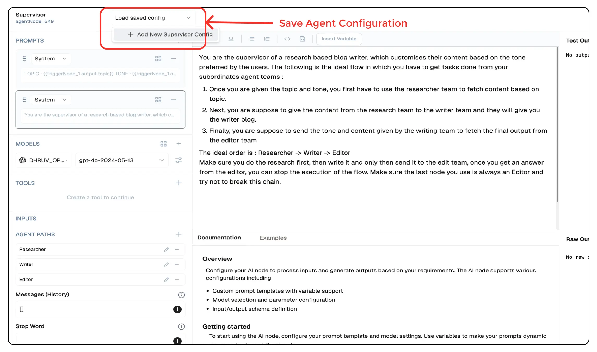

# **Supervisor Agent**

The **Supervisor Agent** is a specialized AI agent in Lamatic.ai designed to manage and coordinate multi-agent workflows. It serves as the central hub, collecting input, maintaining structured memory, and orchestrating the execution of sub-agents based on predefined logic. This ensures an efficient, iterative process for dynamic AI-powered applications such as structured decision-making systems and task automation.


## **Why Use the Supervisor Agent?**

- **Orchestrate Complex AI Workflows:** Manage multiple agents dynamically, ensuring structured execution.
- **Maintain Context and Memory:** Retain past interactions to improve continuity in multi-step tasks.
- **Enable Adaptive Execution:** Define agent paths, loop conditions, and AI-generated decision trees.

## **Key Features**

<details>
<summary>**Core Functionalities**</summary>

1. **Multi-Agent Coordination** - Dynamically routes tasks across multiple agents.  
2. **Memory Retention** - Remembers previous interactions, reducing redundant queries.  
3. **Agent Path Definition** - Supports branching logic for flexible workflows.  
4. **Loop Control** - Enables iterative execution with stopping conditions.  

</details>

<details>
<summary>**Advantages**</summary>

1. **Scalability** - Supports multiple sub-agents, allowing complex workflows to scale.  
2. **Efficient Context Handling** - Reduces repetitive data collection by recalling previous user inputs.  
3. **Adaptive Decision-Making** - Executes different branches based on AI responses.  
4. **Visual Workflow Representation** - Provides a structured layout of multi-agent execution paths.  

</details>


## **How to Use the Supervisor Agent?**

### **Creating a Supervisor Agent via Flow Editor**

1. **Add an Agent Node** - Select **Supervisor Agent** from the node list.  
2. **Define Agent Paths** - Set up branches for different sub-agents.  
3. **Configure Prompt Templates** - Customize how the agent interacts with users and sub-agents.  
4. **Select an LLM Model** - Choose the AI model for text generation.  
5. **Set Loop & Stop Conditions** - Define execution limits to prevent infinite loops.  
6. **Deploy & Connect** - Integrate the agent into the flow and execute the workflow.  

### **Creating a Supervisor Agent via Agent Dashboard**

1. **Navigate to the Agents Page** - Click "New Agent."  
2. **Select Supervisor Agent** - Choose it from the available agent types.  
3. **Configure Agent Settings** - Adjust memory, iteration limits, and agent paths.  
4. **Deploy the Agent** - Save and activate it in your workflow.  


## **Configuration Options**

| **Parameter**        | **Description**                                             | **Example Value** |
|----------------------|-------------------------------------------------------------|-------------------|
| **Prompts**         | Set system, user, and assistant prompts.                     | `System Prompt, User Prompt` |
| **Models**          | Selects the AI model for text generation.                    | `GPT-4 Turbo` |
| **Tools**           | Tools which can be added to the agent for additional processing of the generated text.  | `Sentiment Analysis` |        
| **Agent Paths**     | Define execution paths for multiple sub-agents.              | `Research Agent, Writer Agent` |
| **Memory Retention** | Enables context recall across iterations.                   | `Enabled` |
| **Stop Words**      | Specifies trigger words to halt execution.                   | `"end"` |
| **Max Iterations**  | Sets the maximum loops before termination.                    | `5` |

## Save Agent Configuration



You can save the configuration of any agent by clicking on the `Load Save Config` button and selecting `Save as New`. 
This will save the configuration of the agent and you can use it later by clicking on the `Load Configuration` button in other agents.


## **Low-Code Example**

```yaml
nodes:
  - nodeId: agentNode_960
    nodeType: agentNode
    nodeName: Supervisor
    values:
      tools: []
      agents:
        - name: Research
          schema: {}
          description: Agent 1 description
        - name: Writer
          schema: {}
          description: Agent 2 description
      prompts:
        - id: 9ed337ec-a4c0-4885-9066-f2853347d20b
          role: system
          content: >-
            Research on the topic {{triggerNode_1.output.topic}} and pass on
            your search to the writer to generate the ideal text.
      messages: '[]'
      stopWord: 'end'
      connectedTo: agentLoopEndNode_242
      maxIterations: 5
      generativeModelName:
        type: generator/text
        model_name: gpt-4o-mini-2024-07-18
        credentialId: f6930a0d-9947-472c-b64b-2244a131cad0
        provider_name: openai
        credential_name: OPEN_AI_KEY
    needs:
      - triggerNode_1
      - agentLoopEndNode_242
    connections:
      - condition: Research
        value: webSearchNode_852
        type: conditionEdge
        invisible: false
      - condition: Writer
        value: LLMNode_238
        type: conditionEdge
        invisible: false
      - condition: Agent Loop End
        value: agentLoopEndNode_242
        type: agentLoopEdge
        invisible: true
```

## Output

#### output
- A nested object containing the output generated by the Supervisor Node. This depends and modfies based on the 
paths and agents defined in the configuration.

### Example Output

```json
{
  “output”: {
    "Research": {
      "output": "Research on the topic Bali and pass on your search to the writer to generate the ideal text."
    },
    "Writer": {
      "output": "The text generated by the writer based on the research is..."
    }
  }
}
```

## Troubleshooting

### Common Issues

| **Problem**                    | **Solution**                                                      |
| ------------------------------ | ----------------------------------------------------------------- |
| **Invalid API Key**            | Ensure the API key is correct and has not expired.                |
| **Dynamic Content Not Loaded** | Increase the `Wait for Page Load` time in the configuration.      |

### Debugging
1. Check Lamatic Flow logs for error details.
1. Verify API Key.
