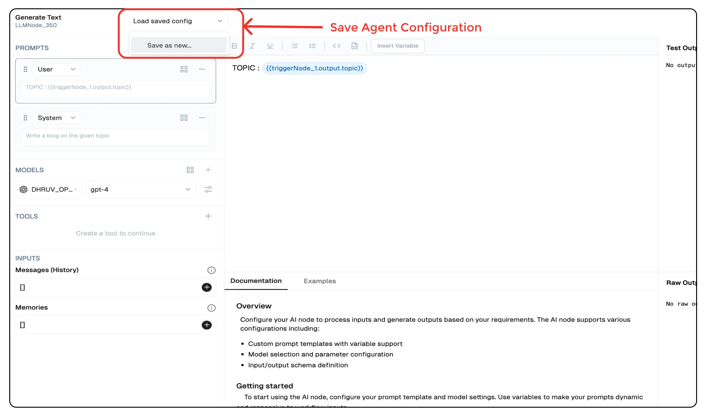

# **Text Agent**

The **Text Agent** is a generative AI agent that enables users to programmatically create text-based outputs using prompts and selected LLMs. It is ideal for applications requiring dynamic content generation, such as chatbots, content creation, automated reporting, and structured AI responses.


## **Why Use the Text Agent?**

- **AI-Powered Content Generation:** Automate text creation for various use cases.
- **Customizable AI Responses:** Define system and user prompts for precise output.
- **Flexible Model Selection:** Choose from different LLM providers based on your needs.
- **Seamless Integration:** Connect with workflows for automated processing.


## **Key Features**

<details>
<summary>**Core Functionalities**</summary>

1. **Generative Model Selection** – Choose from multiple LLM providers and configure API credentials.  
2. **Customizable Prompts** – Define user and system prompts for tailored AI responses.  
3. **System Prompt Definition** – Guide AI behavior with context-aware instructions.  
4. **Advanced Properties Management** – Fine-tune outputs with additional configuration options.  

</details>

<details>
<summary>**Advantages**</summary>

1. **Flexibility** – Supports multiple LLMs, enabling diverse AI-powered applications.  
2. **User-Friendly Interface** – Easily configure prompt settings for quick deployment.  
3. **Enhanced Control** – Customize AI behavior through structured prompt templates.  
4. **Scalability** – Reuse and adapt prompt templates for various workflows.  

</details>


## **What Can I Build?**

- **Automated Content Generation** – AI-powered writing for blogs, social media, and marketing.  
- **Chatbots & Virtual Assistants** – Dynamic, context-aware conversational agents.  
- **Automated Reports & Summaries** – AI-driven data analysis and business intelligence reporting.  
- **Email & Message Drafting** – Smart communication tools for efficiency and personalization.  


## **How to Use the Text Agent?**

### **Creating a Text Agent via Flow Editor**
1. **Add a Text Agent Node** – Select the **Text Agent** from the node list.  
2. **Configure Prompts** – Define system-level and user prompts.  
3. **Select an LLM Model** – Choose an AI model for text generation.  
4. **Customize Output Settings** – Adjust properties for response formatting.  
5. **Connect & Deploy** – Integrate the Text Agent into your workflow and execute.  

### **Creating a Text Agent via Agent Dashboard**
1. **Go to the Agents Page** – Click **New Agent**.  
2. **Choose Text Agent** – Select from available agent types.  
3. **Configure Model & Prompts** – Set up LLM credentials and prompt templates.  
4. **Deploy & Integrate** – Save and start using the agent in your application.  


## **Configuration Options**

| **Parameter**             | **Description**                                                                                                | **Example Value** |
|---------------------------|----------------------------------------------------------------------------------------------------------------|-------------------------------|
| **Prompts**               | Define the prompts for system, user and assistant to be used for the LLM                                        | `System Prompt, User Prompt` | 
| **Models**                | Selects the AI model for text generation.                                                                       | `GPT-4 Turbo` |
| **Tools**                 | Tools which can be added to the agent for additional processing of the generated text.                         | `Sentiment Analysis` |            
| **Messages**              | System messages to guide the agent's behavior.                                                                 | `[{'user' : 'give me a write up for the topic : Claude vs GPT 4'}]` |
| **Memory**                | Retains context across iterations.                                                                             | `[{'sessionID' : '1234','context' : 'Claude vs GPT 4'}]` |

## Save Agent Configuration



You can save the configuration of any agent by clicking on the `Load Save Config` button and selecting `Save as New`. 
This will save the configuration of the agent and you can use it later by clicking on the `Load Configuration` button in other agents.

## Output

#### `_meta`
- A nested object containing metadata about the processing of the text generation request.

  - **`prompt_tokens`**: Number of tokens in the input prompt.
  - **`completion_tokens`**: Number of tokens in the generated output.
  - **`total_tokens`**: Sum of `prompt_tokens` and `completion_tokens`.

  - **`prompt_tokens_details`**: Breakdown of token usage in the prompt.
    - **`cached_tokens`**: Tokens reused from cache.
    - **`audio_tokens`**: Tokens from audio input (if applicable).

  - **`completion_tokens_details`**: Breakdown of token usage in the generated output.
    - **`reasoning_tokens`**: Tokens used for reasoning.
    - **`audio_tokens`**: Tokens from audio output (if applicable).
    - **`accepted_prediction_tokens`**: Tokens from accepted predictions.
    - **`rejected_prediction_tokens`**: Tokens from rejected predictions.

  - **`model_name`**: Name of the AI model used for text generation.
  - **`model_provider`**: The provider or organization supplying the model.

#### `generatedResponse`
- A string containing the text output generated by the model based on the input prompt.


### Example Output

```json
{
    "_meta": {
      "prompt_tokens": 19,
      "completion_tokens": 212,
      "total_tokens": 231,
      "prompt_tokens_details": {
        "cached_tokens": 0,
        "audio_tokens": 0
      },
      "completion_tokens_details": {
        "reasoning_tokens": 0,
        "audio_tokens": 0,
        "accepted_prediction_tokens": 0,
        "rejected_prediction_tokens": 0
      },
      "model_name": "gpt-4-turbo",
      "model_provider": "openai"
    },
    "generatedResponse": "Response"
  }
```

## Troubleshooting

### Common Issues

| **Problem**                    | **Solution**                                                      |
| ------------------------------ | ----------------------------------------------------------------- |
| **Invalid API Key**            | Ensure the API key is correct and has not expired.                |
| **Dynamic Content Not Loaded** | Increase the `Wait for Page Load` time in the configuration.      |

### Debugging
1. Check Lamatic Flow logs for error details.
1. Verify API Key.