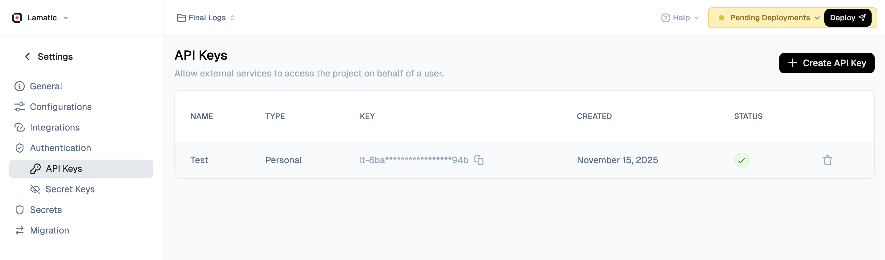

# API Keys

Lamatic uses API keys to authenticate access to its services. There are two types of API keys, each scoped to a different part of the platform.

## Project API Key

To ensure secure access to our platform, Lamatic.ai employs API keys for authentication. When triggering flows via GraphQL, you'll need to include your API key in the request headers. This key serves as a unique identifier, granting you authorized access to our services while maintaining the integrity and confidentiality of your data.



### How to Get the Project API Key

Follow these steps to create and retrieve your API key:

1. **Navigate to Studio**: Open your Lamatic.ai Studio
2. **Go to Settings**: Click on **Settings** in the navigation menu
3. **Access API Keys**: Select **API Keys** from the settings options
4. **Create New Key**: Click the **Create a New API Key** button
5. **Copy Your Key**: Once created, copy your API key immediately (you won't be able to see it again)

<Callout type="warning">
**Important**: Store your API key securely. If you lose it, you'll need to create a new one. After creating a new API key, make sure to redeploy your project for the changes to take effect.
</Callout>

### Using the Project API Key

Include your API key in the `Authorization` header of all GraphQL requests using the Bearer token format:

```js
Authorization: Bearer your_api_key
```

By including the API key in the `Authorization` header, our platform can verify your identity and grant you access to trigger the desired flow.

## Network and firewall configuration

If your application environment, API gateway, or webhook receiver uses IP-based access controls, review [IP Allowlisting](/docs/whitelist-ip) to allow Lamatic traffic before moving to production.

### Next Steps

Now that you have your API key, you're ready to integrate Lamatic.ai into your application. Check out our [Integration Guide](/docs/sdk/integration-guide) for step-by-step instructions and code examples in JavaScript, Python, and cURL.

## Enterprise API Key

The Enterprise (org-level) API key (`lt-org-...`) is used for managing your Lamatic organization via the Enterprise API. It gives access to:

- Managing projects (create, delete, deploy)
- Managing flows (create, update, delete)
- Managing credentials (model keys, integrations)
- Managing contexts and deployments
- Listing resources across your org — and much more

## When to use which

|                  | Project API Key                          | Enterprise API Key                                |
| ---------------- | ---------------------------------------- | ------------------------------------------------- |
| **Scope**        | Single project                           | Entire organization                               |
| **Prefix**       | `lt-...`                                 | `lt-org-...`                                      |
| **Use case**     | Trigger deployed flows from your app     | Manage org-level resources programmatically       |
| **Where to get** | Studio → Project Settings → API Keys     | In Enterprise plan                                |
