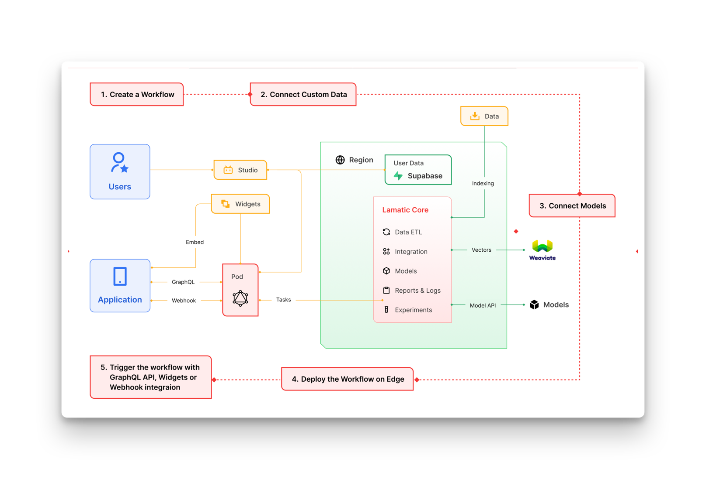

# Architecture
<Callout>
Lamatic was designed with redundancy and scalability in mind. The architecture is divided into different layers that work together to provide a seamless experience to the users.
Its designed such that even if our main system fails, it wont still affect your deployed applications and APIs.
</Callout>

## Execution Steps
These following steps highlight the typical execution of steps involved in building and deploying project on Lamatic.ai
<Steps>
    ### User Creates a flow
    Create flow by connecting required nodes to achieve the desired output.
    ### Connecting custom data and apps
    Integrate your data sources for custom data and apps within your flow.
    ### Connect models
    Add model credentials to your flow.
    ### Deploy the flow on Edge
    Triggering deployment compiles the  whole  worlfow and deploys it on the edge. This is a locked in state of your project which is isolated from lamatic studio and platform.
    ### Trigger the Flow with GrapgQL  API, widgets or webhooks
    Integrate with method of your choice to trigger the flow.
</Steps>
### Privacy and on premise hosting

    The green shaded area is where the private  information of organisation is stored and processed. Lamatic can be customized
    to host this data on premise or on a private cloud. This ensures that the data is not shared with any third party and is
    completely secure.

## Layers

Different parts of lamatic could be easily understood through the following different layers -

### Integration

This layer integrates third-party applications with Lamatic.ai, which is accessible in the following ways:

- **Apps** - Connect 3rd party apps to trigger flows and receive the response directly within the application.
- **Widgets** - Customizable pre-built components that you can drop into your applications (e.g., chat widget).
- **GraphQL API** - User-specific Schema API that performs different operations. This includes GraphQL object caching on the edge for faster response to repeated requests.
- **Webhooks** - Trigger flows using webhooks and receive an asynchronous response in your application.

### Studio

This is the Visual layer on top of Core. Lamatic Studio allows non-technical users to configure, monitor, and maintain system operation and flows.

- **IAM** - Manage external API keys for your development team.
- **Dashboard** - Complete overview of operating metrics for your active projects.
- **Cache Control** - Control the cache (semantic and vector) to your specification and performance goals.
- **Format** - Specify the format of query responses based on your data structure.
- **Logs** - Log all incoming requests and query them for analysis.
- **Quality** - Manage the quality of the return output.
- **Agents** - Use our library of agents for specific tasks or create your own agents using custom prompts.
- **Flow Management** - Manage complex flows (i.e., series of Agents) collaborating to complete tasks. You can also integrate apps to perform actions or fetch information.
- **Experiments** - Set up A/B tests and experiments that help you evaluate the best model, prompts, and agents.
- **Fallback** - Set up failover models.
- **Predictions** - Cost predictions based on consumption.
- **Subscription** - Manage your model subscriptions in one place.

### Managed Infrastructure

Lamatic's managed infrastructure hosts everything required for a performant application including edge deployed functions and cluster nodes that autoscales according to customer demands.
### Data ETL

Hosted vector database that includes ETL pipeline to integrate data from third party sources and transform them into vectors for use in RAG use cases.
### Core

Here’s the text with the main headings converted to bold:

This holds all the code logic that enables the reliable execution of our GraphQL API.

- **Request Monitoring** - Monitors and authenticates incoming requests.
- **Cache** - Semantic caching modules based on query vectors.
- **Query Controls** - Maps the right data along with Object Retrieval for downstream queries. Includes checking JSON format for response validation and quality control. Optionally could be used for privacy data filtering and redaction.
- **Agents** - Setup prompts and conditions to pass to models.
- **Flows** - Organize Agents into a flow chain to perform specific tasks.
- **Memory** - Memory for Chatbots and context-related queries.
- **A/B Module** - Perform optimization across Agents, Rules, and Models.
- **Model Relay** - Managed connections across multiple models.

### Model Integration

Integration with third-party models and APIs.

## Architecture  Diagram
We have this interative Miro board that explains the architecture of Lamatic.ai in detail and is continously updated. Please feel free to check it out and drop any comments.

<iframe width="768" height="432" src="https://miro.com/app/live-embed/uXjVKlDyfYc=/?moveToViewport=-952,-3613,1893,1265&embedId=116751400693" frameborder="0" scrolling="no" allow="fullscreen; clipboard-read; clipboard-write" allowFullScreen></iframe>