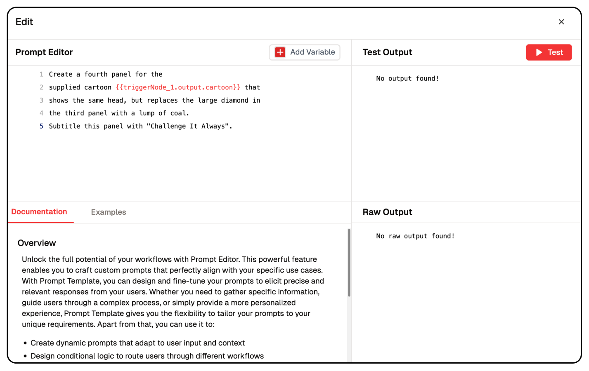

# LLM Prompting Techniques

## What are LLMs?
Large Language Models (like Claude) are AI systems that understand and generate text. How you ask questions matters a lot for getting good answers!

## Effective Ways to Talk to AI

### 1. Direct Questions (Zero-Shot)
Just ask plainly what you want.

**Example:**
```
Summarize this paragraph about climate change: [your text here]
```

### 2. Show Examples First (Few-Shot)
Give examples of what you want before asking.

**Example:**
```
Change these to past tense:

"I walk" → "I walked"
"She runs" → "She ran"

Now change: "They build sandcastles"
```

### 3. Step-by-Step Thinking (Chain-of-Thought)
Ask the AI to solve problems one step at a time.

**Example:**
```
If a $50 shirt is 30% off, then has another 15% discount, what's the final price? Think step by step.
```

### 4. Multiple Solutions Approach
Ask for several answers to pick the best one.

**Example:**
```
Solve this math problem three different ways, then tell me which is right: [problem]
```

### 5. Role-Playing
Ask the AI to pretend to be someone specific.

**Example:**
```
As an experienced data scientist, explain how to handle imbalanced datasets to a beginner.
```

### 6. Using Templates
Create a fill-in-the-blank structure.

**Example:**
```
Article Title: [topic]
Audience: [who]
Tone: [style]
Word Count: [length]

Write a blog post following this plan.
```

### 7. Clear Instructions
Give numbered or step-by-step directions.

**Example:**
```
Write a product description for headphones. Please:
1. Start with a catchy headline
2. List 3-5 key features
3. End with a call-to-action
4. Keep it under 200 words
```

### 8. Define Who's Talking to Who
Set up both the AI's role and the audience.

**Example:**
```
You're a financial advisor talking to a 28-year-old who just got promoted. Give them financial advice.
```

### 9. Set Clear Boundaries
Define what you do and don't want.

**Example:**
```
Write a short story about friendship with these rules:
- Max 250 words
- Post-apocalyptic setting
- No human characters
- End on a positive note
```

### 10. Request Specific Formats
Ask for information organized in a particular way.

**Example:**
```
Analyze renewable energy and present it like this:

Introduction: (brief overview)

Strengths:
- [point 1]
- [point 2]

Weaknesses:
- [point 1]
- [point 2]

Conclusion: (summary)
```

## Lamatic Prompt Editor

In Lamatic Studio, you can implement different types of prompts with Dynamic variables.

## Tips for Better Results

1. Be specific about what you want
2. Give helpful background information
3. Organize your request clearly
4. Try again with changes if needed
5. Say how long or short you want the answer
6. Mention what writing style you prefer
7. Use markers like quotes or brackets to separate parts of your request