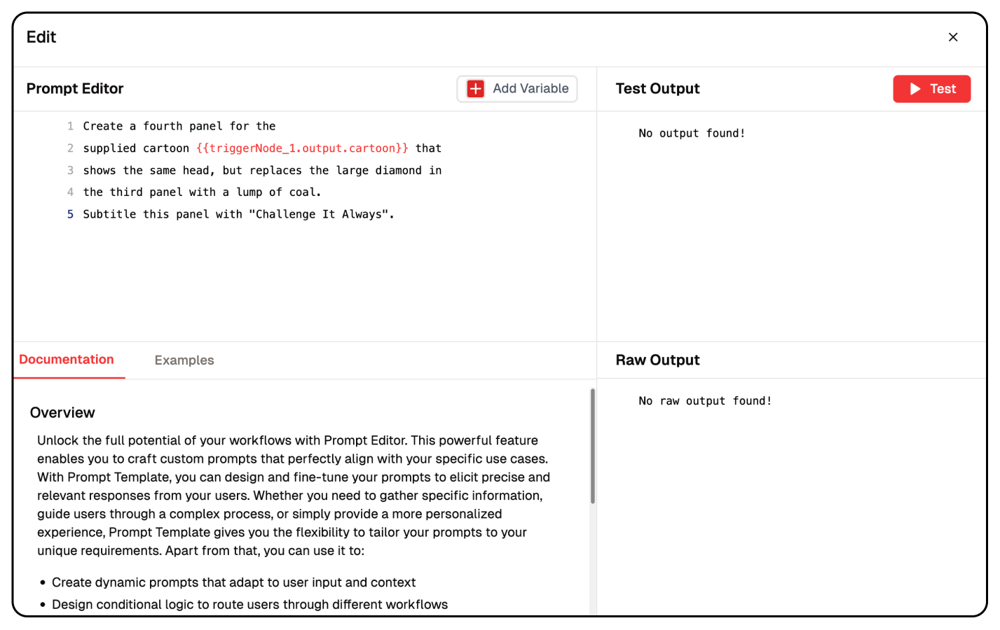

Prompting quality directly affects output quality. This page covers practical prompting patterns you can use in Lamatic agents and flows.

## Core Prompting Techniques

### Zero-shot prompting
Ask the model to perform a task with no examples.

```text
Summarize this paragraph in 3 bullet points for a product manager.
```

### Few-shot prompting
Provide 1-3 examples to lock in structure and style.

```text
Input: "I walk to the store."
Output: "I walked to the store."

Input: "She runs every morning."
Output: "She ran every morning."

Input: "They build sandcastles at the beach."
Output:
```

### Role-based prompting
Set a role so the response matches a specific perspective.

```text
You are a senior data engineer. Explain this pipeline issue to a junior developer.
```

### Constraint-based prompting
Define length, tone, and required content to reduce ambiguity.

```text
Write a release note in under 120 words.
Include: one user benefit, one technical detail, one next step.
Tone: clear and professional.
```

### Structured output prompting
Force a predictable output shape for downstream nodes.

```text
Return JSON with keys: summary, risks, actions.
No markdown. No extra keys.
```

## Use Prompting in Lamatic

Use prompting patterns in model, agent, and evaluation nodes to improve consistency.

<Frame>
  
</Frame>

## Best Practices

1. State the task clearly.
2. Add context the model needs.
3. Specify output format early.
4. Add constraints for length and tone.
5. Iterate prompts with real test inputs.
