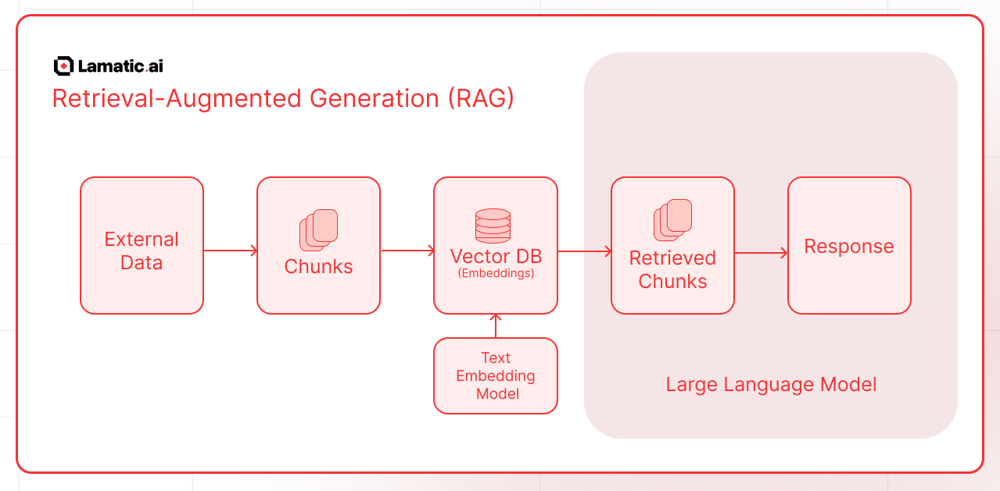

# What is Retrieval-Augmented Generation (RAG)?

Retrieval-Augmented Generation (RAG) is an AI framework that enhances the performance of Large Language Models (LLMs) by integrating external information retrieval mechanisms. This approach addresses limitations inherent in LLMs, such as outdated knowledge and potential inaccuracies, by enabling models to access and incorporate up-to-date, relevant data from external sources during the generation process.

 
In a RAG system, when a user poses a query, the model retrieves pertinent documents
or data from designated databases or knowledge bases. The LLM then synthesizes this
retrieved information with its existing knowledge to generate responses that are
more accurate, contextually relevant, and tailored to the user's specific needs.

## Understanding Retrieval-Augmented Generation (RAG)

Retrieval-Augmented Generation (RAG) is an AI framework that enhances Large Language Models (LLMs) by integrating external data retrieval mechanisms. This combination allows for more accurate, up-to-date, and contextually relevant responses. The process involves several key steps:

1. **Data Collection and Chunking**:

   - **External Data Sources**: Gather information from various repositories such as documents, databases, or other structured and unstructured data.
   - **Chunking**: Break down the collected data into smaller, manageable pieces or "chunks" to facilitate efficient retrieval.

2. **Embedding and Storage**:

   - **Text Embedding Model**: Convert each data chunk into numerical representations known as embeddings. These embeddings capture the semantic meaning of the text.
   - **Vector Database**: Store these embeddings in a vector database, enabling rapid similarity searches.

3. **Query Processing and Retrieval**:

   - **User Query**: When a user submits a question or prompt, the system processes this input to understand the intent.
   - **Retrieval**: The system searches the vector database to find embeddings that closely match the user's query, retrieving the most relevant data chunks.

4. **Response Generation**:
   - **Large Language Model (LLM)**: The retrieved information is combined with the user's original query and fed into the LLM.
   - **Augmented Response**: The LLM generates a response that incorporates both its pre-existing knowledge and the newly retrieved external information, ensuring the answer is accurate and contextually relevant.

## Benefits of RAG

- **Accuracy**: By grounding responses in real-time data, RAG reduces the chances of generating incorrect or outdated information.
- **Relevance**: The integration of external data ensures that responses are tailored to the user's specific context and needs.
- **Efficiency**: Utilizing a vector database allows for quick retrieval of pertinent information, enhancing the responsiveness of the system.

## Implementing RAG with Lamatic.ai

Here are the Lamatic.ai Nodes associated with Retrieval-Augmented Generation (RAG):### Lamatic.ai Nodes for Retrieval-Augmented Generation (RAG)

| Node Name               | Description                                                                                                   | Docs                     |
| ----------------------- | ------------------------------------------------------------------------------------------------------------- | ------------------------ |
| **RAG Node**            | Enhances responses from a Language Learning Model (LLM) using Retrieval-Augmented Generation (RAG).           | [View Docs](/docs/nodes/rag-node) |
| **Chunking Node**       | Parses data into manageable chunks for vectorization and semantic retrieval, improving processing efficiency. | [View Docs](/docs/nodes/chunking-node) |
| **Vectorize Node**      | Converts data chunks into numeric vector representations using an embedding model.                            | [View Docs](/docs/nodes/vectorize-node) |
| **Index Node**          | Inserts records into a vector database, enabling fast semantic retrieval.                                     | [View Docs](/docs/nodes/index-node) |
| **Vector Search Node**  | Retrieves information using vector-based search rather than plain text matching.                              | [View Docs](/docs/nodes/vector-search-node) |
| **Hybrid Search Node**  | Embeds vector search within a Lamatic flow, combining multiple retrieval methods.                             | [View Docs](/docs/nodes/hybrid-search-node) |
| **Keyword Search Node** | Searches for specific keywords within a Vector Database.                                                      | [View Docs](/docs/nodes/keyword-search-node) |

## Simple Example 
1. **Create a New Flow** in Lamatic.ai.  
2. **Set up an API Node as the Trigger Node**, allowing data to be passed in the schema.  
3. **Add a Chunking Node** to split the input data into manageable chunks for processing.  
4. **Vectorize the Chunks** using the Vectorize Node to convert them into numerical vector representations.  
5. **Store the Vectorized Data** in a Vector Database using the Index Node for efficient semantic retrieval.  
6. **Use the RAG Node** in your Flow to generate responses from an LLM using Retrieval-Augmented Generation.  
 
You can explore [guides](/guides) on implementing RAG with Google Drive, S3, and other integrations.
