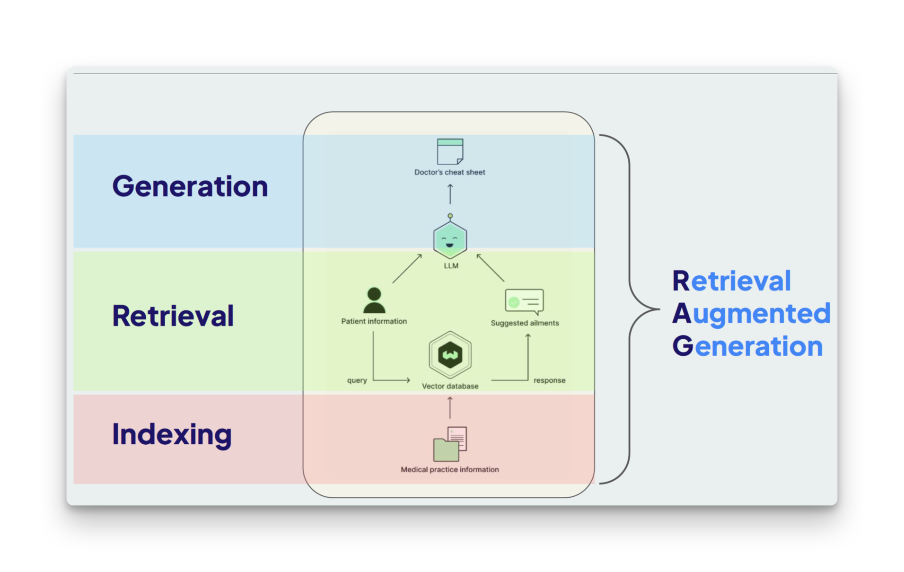

# Context in Lamatic

## Prerequisites

- Basic understanding of [Flows](/docs/flows) and [Nodes](/docs/nodes)
- Understanding of [LLMs](/docs/models) (Large Language Models)
- A Lamatic Project in Studio

## What's Context?

Context refers to additional information provided to a Large Language Model during text generation or chat interactions. This supplementary data enhances the LLM's understanding of the specific topic or task at hand, leading to more accurate and relevant outputs.

<Callout type="info">
**Simple analogy**: If an LLM is a student, context is the textbook or notes you give them. Without context, they can only rely on what they learned during training. With context, they can answer questions about your specific data, company, or use case.
</Callout>

---

### **LLMs Have Limitations:**

1. **Knowledge Cut-off**: LLMs lack real-time access to the most current information.
2. **Limited Access**: Some information may not be publicly available, and thus, not included in the model's training data.
3. **Private Information**: Certain data may be part of confidential interactions with the AI system.

> ⚠️ **Note**: LLMs operate within these limitations, which can affect the quality and relevance of their outputs.

---

### **Benefits of Providing Context:**

- **Improved Understanding**: Additional context helps LLMs better comprehend tasks, resulting in more relevant and accurate responses.
- **Reduced Hallucinations**: By narrowing the scope, LLMs are less likely to generate false or irrelevant information.
- **Enhanced Efficiency**: Context allows LLMs to focus on specific information, leading to faster and more precise responses.

> 💡 **Tip**: Providing context results in higher quality outputs with fewer iterations and less training.

---

## **Methods of Providing Context**

### **Direct Prompt Inclusion**
The simplest method involves incorporating relevant information directly into the prompt. However, this approach has limitations due to LLMs' context limits.

### **Retrieval using Vector Databases**

Vector databases are a powerful solution for context-related challenges in AI. They store and retrieve information based on semantic meaning, allowing for more nuanced and relevant context retrieval.

#### **Understanding Vectors and Vector Databases**

Vectors in this context are mathematical representations of words, phrases, or entire documents. They capture semantic meaning, allowing for comparison and retrieval based on similarity rather than exact matching. Vector databases efficiently store and query these high-dimensional vectors, enabling rapid retrieval of relevant context.

> 📊 **Quick Fact**: Vectors enable semantic searches, making them highly effective for contextual queries.

#### **When to Use Vector Databases**

Vector databases are particularly useful when dealing with large amounts of unstructured data, such as documents, articles, or product descriptions. They excel in scenarios where semantic similarity is more important than exact keyword matching, making them ideal for providing relevant context to LLMs.

> 📝 **Best Practice**: Use vector databases for unstructured data retrieval when accuracy based on meaning is essential.

#### **Lamatic's Built-in Vector Database Powered by Weaviate**

Lamatic integrates **Weaviate**, a powerful vector database, to provide efficient and accurate context retrieval. This integration allows users to leverage the benefits of vector-based search and retrieval without the need for complex setup or management.

> ⚙️ **Pro Tip**: Take advantage of Lamatic’s Weaviate-powered system for easy and precise context management.

---

### **Memories (Beta)**

Memory systems offer another approach to providing context, particularly useful for maintaining continuity in conversations and personalizing interactions over time.

#### **When to Use Memories**

Memories are particularly valuable in scenarios requiring long-term context retention, such as ongoing customer support interactions, personalized tutoring, or any application where user preferences and history play a crucial role in generating appropriate responses.

> 🔄 **Pro Tip**: Use memories for long-term user preferences and ongoing conversations.

#### **Lamatic's Built-in Memories Powered by mem0 ( Beta )**

Lamatic incorporates **mem0**, a cutting-edge memory system, to enhance its context-awareness capabilities. This feature allows the platform to remember and utilize important information across multiple interactions, leading to more personalized and contextually relevant outputs.

> 💡 **Tip**: Leverage mem0 for enhanced personalization and context awareness over time.

---

## **Other Methods**

### **API Calling**

API calling involves retrieving real-time information from external sources to provide up-to-date context. This method is particularly useful when dealing with dynamic data such as weather information, stock prices, or current events.

> 🔗 **Quick Note**: Use API calls to fetch real-time data for the most current context.

---

### **Tools in Agents**

Agent-based systems can utilize various tools to gather and process context. These tools may include web scrapers, database queries, or specialized algorithms that can analyze and summarize large amounts of data to provide relevant context to the LLM.

> 🛠️ **Pro Tip**: Implement agent tools to enhance the breadth and depth of context provided to LLMs.

## Choosing the Right Context Method

| **Method** | **Best For** | **When to Use** |
|------------|--------------|-----------------|
| **Direct Prompt** | Small amounts of static data | Simple use cases, one-time context |
| **Vector Database** | Large documents, semantic search | RAG applications, knowledge bases |
| **Memories** | Long-term user preferences | Chatbots, personalized experiences |
| **API Calling** | Real-time, dynamic data | Weather, stock prices, current events |
| **Agent Tools** | Complex data processing | Multi-step context gathering |

## Troubleshooting

- **Context not being used**: Verify your Flow is passing context to the LLM node correctly
- **Vector search not finding relevant data**: Check that your data was properly chunked and indexed
- **Memory not persisting**: Ensure Memory Store is configured and enabled in your Flow
- **Context too long**: Use chunking or vector search instead of including everything in the prompt

## Next steps

- **Learn about RAG**: Read [What is RAG?](/docs/concepts/rag) for detailed information on Retrieval-Augmented Generation
- **Set up Vector Database**: Follow guides on [Data Storage](/docs/context/vectordb) to index your documents
- **Build a RAG application**: Check out [RAG Tutorials](/guides) for step-by-step examples