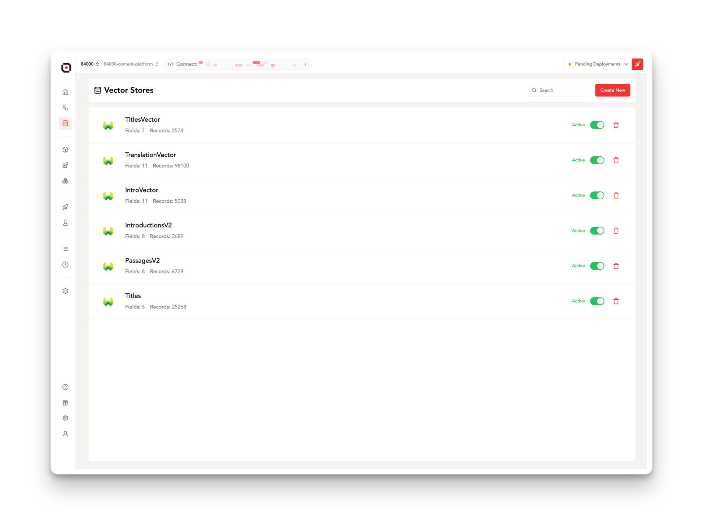
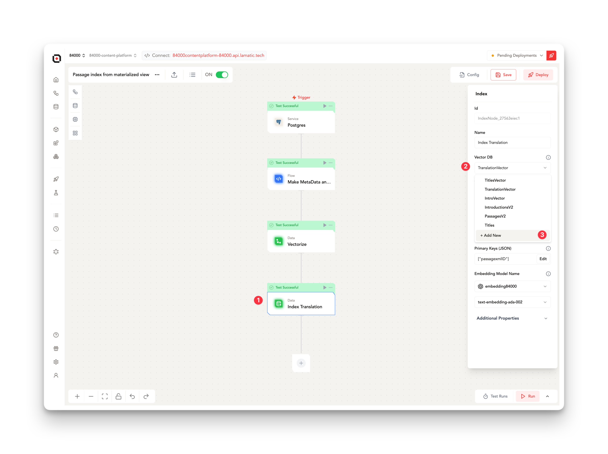
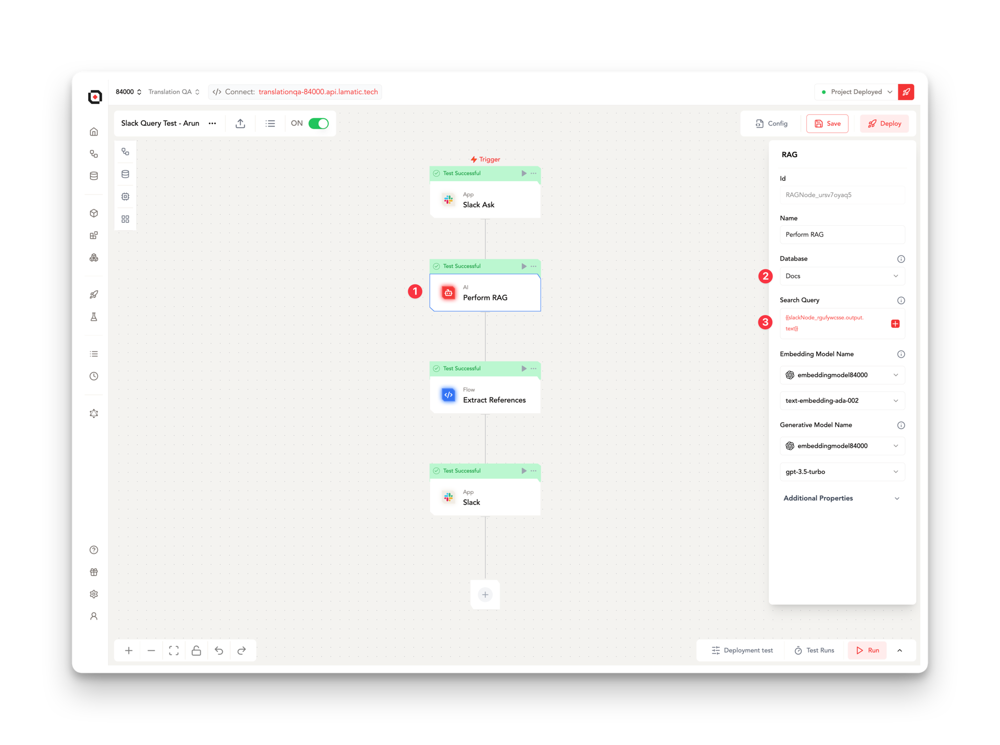
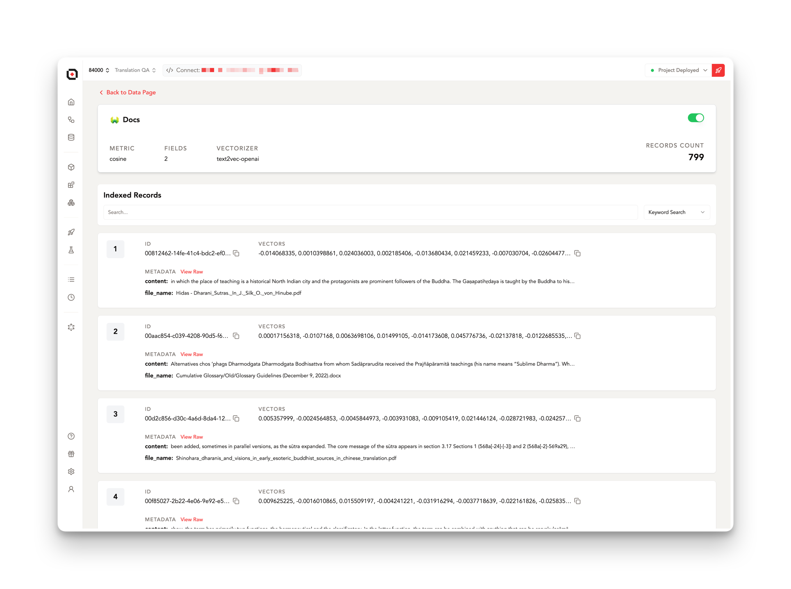
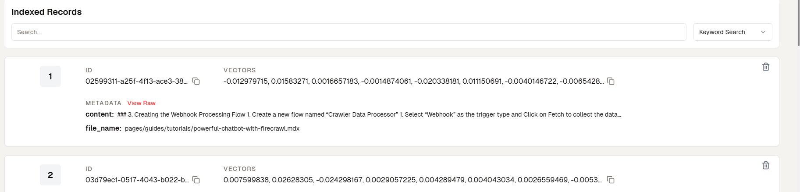

# **Lamatic.ai built in VectorDB**

At the core of many generative AI applications is the ability to store, search, and retrieve semantic vector representations of data. Lamatic.ai provides seamless integration with **Weaviate**, an open-source vector database, allowing you to easily build and scale vector storage for your use cases.

---

## **VectorDB powered by Weaviate**

[Weaviate](https://weaviate.io/developers/weaviate) is a cloud-native, vectorized data storage solution. It allows you to store objects (documents, images, videos, etc.) and their properties in a data schema you define.

The real power comes from Weaviate's ability to store high-dimensional vector embeddings generated from embedding models. These embeddings capture semantic representations, enabling complex filtering, searching, and nearest neighbor queries based on conceptual similarity.

> 💡 **Key Insight**: Weaviate's ability to store vector embeddings makes it perfect for AI use cases involving search and retrieval based on meaning, not just keywords.

---

## **Setting Up VectorDB**

On Lamatic.ai, you can provision a fully managed Weaviate instance with just a few clicks from the **"Vector Stores"** dashboard. Simply provide a name, select your desired configuration, and Lamatic.ai will handle the provisioning and scaling for you.

> ⚙️ **Pro Tip**: Quickly deploy a Weaviate instance and start storing vectors in minutes, without worrying about infrastructure management.

---

## **Data Vectorization**

A key capability is the ability to automatically vectorize your data as it gets loaded into Weaviate. Lamatic.ai supports connecting to and orchestrating different embedding models to generate high-quality vector representations.

- **Pre-trained embeddings**: For common data types like text, images, and audio.
- **Custom embeddings**: Connect your own custom embedding model for specialized needs.

> 🚀 **Quick Tip**: Easily vectorize your data using either pre-trained or custom embeddings, tailored to your specific use case.

---

## **Queries and Retrieval**

With your data vectorized, you can use Weaviate's **GraphQL** interface to run powerful queries combining filters, where clauses, semantic searching, and more. Results are returned ranked by relevance using nearest neighbor search over the vector embeddings.

### **Example Use Cases**:
- Semantic text search over documents or knowledge bases
- Similarity matching for recommendation engines
- Clustering and classification of multimedia data
- Query understanding and intent matching for conversational AI

> 🔍 **Did You Know?**: Lamatic.ai provides a visual query builder and templates, so you can build these queries without dealing with raw GraphQL syntax.

---

## Vector Explorer

[Lamatic.ai](http://Lamatic.ai) offers an intuitive and comprehensive Vector Explorer feature, designed to provide users with a clear view of their vector records. This powerful tool allows you to delve deep into your vector database, offering insights and analysis capabilities that can significantly enhance your understanding of your data.

To access the Vector Explorer, navigate through the following path: Context > VectorDB > [VectorDB]. Here, you'll find a user-friendly interface that displays all the vector objects you've created. This centralized view makes it easy to manage and analyze your vector data efficiently.

One of the key features of the Vector Explorer is its ability to run sample search queries. This functionality allows you to test and refine your search parameters, ensuring that your vector database is performing optimally. As you run these queries, you can examine various similarity scores, which provide valuable insights into how closely different vector objects relate to each other.

The similarity scores are particularly useful for understanding the semantic relationships between your vector objects. By analyzing these scores, you can fine-tune your vector representations, improve your search algorithms, and ultimately enhance the overall performance of your AI applications that rely on this vector data.score.

### Delete record
You can also remove the index by clicking the delete button.

## **Scaling Vector Storage**

Weaviate is a distributed, cloud-native database that can scale horizontally by adding more nodes. Lamatic.ai automatically handles this scaling based on your usage and performance needs.

- **Modular storage backend**: Start with localized storage and seamlessly migrate to remote object stores as your data grows to petabyte scales.

> ⚡ **Scale Effortlessly**: As your data grows, Lamatic.ai automatically scales your vector storage infrastructure to meet demand.

---
