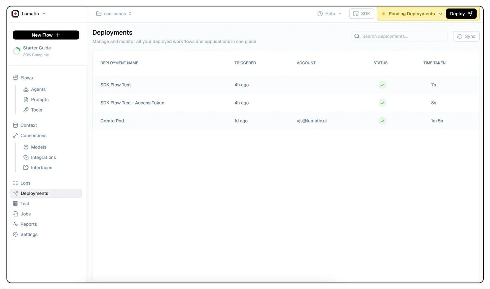

# **Edge Deployment**

[Lamatic.ai](http://Lamatic.ai) seamlessly and automatically deploys your Project to a globally distributed edge network, ensuring exceptional performance, ultra-low latency, and unparalleled scalability. This advanced deployment strategy leverages strategically positioned servers worldwide, bringing your application closer to end-users and significantly reducing response times. By utilizing this cutting-edge infrastructure, [Lamatic.ai](http://Lamatic.ai) empowers your Project to deliver lightning-fast experiences and effortlessly handle varying loads, providing a robust foundation for your application's success in today's competitive digital landscape.

<Callout type="error" emoji="⚠️">
    **Applying changes**  
    When you change any project configuration you also need to redeploy your project to take those into effect.
</Callout>
---

## **What is Edge Deployment?**

Edge deployment is an innovative approach to running applications and services that brings computation closer to the end-users. This method utilizes a network of geographically distributed nodes or servers strategically positioned around the globe. By implementing this decentralized architecture, edge deployment significantly reduces latency and enhances overall performance. The key principle behind this technology is minimizing the distance that data needs to travel between the user and the application, resulting in faster response times and improved user experiences.

> 🌩️ **Built on Cloudflare**: Our cutting-edge infrastructure leverages Enterprise-grade Cloudflare Workers for optimal performance and reliability. For organizations requiring on-premise solutions or custom network deployments tailored to specific needs, we invite you to reach out to our dedicated team at [hello@lamatic.ai](mailto:hello@lamatic.ai). We're here to provide personalized solutions that align with your unique requirements.

---

## **Why Choose Edge Deployment?**

1. **Exceptional Low Latency**: By strategically positioning edge servers in close proximity to end-users, [Lamatic.ai](http://Lamatic.ai) applications achieve remarkably low latency. This proximity ensures lightning-fast response times, resulting in exceptionally snappy and responsive user experiences that keep your audience engaged and satisfied.
2. **Unparalleled Global Availability**: Our extensive global edge network guarantees that your applications remain highly available and performant, regardless of your users' geographic locations. This global reach empowers you to serve a truly international audience without compromising on speed or reliability, opening up new markets and opportunities for your business.
3. **Advanced Serverless Architecture**: [Lamatic.ai](http://Lamatic.ai) projects operate on a cutting-edge serverless architecture, which automatically scales to meet fluctuating demand while optimizing resource utilization. This intelligent system eliminates the need for manual provisioning and scaling of infrastructure, allowing you to focus on developing your application while we handle the complexities of server management.
4. **Intelligent Auto-Scaling Capabilities**: One of the most significant advantages of edge deployment with [Lamatic.ai](http://Lamatic.ai) is its sophisticated automatic scaling feature. As traffic demands fluctuate, our platform dynamically and intelligently adjusts the number of workers running your application. This ensures optimal performance and efficient resource utilization at all times, providing a seamless experience for your users even during unexpected traffic spikes.
5. **Robust Security and Unmatched Reliability**: [Lamatic.ai](http://Lamatic.ai)'s globally distributed network is fortified with advanced security features, including state-of-the-art DDoS protection and a comprehensive Web Application Firewall (WAF). These robust security measures work in tandem to ensure that your applications remain secure and highly available, even when faced with sophisticated malicious attacks or unexpected surges in traffic. Our multi-layered approach to security provides peace of mind, allowing you to focus on your core business objectives.

Whether you're a forward-thinking global enterprise aiming to harness the full potential of GenAI for mission-critical applications, or an ambitious, rapidly growing startup poised to develop the next revolutionary GenAI solution, [Lamatic.ai](http://Lamatic.ai)'s advanced edge deployment capabilities provide the robust, scalable, and secure foundation essential for your success in the competitive digital landscape.

---

### **The Inner Workings of Edge Deployment**

1. **Initiation**: The process begins when you click the `🚀 Deploy` button. This action triggers the system to save your meticulously crafted Flow as a comprehensive LowCode Configuration, capturing all the intricacies of your application design.
2. **Transformation**: The LowCode Configuration undergoes a sophisticated transpilation process, converting it into a highly optimized TypeScript bundle. This bundle is enriched with essential resources, including your specified Model parameters and secure App Credentials, ensuring a complete package for deployment.
3. **Distribution**: The final step involves the seamless deployment of the TypeScript bundle across our expansive, distributed Edge network. This strategic distribution ensures that your application is readily available at numerous points of presence worldwide, primed for high performance and low latency.

> 💡 **Note**: While our advanced systems typically complete this intricate deployment process in less than a minute, please note that during periods of high deployment volume across our platform, the process might require additional time. Rest assured, we're continuously optimizing our systems to maintain the fastest possible deployment times without compromising on quality or security.

---

## **Deployment Logs**

To provide you with full transparency and control over your deployment process, we offer detailed deployment logs. These logs allow you to monitor the entire build process, providing a step-by-step breakdown of each stage. This feature is invaluable for troubleshooting, as it allows you to quickly identify and address any errors or issues that may arise during the build and deployment phases, ensuring smooth and efficient application launches.
