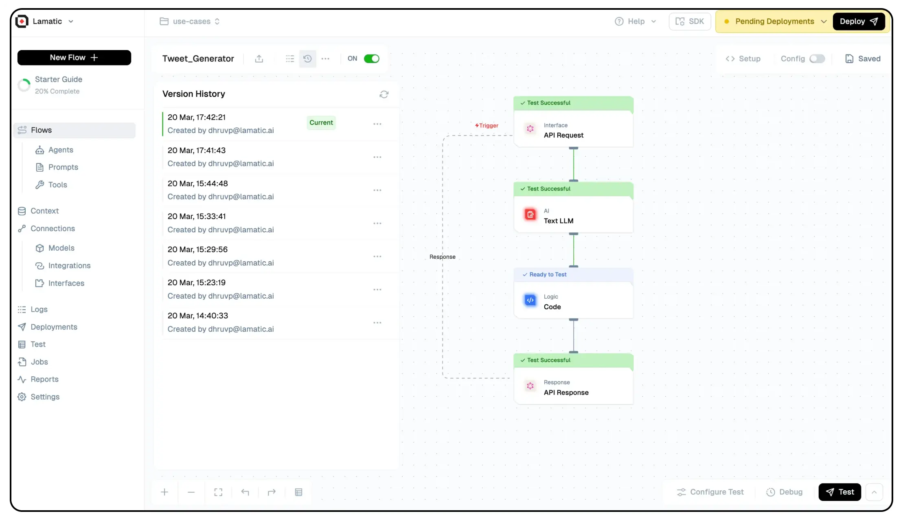
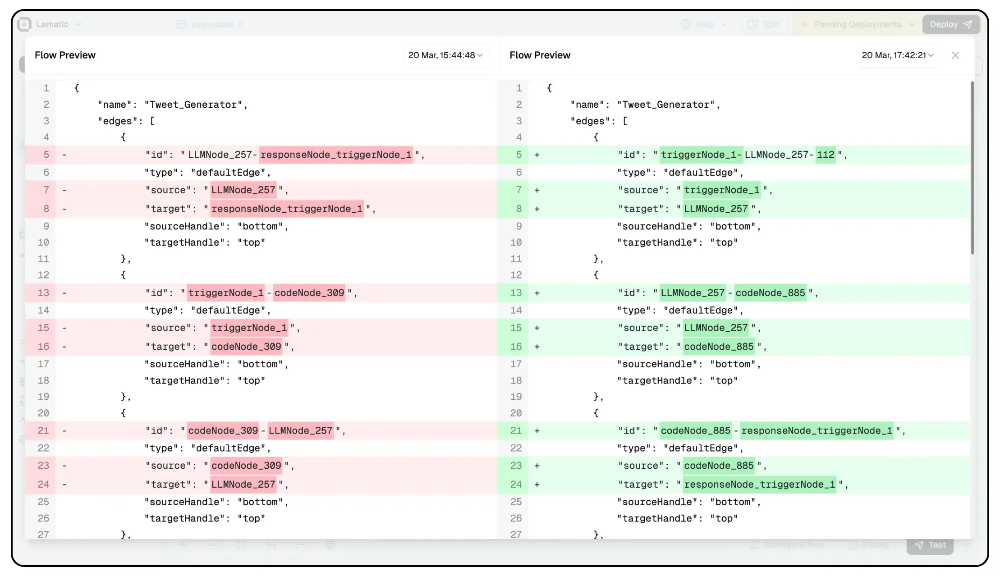

# Version Control in Lamatic AI

Lamatic AI introduces **Version Control**, enabling users to efficiently manage, track, and revert to previous iterations of their workflows. This feature allows for better organization, debugging, and iteration without losing prior configurations.

## Accessing Version Control

1. Navigate to your **Flow Editor**.
2. Click on the **Version History** button.
3. A sidebar will appear, displaying all saved versions of the flow.

### Features in the Version Control Sidebar
- **List of Saved Versions**: Each version is time-stamped and labeled with the creator’s email.
- **Preview Option**: Clicking on the three dots next to any version allows you to preview the exact configuration and logic used.
- **Duplicate Option**: Users can duplicate a previous version to create a new flow based on it.

## Previewing a Previous Version
Clicking **Preview** opens a structured JSON view of the flow’s configuration, helping users compare differences between versions.

### Benefits of Version Control:
- ✅ Quickly revert to a previous stable version.
- ✅ Compare different iterations using JSON previews.
- ✅ Duplicate past versions to create alternative workflows.

This feature enhances flexibility and reliability, making workflow management in Lamatic AI seamless! 🚀