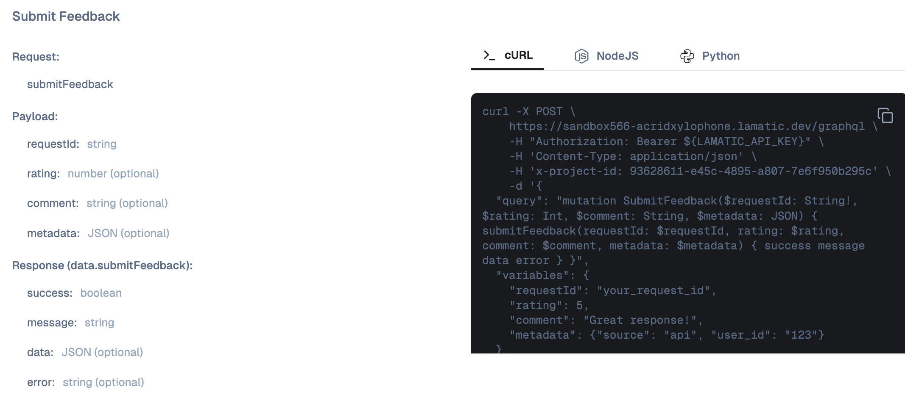

import { Tabs } from "nextra/components";

# Feedback API

The Feedback API allows you to collect user feedback from any flows, specifically GraphQL APIs. This enables you to gather ratings, comments, and metadata about API responses, which can be viewed in the Reports section to improve your AI applications.

## Overview

When executing flows via GraphQL API, you receive a `requestId` in the response. This `requestId` can be used to submit feedback about the flow execution, helping you track user satisfaction and identify areas for improvement.

## Getting the Request ID

After executing a flow via GraphQL API, you'll receive a `requestId` in the response. This unique identifier is used to associate feedback with a specific flow execution.

```json
{
  "data": {
    "executeWorkflow": {
      "requestId": "your_request_id",
      "status": "success",
      "result": { ... }
    }
  }
}
```

## Authentication

To submit feedback, you'll need to include your API key in the request headers:

```
Authorization: Bearer your_api_key
```

You'll also need to include your project ID:

```
x-project-id: your_project_id
```

> Click Here to know how to get your own [API Key](/docs/studio/Project/Settings/keys)

## Submit Feedback

The `submitFeedback` mutation allows you to submit feedback for a specific flow execution.

### Request Parameters

| Parameter | Type | Required | Description |
| --- | --- | --- | --- |
| `requestId` | String | Yes | The unique identifier from the flow execution response |
| `rating` | Int | No | A numeric rating (e.g., 1-5) |
| `comment` | String | No | Text feedback or comments |
| `metadata` | JSON | No | Additional metadata as a JSON object |

### Response Fields

| Field | Type | Description |
| --- | --- | --- |
| `success` | Boolean | Indicates if the feedback was submitted successfully |
| `message` | String | A message describing the result |
| `data` | JSON | Optional additional data |
| `error` | String | Error message if submission failed |

### Code Examples

<Tabs items={['cURL', 'NodeJS', 'Python']}>
  <Tabs.Tab>
    ```bash
    curl -X POST \
      https://sandbox566-acridxylophone.lamatic.dev/graphql \
      -H "Authorization: Bearer ${LAMATIC_API_KEY}" \
      -H 'Content-Type: application/json' \
      -H 'x-project-id: 93628611-e45c-4895-a807-7e6f950b295c' \
      -d '{
        "query": "mutation SubmitFeedback($requestId: String!, $rating: Int, $comment: String, $metadata: JSON) { submitFeedback(requestId: $requestId, rating: $rating, comment: $comment, metadata: $metadata) { success message data error } }",
        "variables": {
          "requestId": "your_request_id",
          "rating": 5,
          "comment": "Great response!",
          "metadata": {
            "source": "api",
            "user_id": "123"
          }
        }
      }'
    ```
  </Tabs.Tab>
  <Tabs.Tab>
    ```javascript
    const axios = require('axios');

    // Export your Lamatic API key as an environment variable
    const lamatic_api_key = process.env.LAMATIC_API_KEY;

    const query = `
      mutation SubmitFeedback(
        $requestId: String!
        $rating: Int
        $comment: String
        $metadata: JSON
      ) {
        submitFeedback(
          requestId: $requestId
          rating: $rating
          comment: $comment
          metadata: $metadata
        ) {
          success
          message
          data
          error
        }
      }
    `;

    const variables = {
      requestId: "your_request_id",
      rating: 5,
      comment: "Great response!",
      metadata: {
        source: "api",
        user_id: "123"
      }
    };

    const options = {
      method: 'POST',
      url: 'YOUR_PROJECT_ENDPOINT',
      headers: {
        Authorization: `Bearer ${lamatic_api_key}`,
        'Content-Type': 'application/json',
        'x-project-id': 'YOUR_PROJECT_ID',
      },
      data: { query, variables }
    };

    axios(options)
      .then(response => console.log(response.data))
      .catch(error => console.error(error));
    ```
  </Tabs.Tab>
  <Tabs.Tab>
    ```python
    import os
    import requests

    # Export your Lamatic API key as an environment variable
    lamatic_api_key = os.getenv('LAMATIC_API_KEY')

    gqlQuery = """
      mutation SubmitFeedback(
        $requestId: String!
        $rating: Int
        $comment: String
        $metadata: JSON
      ) {
        submitFeedback(
          requestId: $requestId
          rating: $rating
          comment: $comment
          metadata: $metadata
        ) {
          success
          message
          data
          error
        }
      }
    """

    variables = {
      "requestId": "your_request_id",
      "rating": 5,
      "comment": "Great response!",
      "metadata": {
        "source": "api",
        "user_id": "123"
      }
    }

    data = {"query": gqlQuery, "variables": variables}

    headers = {
      "Authorization": f"Bearer {lamatic_api_key}",
      "Content-Type": "application/json",
      "x-project-id": "YOUR_PROJECT_ID"
    }

    url = "YOUR_PROJECT_ENDPOINT"

    response = requests.post(url, headers=headers, json=data)

    if response.status_code == 200:
        print(response.json())
    else:
        print(f"Error: {response.status_code}")
        print(response.text)
    ```
  </Tabs.Tab>
</Tabs>

## Response Example

### Success Response

```json
{
  "data": {
    "submitFeedback": {
      "success": true,
      "message": "Feedback submitted successfully",
      "data": null,
      "error": null
    }
  }
}
```

### Error Response

```json
{
  "data": {
    "submitFeedback": {
      "success": false,
      "message": "Failed to submit feedback",
      "data": null,
      "error": "Invalid requestId"
    }
  }
}
```

## Viewing Feedback

After submitting feedback, you can view all collected feedback in the **Reports** section of your Lamatic dashboard. The reports provide insights into:

- User ratings and satisfaction levels
- Comments and textual feedback
- Metadata associated with feedback submissions
- Trends and patterns over time

This data helps you identify areas for improvement and track the quality of your AI applications.

