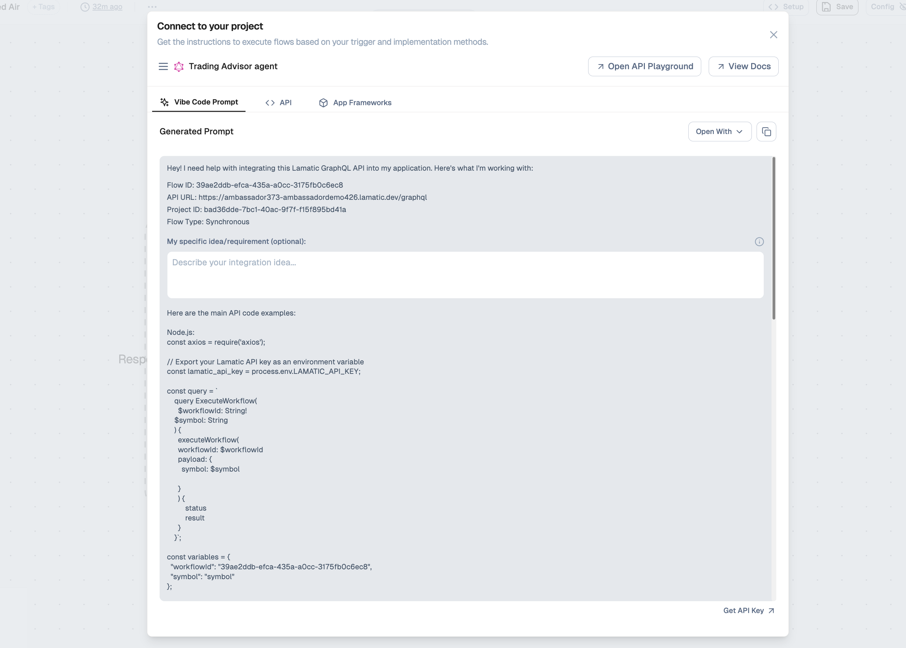
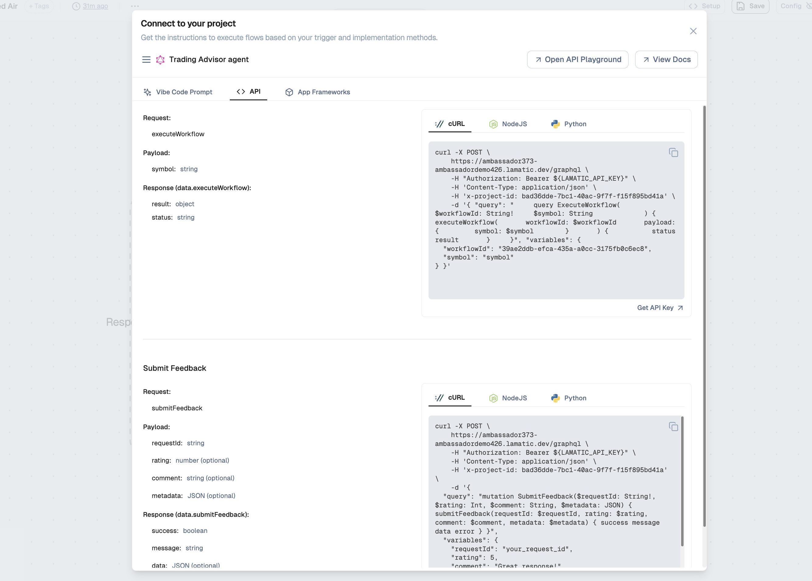
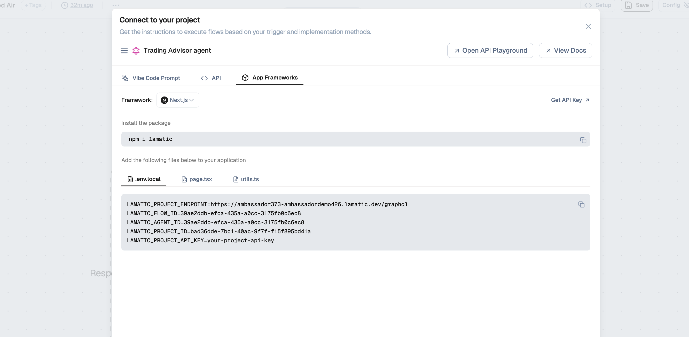

# Flow Integration

Once you've developed your flow along with testing and deployment, you can integrate it into your application. Lamatic provides a **Connect to your project** experience in the Studio that gives you instructions to execute flows based on your trigger and implementation methods.

## Integration checklist

1. **Confirm deployment**: Make sure your latest version of the flow is deployed and passing tests.
2. **Open the Connect modal**: From the flow canvas, click **Connect to your project** to get the endpoint, IDs, and example code.
3. **Choose an integration path**:
   - Use **Vibe Code Prompt** to generate app-specific code via your AI assistant.
   - Use the **API** tab for raw GraphQL requests (see also API Overview and Integration Guide).
   - Use **App Frameworks** for framework-specific snippets (e.g. Next.js + SDK).

## Connect to your project

In the flow editor, use **Connect to your project** to open a modal that shows integration options for the current flow (e.g. your agent or workflow). The modal includes:



- **Open API Playground** — Test the API interactively.
- **View Docs** — Link to full documentation.

You can choose how you want to integrate:

| Tab | Use when |
|-----|----------|
| **Vibe Code Prompt** | You want a ready-made prompt to paste into an AI assistant (e.g. Cursor, ChatGPT) to get integration code. |
| **API** | You want to call the flow via GraphQL from any backend or script (cURL, Node.js, Python, etc.). |
| **App Frameworks** | You are building with a supported framework (e.g. Next.js) and want framework-specific setup and files. |

---

## Vibe Code Prompt

The **Vibe Code Prompt** tab gives you a generated prompt you can copy and use with an AI coding assistant. It includes:

- **Flow ID** — Unique identifier for this flow.
- **API URL** — Your project’s GraphQL endpoint (e.g. `https://<project>.lamatic.dev/graphql`).
- **Project ID** — Your project’s identifier.
- **Flow type** — e.g. Synchronous.

You can optionally add your own integration idea or requirement in the text area. Use **Open With** or the copy button to paste the prompt into your preferred tool and get tailored integration code.

---

## API integration

The **API** tab shows the main operations and code examples for calling your flow from code.



### executeWorkflow

Use this to run the flow with a payload.

- **Payload:** Depends on your flow’s inputs (e.g. `symbol: string`).
- **Response (`data.executeWorkflow`):** `result` (object), `status` (string).

**Example (cURL):**

```bash
curl -X POST "https://<project>.lamatic.dev/graphql" \
  -H "Authorization: Bearer $(LAMATIC_API_KEY)" \
  -H "Content-Type: application/json" \
  -H "x-project-id: <PROJECT_ID>" \
  -d '{
    "query": "query ExecuteWorkflow($workflowId: String!, $symbol: String) { executeWorkflow(workflowId: $workflowId, payload: { symbol: $symbol }) { status result } }",
    "variables": {
      "workflowId": "<FLOW_ID>",
      "symbol": "symbol"
    }
  }'
```

**Example (Node.js):**

```javascript
const axios = require('axios');

// Export your Lamatic API key as an environment variable
const lamatic_api_key = process.env.LAMATIC_API_KEY;

const query = `
  query ExecuteWorkflow($workflowId: String!, $symbol: String) {
    executeWorkflow(workflowId: $workflowId, payload: { symbol: $symbol }) {
      status
      result
    }
  }
`;

const variables = {
  workflowId: "<FLOW_ID>",
  symbol: "symbol"
};

const options = {
  method: 'POST',
  url: process.env.LAMATIC_PROJECT_ENDPOINT,
  headers: {
    'Authorization': `Bearer ${lamatic_api_key}`,
    'Content-Type': 'application/json',
    'x-project-id': process.env.LAMATIC_PROJECT_ID
  },
  data: { query, variables }
};

axios(options)
  .then(response => console.log('Success:', response.data))
  .catch(error => console.error('Error:', error.response?.data || error.message));
```

Replace `<FLOW_ID>`, `<PROJECT_ID>`, and the endpoint with the values from the Connect modal. Get your API key from **Studio → Settings → API Keys** or the **Get API Key** link in the modal. See [API Overview](/docs/api-overview) and [API Keys](/docs/api-integration/api-key) for more.

### submitFeedback

Use this to send feedback for a workflow run (e.g. ratings or comments).

- **Payload:** `requestId` (string, required), `rating` (number, optional), `comment` (string, optional), `metadata` (JSON, optional).
- **Response (`data.submitFeedback`):** `success` (boolean), `message` (string), `data` (JSON, optional).

**Example (cURL):**

```bash
curl -X POST "https://<project>.lamatic.dev/graphql" \
  -H "Authorization: Bearer $(LAMATIC_API_KEY)" \
  -H "Content-Type: application/json" \
  -H "x-project-id: <PROJECT_ID>" \
  -d '{
    "query": "mutation SubmitFeedback($requestId: String!, $rating: Int, $comment: String, $metadata: JSON) { submitFeedback(requestId: $requestId, rating: $rating, comment: $comment, metadata: $metadata) { success message data error } }",
    "variables": {
      "requestId": "your_request_id",
      "rating": 5,
      "comment": "Great response!"
    }
  }'
```

---

## App Frameworks

The **App Frameworks** tab provides framework-specific setup (e.g. **Next.js**). It typically includes:



1. **Install the package** — e.g. `npm i lamatic`.
2. **Add files to your app** — e.g. `.env.local`, a page component, and a `utils` (or similar) file.

### Environment variables

Add the following to `.env.local` (or your framework’s env file), using values from the Connect modal:

```bash
LAMATIC_PROJECT_ENDPOINT=https://<project>.lamatic.dev/graphql
LAMATIC_FLOW_ID=<FLOW_ID>
LAMATIC_AGENT_ID=<AGENT_ID>
LAMATIC_PROJECT_ID=<PROJECT_ID>
LAMATIC_PROJECT_API_KEY=your-project-api-key
```

Replace `your-project-api-key` with your actual API key from **Get API Key** in the modal or from [Studio → Settings → API Keys](/docs/api-integration/api-key).

### Next steps

- Copy the generated **page** and **utils** snippets from the App Frameworks tab into your app.
- Ensure the payload you send matches your flow’s input schema (e.g. required fields like `symbol`).
- For more API details, see [API Overview](/docs/api-overview) and [Integration Guide](/docs/api-integration/integration-guide).
