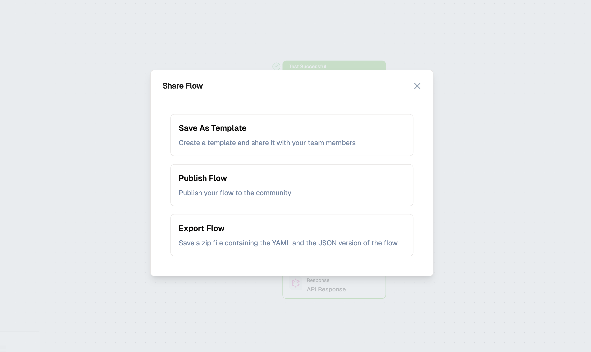

# Lamatic Flows

Flows are the core building blocks of Lamatic, enabling you to connect various modules (nodes) in a meaningful sequence to achieve your desired outcomes. This guide provides a comprehensive overview of understanding and creating flows in Lamatic.

## What are Flows?

Flows are sequences of interconnected nodes that process and transform data. They allow you to build complex automation and data-processing pipelines with ease.

## Creating a Flow

To create a flow:

1. **Select a Trigger Node:** Begin by choosing a trigger node to initiate your flow.
2. **Add Processing Nodes:** Add subsequent nodes that will handle and process your data.
3. **Arrange Nodes:** Drag and place nodes in the desired order to shape your flow.

## Key Components of a Flow

### Trigger Node

A trigger initiates the flow. It can be a built-in tool or an integration with an external application. There are two main trigger types:

- **Event Trigger:** Triggered by a single event, resulting in one-time execution (e.g., a Slack message).
   - **Example:** A new message in a Slack channel starts the flow.

- **Batch Trigger:** Triggered by batch processing, executing the flow multiple times based on the number of items in the batch (e.g., a PostgreSQL sync for new records).
   - **Example:** A database sync that processes 100 new records will run the flow 100 times.

### Action Nodes

Action nodes perform the main operations in your flow, processing data step-by-step based on your configuration.

- **Built-in Tools & Integrations:** Choose from built-in tools like AI nodes or connect with external applications that support similar functionality.
- **Logical Arrangement:** Arrange nodes sequentially to ensure a smooth data-processing pipeline.
- **Parallel Processing (Branch Node):** Use branch nodes to execute nodes in parallel for faster, more efficient flow when applicable.

### Final Node (Response)

The final step of your flow can send output to an external system, which is particularly useful for flows initiated by triggers like Chat or GraphQL API integrations.

## Share Flow

The **Share Flow** feature in Lamatic.ai allows users to collaborate, distribute, and reuse their workflows efficiently. There are three primary ways to share a flow:

### 1. Save As Template
- This option enables users to **create a reusable template** from an existing flow.
- Templates can be **shared with team members** for consistency and easy duplication.
- Ideal for standardizing workflows across an organization.

### 2. Publish Flow
- This option allows users to **publish their flow to the community**.
- By publishing, users can share their work with others, enabling collaboration and reuse.
- Useful for open-source sharing or showcasing best practices.

### 3. Export Flow
- Users can **export their flow as a YAML file**.
- This makes it easy to **backup, transfer, or migrate** workflows.
- Useful for version control and integrating with other systems.

### Use Cases
- **Team Collaboration**: Share standard workflows with colleagues.
- **Knowledge Sharing**: Contribute flows to the community.
- **Backup & Portability**: Save workflows in YAML format for external use.

## How to Access
1. Navigate to your desired flow.
2. Click on the **Share Flow** option.
3. Choose from **Save as Template, Publish Flow, or Export Flow**.

This feature enhances workflow management, enabling better collaboration and efficiency in building AI-powered solutions.

## Best Practices

- **Clear Goal:** Design each flow with a specific objective.
- **Thorough Testing:** Test flows with various input scenarios to validate reliability.
- **Descriptive Naming:** Use descriptive node names to enhance readability.
- **Regular Optimization:** Periodically review and optimize flows to ensure they run efficiently.

By mastering these elements, you’ll be equipped to build robust, efficient flows that streamline and automate complex flows in Lamatic.