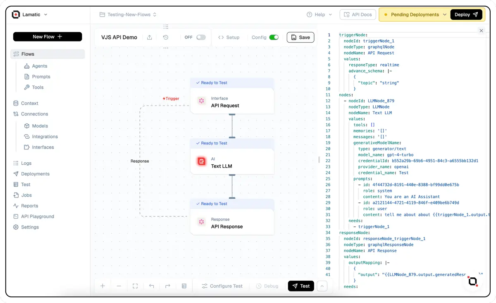

# Flow Config (YAML Format)




At Lamatic.ai, we’ve enhanced our Flow Configuration to use YAML syntax, enabling a clear and organized way to define GenAI workflows. This new structure supports both Low Code and No Code flexibility, allowing users to design and implement flows that meet specific needs efficiently. The YAML configuration is composed of `triggerNode`, `nodes`, and `responseNode`, each playing a distinct role in the workflow setup.

## What is Flow Config?

Flow Config is a way to define, structure, and control GenAI workflows in Lamatic.ai’s platform. It represents each workflow as a series of interconnected components (or nodes) that perform specific tasks, with connections indicating the flow of data or control between these tasks. Using YAML, users can clearly configure these workflows, benefiting both developers seeking fine-tuned control and non-technical users leveraging a simplified, visual interface.

## Key Definitions

| **Parameter**    | **Type**               | **Definition**                                                                                          | **Example**                                                                                                                     |
|------------------|------------------------|---------------------------------------------------------------------------------------------------------|-------------------------------------------------------------------------------------------------------------------------------|
| **nodeId**       | `string`               | A unique identifier for each node in the workflow. It is used to connect nodes and establish dependencies. | `LLMNode_6dek86wu8w`                                                                                                          |
| **nodeType**     | `string`               | The type of node, indicating the functionality or purpose of the node (e.g., `graphqlNode`, `LLMNode`, `branchNode`). | `LLMNode`                                                                                                                     |
| **nodeName**     | `string`               | A human-readable name for the node, helping users understand the node’s role in the workflow.            | `Demo Script Generator`                                                                                                       |
| **values**       | `object`               | A dictionary of key-value pairs that contain specific settings and configurations for the node. Common values include prompts, model details, and mappings. | ```promptTemplate: "{{triggerNode_1.output.input}}", systemPrompt: "AI Assistant", messages: "[]", generativeModel: { provider: "openai", cred: "Gpt-4o", type: "text", id: "afd7b91d", model: "gpt-4o-mini" }``` |
| **needs**        | `array`                | Specifies dependencies, indicating the preceding nodes required for the current node’s operation.        | `[ plus-node-branch-graphqlNode_0gnka1xu15804 ]`                                                                              |

## Different Parts of the Config

### a. `triggerNode`
**What is it?**  
The `triggerNode` is the starting point of the Flow. It initiates the workflow and is generally configured to retrieve or generate initial data. For example, a `graphqlNode` can be used as a triggerNode to pull data from a GraphQL source.

**Syntax and Values:**
```yaml
triggerNode:
  nodeId: triggerNode_1
  nodeType: graphqlNode
  nodeName: API Request
  values:
    advance_schema: |-
      {
        "input": "string"
      }
    responeType: realtime
```
- **nodeId**: Unique identifier for the trigger node.
- **nodeType**: Typically `graphqlNode`, identifying it as a data retrieval point.
- **nodeName**: Descriptive name (e.g., `Graphql`).
- **values**: Settings specific to the trigger node, such as `responseType` and `advance_schema`.

### b. `nodes`
**What is it?**  
The `nodes` section defines each step in the workflow. These nodes perform specific tasks, such as generating content or making decisions. Nodes can be dynamic (e.g., `LLMNode` for language models) or static (e.g., `branchNode` for logic branches).

**Syntax and Values:**
```yaml
nodes:
  - nodeId: LLMNode_187
    nodeType: LLMNode
    nodeName: Text Generate
    values:
      promptTemplate: Prompt Goes here {{triggerNode_1.output.input}}
      systemPrompt: You are an AI Assistant
      messages: '[]'
      generativeModelName:
        provider_name: openai
        credential_name: Gpt-4o Lamatic
        type: generator/text
        credentialId: afd7b91d-1c69-40cd-a9d6-cdca1ac5927a
        model_name: gpt-4o-mini
    needs:
      - triggerNode_1
```
> Note: The `nodes` are indented under the `nodes` key in the YAML configuration one level below the Nodes and there adjacent nodes are listed on same level with `-` prefix.

- **nodeId**: Unique identifier for each node in the nodes list.
- **nodeType**: Indicates the node’s function, like `LLMNode` or `branchNode`.
- **nodeName**: Human-readable name to help identify the node.
- **values**: Contains settings like `promptTemplate` for content generation and `generativeModelName` for AI model selection.
- **needs**: Dependencies specifying prior nodes required for this node’s execution.

**Example of Branching Node:**
```yaml
 - nodeId: branchNode_423
    nodeType: branchNode
    nodeName: Branching
    values:
      branches:
        - label: Branch 1
          value: branchNode_423-addNode_754
        - label: Branch 2
          value: branchNode_423-addNode_151
    needs:
      - LLMNode_187
    branches:
      - label: Branch 1
        value: plus-node-addNode_754941
      - label: Branch 2
        value: plus-node-addNode_151825
```
- **branches**: Lists branching options, each with a label and value that defines the connection to subsequent nodes.

### c. `responseNode`
**What is it?**  
The `responseNode` is the endpoint of the Flow, aggregating and outputting the results from the previous nodes. It often combines results from multiple nodes into a single response format.

**Syntax and Values:**

```yaml
responseNode:
  nodeId: responseNode_triggerNode_1
  nodeType: graphqlResponseNode
  nodeName: API Response
  values:
    outputMapping: |-
      {
        "output": "{{LLMNode_187.output.generatedResponse}}"
      }
  needs:
    - plus-node-addNode_161562
```

- **nodeId**: Unique identifier for the response node.
- **nodeType**: Identifies the node type, commonly `graphqlResponseNode`.
- **values**: Contains `outputMapping`, which organizes outputs from previous nodes.
- **needs**: Lists dependencies, generally the final node or merge nodes that lead into the response node.

Each part of the YAML configuration plays a crucial role in defining, structuring, and executing workflows in a clear and flexible format, enabling both developers and non-technical users to create robust GenAI applications on Lamatic.ai’s platform.

## Common Issues
1. **Missing Fields**: See what nodes are missing required fields and retry after adding them.
2. **Flow Breaking**: Ensure that the flow is logically structured and all dependencies are correctly defined.
