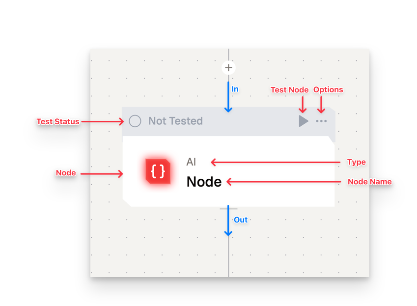

# Nodes in Lamatic

Nodes are the fundamental building blocks of a flow in Lamatic. Each node serves a specific purpose, acting as a self-contained unit that processes input and produces output. This modular approach allows users to create complex flows by interconnecting various nodes.

## Node Categories

Lamatic organizes nodes into four main categories, each with a unique function in building flows:

### 1. Apps

- **Purpose**: Integrate third-party applications into your workflow.
- **Examples**: Slack, PostgreSQL, Google Sheets
- **Method**: These nodes act as bridges, enabling data exchange and action execution between Lamatic and external services.

### 2. AI

- **Purpose**: Perform artificial intelligence operations within your flow.
- **Examples**: Vector operations, text generation, natural language understanding
- **Method**: AI nodes use machine learning models to process and analyze data, allowing for tasks such as sentiment analysis, text classification, or content generation.

### 3. Data

- **Purpose**: Manipulate and transform data within your flow.
- **Examples**: Indexing, chunking, filtering
- **Method**: Data nodes provide tools for structuring, organizing, and processing information, ensuring data is in the right format for subsequent nodes.

### 4. Logic

- **Purpose**: Control the flow of execution in your workflow.
- **Examples**: Conditional statements, loops, custom code execution
- **Method**: Logic nodes allow for decision-making and branching, enabling dynamic, responsive workflows based on specific conditions or criteria.

## Available Nodes
// TODO: Embed Nodes

## Working with Nodes

### Configuring Input Fields

1. Click on the white space of a node to access its configuration panel.
2. Complete the required fields, marked with a red asterisk (*).
3. Configure optional fields based on your specific needs.
4. Ensure all required fields are filled to prevent flow errors.

### Understanding Node States

Nodes in Lamatic have visual indicators representing their current state:

- **Default (Grey)**: The initial state of a newly added node.
    - *Method*: Add the node to your flow, then configure it.
- **Requires Fields (Yellow)**: Indicates missing required fields.
    - *Method*: Review the configuration and complete all fields marked with a red asterisk (*).
- **Error (Red)**: Indicates an issue occurred during the last test run.
    - *Method*: Check the error message, review your configuration, and make necessary adjustments.
- **Success (Green)**: Node is correctly configured and ready for deployment.
    - *Method*: Connect this node to others in your flow or proceed with deployment.

### Working with Node Outputs

1. Each node generates output based on its configuration and input.
2. Output schemas vary depending on the node type and settings.
3. Consult individual node documentation for detailed output information.
4. Use the variable selector tool to understand and work with node outputs effectively.
5. Connect node outputs to subsequent nodes to create a cohesive workflow.

## Best Practices for Node Usage

1. Start with a clear understanding of your workflow requirements.
2. Choose appropriate nodes from each category to build a comprehensive flow.
3. Ensure all nodes are properly configured, with attention to required fields.
4. Regularly test your flow and address any errors or warnings.
5. Leverage diverse node categories to create powerful, automated workflows combining third-party integrations, AI capabilities, data manipulation, and logical operations.