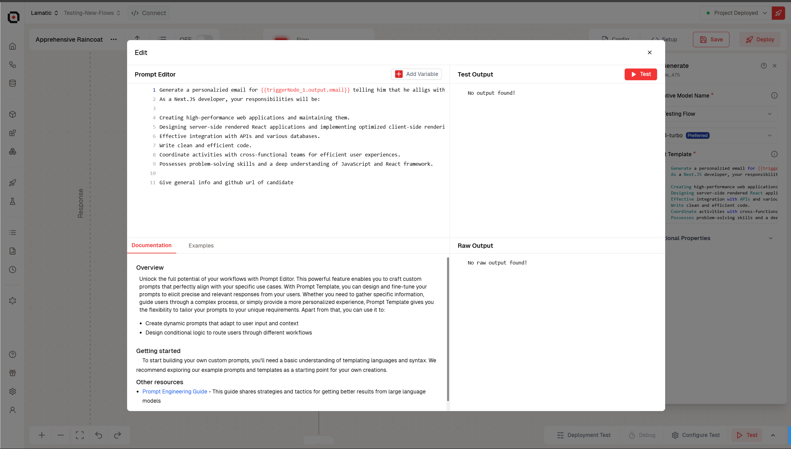

# AI Candidate Screener Guide

> This guide will help you build an AI-powered GitHub profile screening system using Lamatic.ai's flow builder. The system can automatically analyze candidates' GitHub repositories, match their experience and skills against job requirements, and generate personalized email responses - either congratulating qualified candidates for advancing to the next round or providing constructive feedback to those who didn't meet the criteria.

 

## Steps

### 1. Initial Setup for Scrapping Candidate Github

In the First Flow Add the API Request Node


### 2. Set Params for API Request Node

Set the url param in API Request Node


### 3. Search for Scraper Node and Add it


### 4. Select Credentials for the Scrapper Node

If you don't have any saved credentials click on Add Credentials


### 5. Add your firecrawl credentials

Get your API key from https://www.firecrawl.dev/app/api-keys


### 6. Pass the URL to Scraper Node

From the variable selector select the url param which we defined in the API Request Node


### 7. Set the API Response Params


### 8. Pass the Scrapped markdown and html in Response

Respond with the scrapped markdown and html, which can be set using variable selector and selecting response for the scrapped node


### 9. Turn on the flow from the top switch and Deploy the project


### 10. Create a new flow and add an API Request Node in it


### 11. Set the Request Parameters

Set the input params in our case email, aboutYou and githubUrl.


### 12.Search for Execute Flow Node and Add it


### 13. Select the flow which we previously created


### 14. Pass the candidate's githubUrl as the url param for that flow


### 15. Search for Agent Classifier Node and Add it


### 16. Add you AI Provider Credentials


### 17. Set up the prompt with your JD and Candidate Info

Write a prompt as per your needs by mentioning your JD and the candidate's GitHub info, which we obtained by using the execute flow node calling the scraper flow that we previously created.

Sample Prompt:

```
The candidate has filled the about you and why you section for a job recruitment with job description as follows To recruit the best candidates for the Next.js developer’s role, it is vital to adequately list the required experience and duties. The expectations for the given position may vary, as they may be expanded depending on the role, in other words, entry-level, mid-level, or senior Next.js developer’s position. Thus, a precise enumeration of job responsibilities and qualifications will help ensure that the applicants meet the job requirements for the Next.js developer role to a greater extent.

As a Next.JS developer, your responsibilities will be:

Creating high-performance web applications and maintaining them.
Designing server-side rendered React applications and implementing optimized client-side rendering.
Effective integration with APIs and various databases.
Write clean and efficient code.
Coordinate activities with cross-functional teams for efficient user experiences.
Possesses problem-solving skills and a deep understanding of JavaScript and React framework.

Scraping the github of candidate we got : {{flowNode_802.output.flowOutput.markdown}}
The candidate has also filled following details about himself :{{triggerNode_1.output.aboutYou}}
Based on this details and job description classify whether the candidate is potential candidate or not at the moment

```


### 18.Edit Classes for Agent Classifier and a Text Generate Node on both.


### 19. Select Credential for Text Generate and write Prompt based on classification

Sample prompt for Potential Candidate:

```
Generate a personalzied email for {{triggerNode_1.output.email}} telling him that he alligs with our jd and we liked his github Profile
As a Next.JS developer, your responsibilities will be:

Creating high-performance web applications and maintaining them.
Designing server-side rendered React applications and implementing optimized client-side rendering.
Effective integration with APIs and various databases.
Write clean and efficient code.
Coordinate activities with cross-functional teams for efficient user experiences.
Possesses problem-solving skills and a deep understanding of JavaScript and React framework.

```



Sample prompt for Not Potential Candidate:

```
Generate an email for candidate sharing him insights where he lacks based on our jd:
The candidate has filled the about you and why you section for a job recruitment with job description as follows To recruit the best candidates for the Next.js developer’s role, it is vital to adequately list the required experience and duties. The expectations for the given position may vary, as they may be expanded depending on the role, in other words, entry-level, mid-level, or senior Next.js developer’s position. Thus, a precise enumeration of job responsibilities and qualifications will help ensure that the applicants meet the job requirements for the Next.js developer role to a greater extent.

As a Next.JS developer, your responsibilities will be:

Creating high-performance web applications and maintaining them.
Designing server-side rendered React applications and implementing optimized client-side rendering.
Effective integration with APIs and various databases.
Write clean and efficient code.
Coordinate activities with cross-functional teams for efficient user experiences.
Possesses problem-solving skills and a deep understanding of JavaScript and React framework.
His github: {{flowNode_318.output.flowOutput.markdown}} and {{flowNode_318.output.flowOutput.html}}
```


### 20. Add API Node on Both Classification Branches


### 21. Fill the API endpoint where you have business logic for sending mail


### 23.Set the body as per your API Config


### 24. Finally in API Response Node set the Response Params


### 24. Click on Test


### 25. Fill in Sample Input


### 26. Click on Test Again and Wait For Flow To Run


### 28. Finally Turn on the Flow and Deploy the Project
