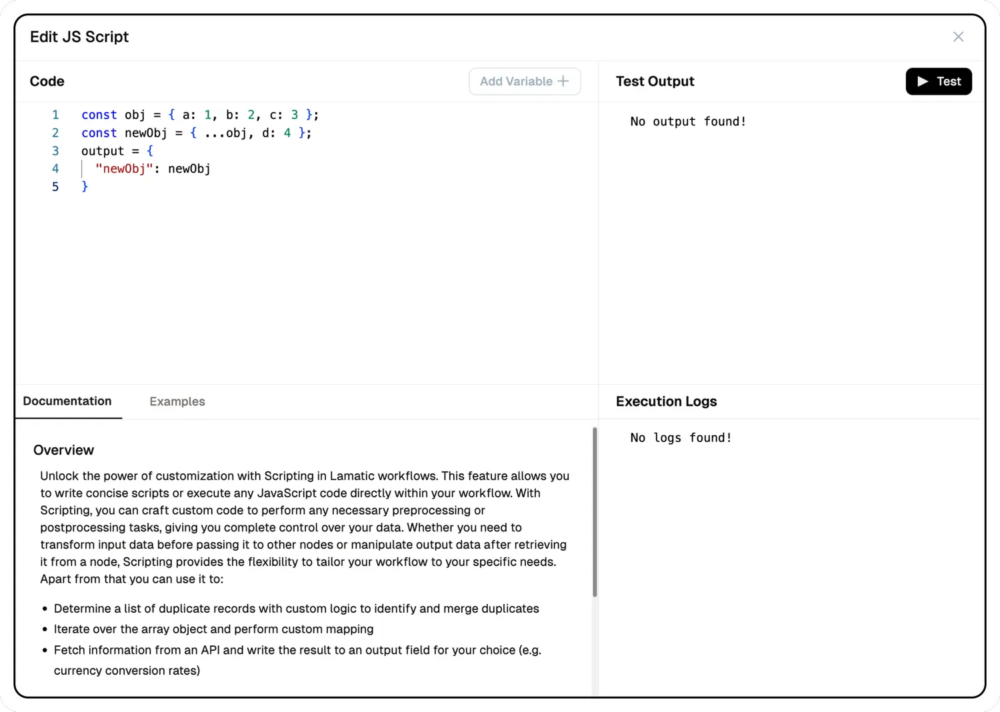

## **Code IDE**

Unlock the power of customization with the **Code IDE** in Lamatic flows. This feature allows you to write concise scripts or execute any JavaScript code directly within your flow. Whether you need to transform input data, manipulate output data, or perform preprocessing tasks, the Code IDE provides the flexibility to tailor your flow.

### Key capabilities:
- Identify and merge duplicate records with custom logic
- Iterate over array objects and apply custom mappings or transformations
- Fetch external API data (e.g., currency conversion rates)
- Implement complex business logic and calculations
- Integrate with external libraries and services to extend functionality

## Code Assistant

The **Code Assistant** is an AI-powered helper that guides you through writing efficient JavaScript code in the Code IDE. Instead of starting from scratch, you can leverage the assistant to generate, refine, and optimize your code with intelligent suggestions and real-time assistance.

### Using the Code Assistant

1. **Access the Assistant**: The Code Assistant is available directly in the code editor interface. Look for the "Ask AI..." input field in the editor panel.

2. **Ask for Help**: Type your request or question in the input field. For example:
   - "Create a function to filter and transform an array of objects"
   - "Help me write code to merge duplicate records"
   - "Add error handling to this function"
   - "Explain how this code snippet works"

3. **Use Suggested Options**: The assistant provides quick-action suggestions to help you get started:
   - **Basic function calling**: Generates foundational function structures for common tasks
   - **Add async/await pattern**: Helps you implement asynchronous operations correctly
   - **Create event handler**: Assists with event-driven code patterns
   - **Add input validation**: Suggests validation logic to ensure data integrity

4. **Iterate and Refine**: The assistant can help you refine your code iteratively. After receiving a suggestion, you can ask follow-up questions or request specific modifications.

### Benefits

- **Understands Your Code**: The assistant analyzes your code context and understands what you're trying to accomplish, providing relevant suggestions
- **Suggests Improvements and Fixes**: Receive intelligent recommendations for bug fixes, performance optimizations, and code quality improvements
- **Optimizes Logic and Structure**: Get help refactoring code for better readability, maintainability, and efficiency
- **Explains Snippets and Concepts**: Learn as you code with inline explanations of code snippets, JavaScript concepts, and best practices

The Code Assistant makes JavaScript development more accessible, helping both beginners and experienced developers write high-quality, efficient code in their flows.

> 🚀 **Quick Start**: Start with a basic understanding of JavaScript. The Code IDE offers syntax highlighting, auto-completion, and error checking to assist you in writing efficient code.

### **Other Resources**:
- [MDN JavaScript Guide](https://developer.mozilla.org/en-US/docs/Web/JavaScript/Guide) - A high-level overview of fundamental JavaScript concepts.
- [Codecademy Introduction to JavaScript](https://www.codecademy.com/learn/introduction-to-javascript) - Free interactive JavaScript course.
- [Node.js Documentation](https://nodejs.org/en/docs/) - Official Node.js documentation for runtime features used in Lamatic's Code IDE.

---