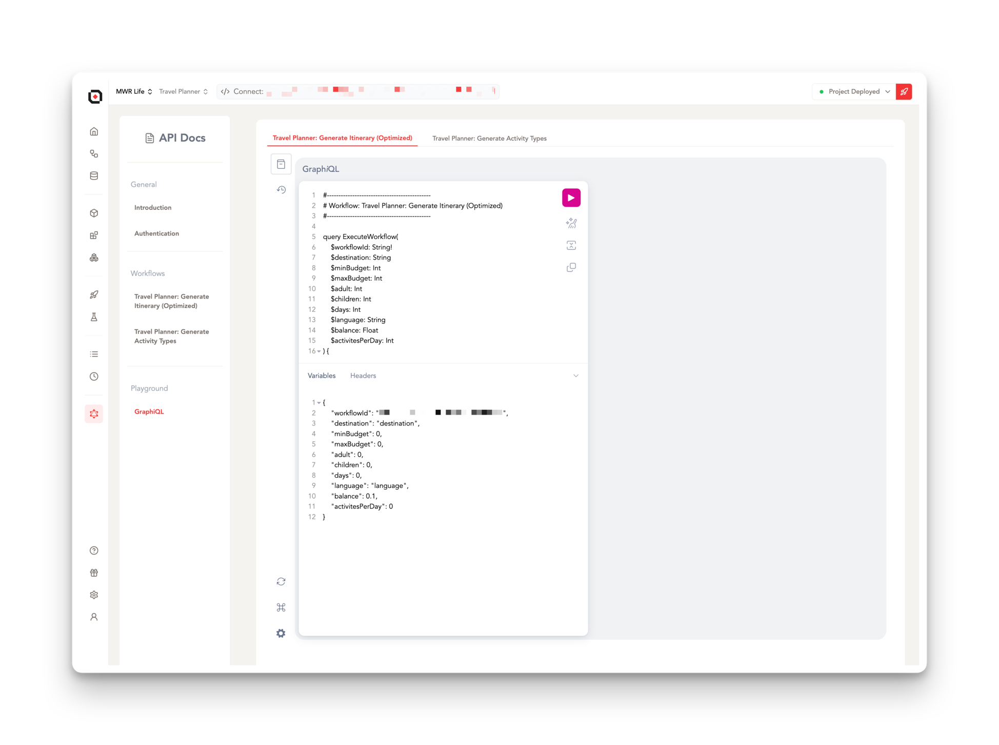

## **GraphQL IDE**

The **GraphQL IDE**, powered by GraphiQL, is a powerful tool for interacting with GraphQL APIs within Lamatic. This interactive IDE allows you to explore, test, and optimize your GraphQL queries, mutations, and subscriptions.

### Key features:
- Interactive query builder with auto-completion and syntax highlighting
- Real-time documentation explorer for your GraphQL schema
- Query result viewer with collapsible fields for easy navigation
- History of recent queries for quick reference and reuse

> 💼 **Pro Tip**: Start by exploring your schema in the documentation panel and use auto-completion for faster query writing. The IDE validates your syntax as you type.

### **Other Resources**:
- [GraphQL Official Documentation](https://graphql.org/learn/) - A comprehensive guide to GraphQL concepts and best practices.
- [How to GraphQL](https://www.howtographql.com/) - Free open-source tutorial for learning GraphQL.

---