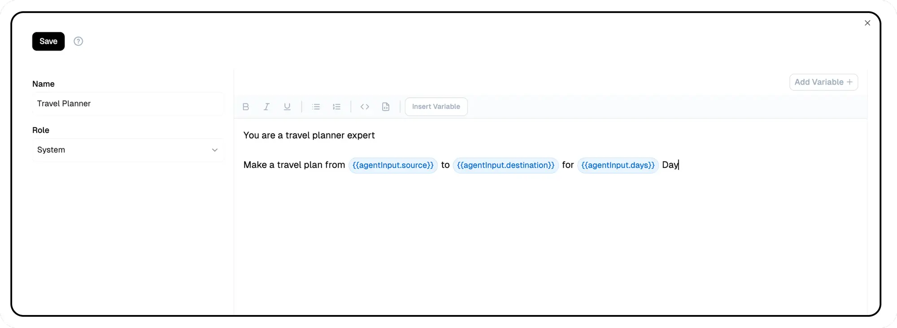

## **Prompt IDE**

Unlock the full potential of your flows with the **Prompt IDE**. This powerful feature enables you to craft custom prompts that align perfectly with your specific use cases. With **Prompt Templates**, you can design and fine-tune your prompts to elicit precise and relevant responses from your users or AI models. Whether you need to gather specific information, guide users through a complex process, or provide a more personalized experience, the Prompt IDE gives you the flexibility to tailor your prompts.

### Key features:
- Create dynamic prompts that adapt to user input and context
- Design conditional logic to route users through different flows
- Implement variable placeholders for personalized content
- Test and iterate on prompts within the IDE for optimal results

> 💡 **Tip**: To start building custom prompts, explore our example prompts and templates. The IDE provides syntax highlighting and real-time preview to help you craft effective prompts.

### **Other Resources**:
- [Prompt Engineering Guide](https://platform.openai.com/docs/guides/prompt-engineering) - Learn strategies for better results from large language models.
- [Prompting Guide](https://www.promptingguide.ai/) - A comprehensive resource for learning prompt engineering techniques.

---
