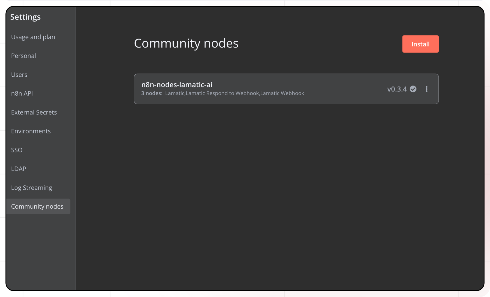
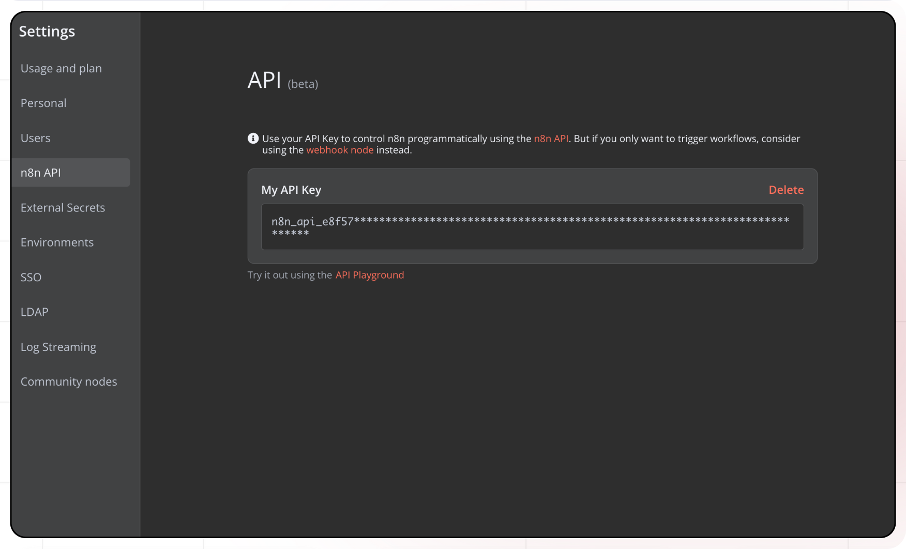
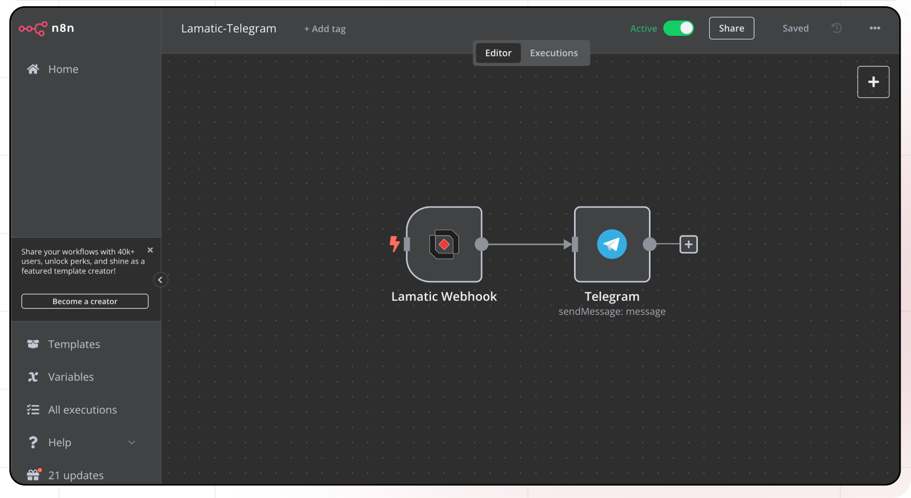

# N8N Node Documentation

The N8N node in Lamatic enables bidirectional integration between Lamatic and N8N platforms. This node supports both triggering N8N flow from Lamatic and executing Lamatic flows from N8N, providing flexible automation capabilities.

## Features

### ✅ Key Functionalities
- **Bidirectional Integration**: Supports both N8N to Lamatic and Lamatic to N8N flow.
- **Easy Configuration**: Simple dropdown-based workflow selection.
- **Webhook Support**: Built-in webhook handling for seamless communication.

### ✅ Benefits
- Combines N8N's workflow automation with Lamatic's Gen AI capabilities.
- Maintains existing N8N flow while adding AI functionality.
- Enables highly configurable cross-platform automation.


## Prerequisites

Before setting up the N8N node, ensure you have the following:

- **Setup N8N**: Choose your preferred option to get started.  
  - **Cloud (Price)**: Use the hosted version with its associated pricing plan.  
  - **Community Edition (Self Hosted)**: Install and run N8N on your own server for free.  

- **Install N8N Lamatic Module**: Add the Lamatic integration to your N8N setup.  
 
  - Navigate to **Settings > Community Nodes** in the N8N interface.  
  - Click **Install** and enter `n8n-nodes-lamatic-ai` to add the module.  
   

- **Trigger Node (Lamatic)**: Set up a Lamatic-specific trigger node in your workflow to initiate actions.  

- **Webhook (Lamatic Webhook)**: Configure a Lamatic webhook to connect and receive data from external sources.  

- **Get API Key from N8N**: Obtain your API key for authentication.  
  - Go to **Settings > API** in N8N, and copy the generated key for use in your setup.

## Installation

### Step 1: Create Flow in Lamatic
1. Drag the N8N node to your workflow.
2. Click on "Add new Credentials".
3. Follow the installation steps provided.
4. Select the newly added credentials.

### Step 2: Configure Integration Type
Choose between:
- Triggering Lamatic from N8N
- Triggering N8N from Lamatic


## Configuration Reference
### Trigger Node (N8N > LAMATIC)
 

- **N8N Cloud**:  
  - Create a **new Workflow** in the N8N cloud interface.  
  - Add a **Lamatic Node** to your workflow.  
  - Configure the node with the following:  
    - **Lamatic Project URL**: Enter the URL of your Lamatic project.  
    - **Lamatic Project API**: Provide the API key for your Lamatic project.  
    - **Body**: Define the workflow input in JSON format.  
    - **Workflow Lamatic ID**: Specify the ID of your Lamatic workflow.  

- **Create a New Flow in Lamatic Studio**:  
  - Use **N8N as the trigger node** to start the flow.  
  - **Define Schema**: Set up the input schema for the data coming from N8N.  
  - **Define Credentials**:  
    - **Host URL**: Input the N8N host URL.  
    - **API Key (N8N)**: Add the API key retrieved from N8N settings.  

### Webhook (LAMATIC > N8N)
 

- **N8N Cloud**:  
  - Create a **new Workflow** in the N8N cloud interface.  
  - Add a **Lamatic Webhook** node to your workflow.  
  - Define the configuration:  
    - **Path**: Specify the webhook path for Lamatic to send data to.  

- **Create a New Flow in Lamatic**:  
  - Use an **API node as the trigger node** to initiate the flow.  
  - Add an **N8N node** to the flow.  
  - **Define Credentials**:  
    - Select the **Webhook created in N8N** to link the two systems.
## Low-Code Example

```js
// Trigger Lamatic from N8N 
triggerNode:
  nodeId: triggerNode_1
  nodeType: n8nTriggerNode
  nodeName: N8N Trigger
  values:
    advance_schema: '{}'
    credentials: your credential name
    workflowId: your n8n workflow id which is linked to this node

// Trigger N8N from Lamatic
nodes:
  - nodeId: n8nNode_716
    nodeType: n8nNode
    nodeName: N8N
    values:
      credentials: your credential name
      workflowId:  your n8n workflow id which is linked to this node
      webhookPath: Auto Fetched Non Configurable Webhook Path
    needs:
      - triggerNode_1
```

## Troubleshooting

### Common Issues

| **Problem**                | **Solution**                                                                                |
|---------------------------|--------------------------------------------------------------------------------------------|
| **Connection Failure**     | Verify N8N Host URL and API credentials are correct.                                       |
| **Webhook Issues**         | Check if webhooks are properly configured and accessible.                                  |
| **Workflow Not Found**     | Ensure workflow IDs are correct and flow are active.                                  |
| **Response Timeout**       | Verify network connectivity and increase timeout settings if needed.                       |

### Debugging

- Check Lamatic Flow logs for error details.
- Verify N8N workflow status and triggers.
- Test webhook endpoints for accessibility.
- Confirm credential permissions and API access.