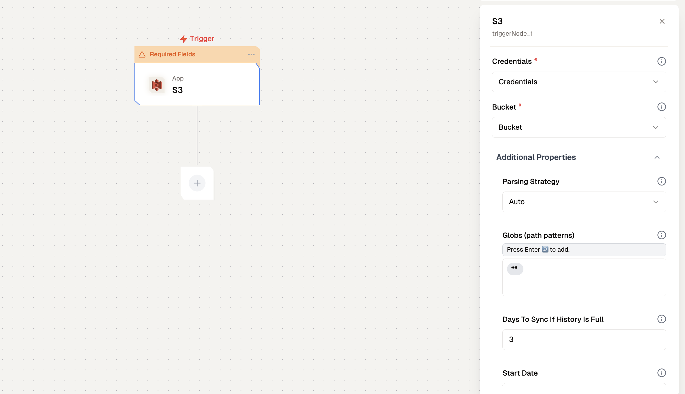

# Amazon S3 Node Documentation

The Amazon S3 Node automates fetching and synchronizing files from Amazon S3 buckets. It supports various file types, including text files, PDFs, Word Documents, and others stored in the bucket. This node enables seamless and regular synchronization of files to facilitate vectorization and indexing for Retrieval-Augmented Generation (RAG) workflows.

## Features for Amazon S3 Node

### ✅ Key Functionalities  
- **Batch Trigger**:  
  Automates file fetching and synchronization from Amazon S3 on a schedule or in real-time using S3 event notifications.  

- **File Type Support**:  
  Handles commonly used file formats stored in S3, including:  
  - Text files (`.txt`)  
  - PDFs  
  - Microsoft Word documents (`.docx`)  
  - Other compatible file formats as needed  

---

### ✅ Benefits  
- **Streamlined File Collection**:  
  Automates retrieval of files from specified Amazon S3 buckets, ensuring up-to-date data availability.  

- **Enhanced RAG Flows**:  
  Prepares and synchronizes files for vectorization and indexing, enabling efficient and accurate Retrieval-Augmented Generation workflows.  

- **Scalability**:  
  Designed to handle buckets of all sizes, scaling with data growth.  


## Prerequisites
- An AWS account with the ability to grant permissions to read from the bucket.
- Access to the S3 bucket containing the files to replicate.

## How to create a workflow using S3 Node?

### Step 1: Get S3 Credentials
If you want to sync from your bucket, lamatic needs to authenticate the connection. This can be done either by using an `IAM User` (with `AWS Access Key ID` and `Secret Access Key`). To add this credentials to Lamatic, Begin by creating a policy with the necessary permissions:

#### 1.1 Create a Policy
1. Log in to your Amazon AWS account and open the [IAM console](https://console.aws.amazon.com/iam/home#home).
1. In the IAM dashboard, select **Policies**, then click **Create Policy**.
1. Select the **JSON** tab, then paste the following JSON into the Policy editor (be sure to substitute in your bucket names):
    ```JSON
    {
        "Version": "2012-10-17",
        "Statement": [
            {
                "Effect": "Allow",
                "Action": [
                    "s3:GetObject",
                    "s3:ListBucket",
                    "s3:ListAllMyBuckets"
                ],
                "Resource": "*"
            }
        ]
    }
    ```

    <Callout type="info" emoji="ℹ️">
        Note: If you want to given permission only to specific buckets then add them to resource key, refer the below example
    </Callout>

    ```JSON
    {
        "Version": "2012-10-17",
        "Statement": [
            {
            "Effect": "Allow",
            "Action": [
                "s3:GetObject",
                "s3:ListBucket"
            ],
            "Resource": [
                    "arn:aws:s3:::{your-bucket-name-1}/*",
                    "arn:aws:s3:::{your-bucket-name-1}",
                    "arn:aws:s3:::{your-bucket-name-2}/*",
                    "arn:aws:s3:::{your-bucket-name-2}"
                ]
            }
        ]
    }
    ```

    <Callout>
    Note: At this time, object-level permissions alone are not sufficient to successfully authenticate the connection. Please ensure you include the bucket-level permissions as provided in the example above.
    </Callout>
1. Give your policy a descriptive name, then click Create policy.


#### 1.2 Create an IAM User
1. Navigate to **IAM** by seaching IAM on the top search bar.
1. In the IAM dashboard, click **Users**. Select an existing IAM user or create a new one by clicking **Add users**.
1. If you are using an *existing* IAM user, click the **Add permissions** dropdown menu and select **Add permissions**. If you are creating a *new* user, you will be taken to the Permissions screen after selecting a name.
1. Select **Attach policies directly**, then find and check the box for your new policy. Click **Next**, then **Add permissions**.
1. After successfully creating your user, select the **Security credentials** tab and click **Create access key**. You will be prompted to select a use case and add optional tags to your access key. Click **Create access key** to generate the keys.

    <Callout type="error" emoji="️⚠️">
    Caution: Your Secret Access Key will only be visible once upon creation. Be sure to copy and store it securely.
    </Callout>


For more information on managing your access keys, please refer to the official [AWS documentation](https://docs.aws.amazon.com/IAM/latest/UserGuide/id_credentials_access-keys.html).


### Step 2: Create a workflow with S3 Node

1. Select the S3 Node from Trigger
1. Click on S3 Node and Provide Info such as Credential, bucket and Additional Properties (Parsing Statergy, Globs (Path Patterns, Days to Sync, Start date, Sync Mode and Sync Schedule)

    | **Field**                    |**Description**                                                                                                                                          | **Options/Examples**                                    | **Requirement/Default**               |
    |------------------------------|----------------------------------------------------------------------------------------------------------------------------------------------------------|--------------------------------------------------------|----------------------------------------|
    | **Credentials**              | Specifies the credentials required to access the S3 bucket. Ensure you have appropriate IAM credentials configured for the node.                      | Pre-configured S3 credentials (e.g., "S3").           | Mandatory                              |
    | **Bucket**                   | Specifies the name of the Amazon S3 bucket that the node will interact with.                                                                             | Example: `new-testing-12345`.                          | Mandatory                              |
    | **Parsing Strategy**         | Defines how files in the S3 bucket will be parsed.                                                                                                      | `Auto` (automatic detection), other custom strategies. | Default: `Auto`                        |
    | **Globs (Path Patterns)**    | Allows specifying file path patterns to include or exclude files during processing.                                                                      | Example: `*.csv` (include all CSV files).              | Default: None (all files included).    |
    | **Days to Sync If History Is Full** | Defines how many days' worth of historical data to sync when the history is full.                                                                 | Example: `3`.                                           | Default: `3`.                          |
    | **Start Date**               | Specifies the date from which the node should begin syncing files.                                                                                       | Format: `YYYY-MM-DD`.                                  | Default: Empty (process all files).    |
    | **Sync Mode**                | Determines how the synchronization is performed.                                                                                                        | `Incremental` (new/updated files), other modes.        | Default: `Incremental`.                |
    | **Sync Schedule**            | Defines the frequency at which the synchronization process occurs.                                                                                      | `Every 24 hours`, custom intervals (e.g., hourly).     | Default: `Every 24 hours`.             |


    ##### Credentials
    These are the authentication details used to connect to the S3 bucket. You must configure IAM credentials with appropriate permissions (e.g., read access to the bucket).

    ##### Bucket 
    The S3 bucket acts as the data source for this trigger. Enter the name of the bucket where your files are stored.

    ##### Parsing Strategy
    This option determines how the files will be interpreted. For example, "Auto" lets the system decide the best way to parse files, while other strategies might require manual setup for specific file types.

    ##### Globs (Path Patterns)
    Use glob patterns to filter which files should be processed. 
    
    - `**`: match everything.
    - `**/*.csv`: match all files with a specific extension.
    - `myFolder/**/*.csv`: match all `.csv` files anywhere under `myFolder`.
    - `*/**`: match everything at least one folder deep.
    - `*/*/*/**`: match everything at least three folders deep.
    - `**/file.*|**/file`: match every file called "file" with any extension (or no extension).
    - `x/*/y/*`: match all files that sit in folder `x -> any folder -> folder y`.
    - `**/prefix*.csv`: match all `.csv` files with a specific prefix.
    - `**/prefix*.parquet`: match all `.parquet` files with a specific prefix.
    
    This is helpful for excluding unnecessary files.

    ##### Days to Sync If History Is Full
    If the system encounters a large backlog of files, this setting limits the synchronization to a defined number of recent days. It helps manage processing time and storage efficiently.

    ##### Start Date
    Define a specific date from which the system should start processing files. This is particularly useful for incremental syncs where you only want to process data from a certain point in time.

    ##### Sync Mode
    In "Incremental" mode, the system only processes files that have been added or updated since the last sync. This reduces redundancy and improves performance.

    ##### Sync Schedule
    This setting allows you to specify how often the synchronization process should run, such as every hour or every 24 hours. Regular intervals ensure that your data stays updated.