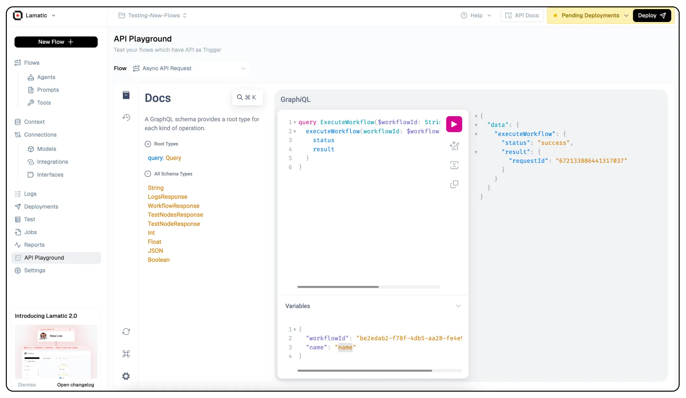
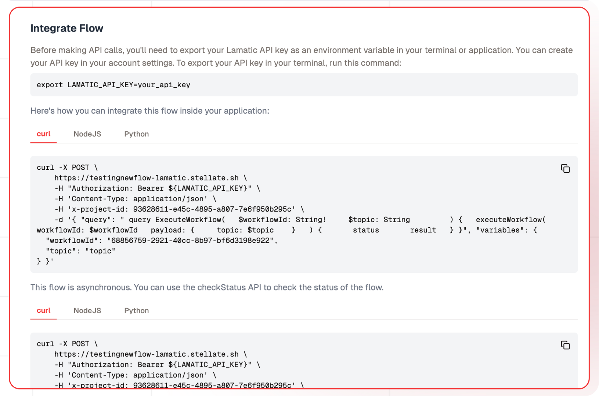

import { Tabs } from "nextra/components";

# Executing Flows with GraphQL API

## What is GraphQL?

GraphQL is an open-source data query and manipulation language developed by Facebook. It provides a more efficient, powerful, and flexible alternative to traditional REST APIs. GraphQL allows clients to define the structure of the data they need, enabling them to retrieve precisely the information they require with a single request.

### GraphQL over REST


While REST APIs have been the industry standard for many years, they often suffer from over-fetching or under-fetching data, leading to inefficient data transfers and increased latency. GraphQL addresses these limitations by empowering clients to request only the data they need, reducing network overhead and improving performance.

## Setting up

### API Playground



Use the API Playground to test your flow and view the response in real-time.

The easies way to setup GraphQL Connection is to click the Connect bar and get the automated code for your project.
Lamatic.ai also generate automatic API documentation for your project. You can access it by visiting the API Docs section.

### Authentication with API Keys

To ensure secure access to our platform, Lamatic.ai employs API keys for authentication. When triggering flows via GraphQL, you'll need to include your API key in the request headers. This key serves as a unique identifier, granting you authorized access to our services while maintaining the integrity and confidentiality of your data.

Here's an example of how you can include the API key in your GraphQL request headers:

```
Authorization: Bearer your_api_key
```

By including the API key in the `Authorization` header, our platform can verify your identity and grant you access to trigger the desired flow.

> Click Here to know how to get your own [API Key](/docs/studio/Project/Settings/keys)

### Triggering Flows with GraphQL



Lamatic.ai's GraphQL integration allows you to trigger your GenAI flows seamlessly using GraphQL queries. This approach provides a standardized and efficient way to interact with our platform, enabling you to execute your GenAI flows on-demand or as part of larger application flows. You need to provide `YOUR_PROJECT_ID` and `LAMATIC_API_KEY`.

Here's an example GraphQL query that demonstrates how you can trigger a flow:

#### Realtime Response Type
<Tabs items={['Node', 'Python', 'cURL']}>
  <Tabs.Tab>
    ```js
      const axios = require('axios');
     
      // Export your Lamatic API key as an environment variable
      const lamatic_api_key = process.env.LAMATIC_API_KEY;

      const query = `
      query ExecuteWorkflow(
        $workflowId: String!
          $topic: String        
      ) {
        executeWorkflow(
        workflowId: $workflowId
        payload: {
          topic: $topic

        }
        ) {
            status
            result
        }
      }`;
            
      const variables = {
        "workflowId": "YOUR_WORKFLOW_ID",
        "topic": "topic"
      };


      const options = {
        method: 'POST',
        url: 'YOUR_PROJECT_ENDPOINT',
        headers: {
          Authorization: `Bearer ${lamatic_api_key}`,
          'Content-Type': 'application/json',
          'x-project-id': 'YOUR_PROJECT_ID',
        },
        data: { query, variables }
      };
        
      axios(options)
        .then(response => console.log(response.data))
        .catch(error => console.error(error));
          
    ```

  </Tabs.Tab>
  <Tabs.Tab>
    ```python
      import os
      import requests
            
      gqlQuery = """
      query ExecuteWorkflow(
        $workflowId: String!
          $topic: String        
      ) {
        executeWorkflow(
        workflowId: $workflowId
        payload: {
          topic: $topic

        }
        ) {
            status
            result
        }
      }"""
            
      variables = {"workflowId":"YOUR_WORKFLOW_ID","topic":"topic"}

      data = {"query": gqlQuery, "variables": variables}

      # Export your Lamatic API key as an environment variable
      lamatic_api_key = os.getenv('LAMATIC_API_KEY')

      headers = {
        "Authorization": f"Bearer {lamatic_api_key}",
        "Content-Type": "application/json",
        "x-project-id": "YOUR_PROJECT_ID"
      }

      url = "YOUR_PROJECT_ENDPOINT"

      response = requests.post(url, headers=headers, json=data)

      if response.status_code == 200:
          print(response.json())
      else:
          print(f"Error: {response.status_code}")
          print(response.text)
    ```

  </Tabs.Tab>
  <Tabs.Tab>
    ```bash
      curl -X POST \
      https://testingnewflow-lamatic.stellate.sh \
      -H "Authorization: Bearer ${LAMATIC_API_KEY}" \
      -H 'Content-Type: application/json' \
      -H 'x-project-id: YOUR_PROJECT_ID' \
      -d '{ "query": " query ExecuteWorkflow(   $workflowId: String!     $prompt: String         ) {   executeWorkflow(   workflowId: $workflowId   payload: {     prompt: $prompt   }   ) {       status       result   } }", "variables": {"workflowId": "YOUR_WORKFLOW_ID", "prompt": "The excited car draws." } }'
    ```
  </Tabs.Tab>
</Tabs>

#### Async Response Type
<Tabs items={['Node', 'Python', 'cURL']}>
  <Tabs.Tab>
    ```js
      const axios = require('axios');
          
      // Export your Lamatic API key as an environment variable
      const lamatic_api_key = process.env.LAMATIC_API_KEY;

      const query = `query CheckStatus {
          checkStatus(requestId: your_request_id)
      }`;

      const variables = {};

      const options = {
        method: 'POST',
        url: 'YOUR_PROJECT_ENDPOINT',
        headers: {
          Authorization: `Bearer ${lamatic_api_key}`,
          'Content-Type': 'application/json',
          'x-project-id': 'YOUR_PROJECT_ID',
        },
      };

      const response = await axios(options);

      console.log(response.data);
          
    ```

  </Tabs.Tab>
  <Tabs.Tab>
    ```python
      import os
      import requests

      url = "YOUR_PROJECT_ENDPOINT"
      gqlQuery = """query CheckStatus {
          checkStatus(requestId: your_request_id)
      }"""

      variables = {}

      headers = {
        "Authorization": f"Bearer {lamatic_api_key}",
        "Content-Type": "application/json",
        "x-project-id": "YOUR_PROJECT_ENDPOINT"
      }

      data = {"query": gqlQuery, "variables": variables}

      response = requests.post(url, headers=headers, json=data)

      if response.status_code == 200:
          print(response.json())
      else:
          print(f"Error: {response.status_code}")
          print(response.text)
    ```

  </Tabs.Tab>

  <Tabs.Tab>
    ```bash
      curl -X POST \
    https://testingnewflow-lamatic.stellate.sh \
    -H "Authorization: Bearer ${LAMATIC_API_KEY}" \
    -H 'Content-Type: application/json' \
    -H 'x-project-id: YOUR_PROJECT_ID' \
    -d '{ "query": " query CheckStatus(   $requestId: String!     ) {   checkStatus(   requestId: $requestId   ) {       status       result   } }", "variables": {
  "requestId": "your_request_id"
} }'
    ```
  </Tabs.Tab>
</Tabs>

#### Output

The Structure output can be configured in the Schema of the Graphql Response node. The expected output will be as follows:

```
{
  // Expected Output as setuped in the Schema
}
```

In this example, the `ExecuteWorkflow` query is used to initiate a workflow execution. You'll need to provide the `workflowId` of the desired workflow and any required `payload`(Input Data) as part of the query variables.
