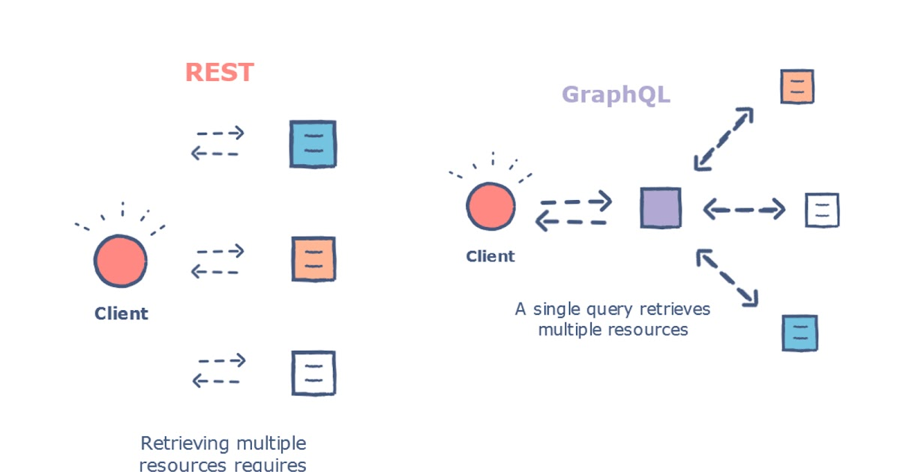
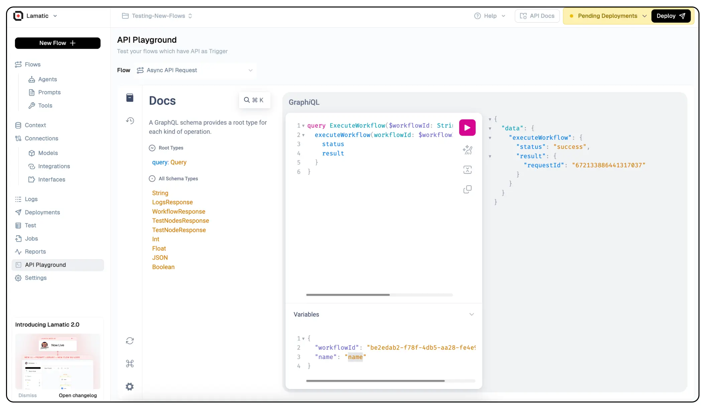
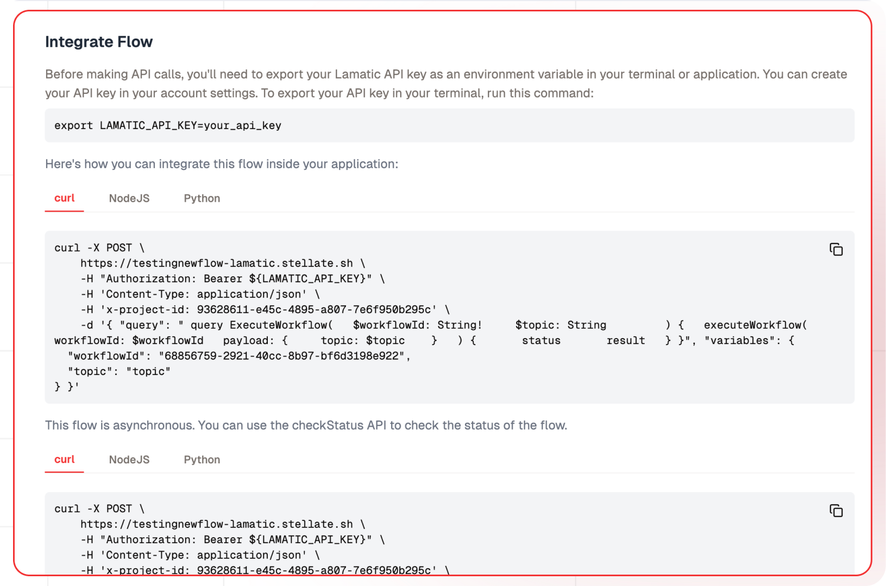

import { Tabs, Callout } from "nextra/components";

# Executing Flows with GraphQL API

<Callout type="info">
  New to the API? The [Integration Guide](/docs/sdk/integration-guide) walks through your first call step by step. Come back here for the full GraphQL reference, async flows, and response shapes.
</Callout>

## What is GraphQL?

GraphQL is an open-source data query and manipulation language developed by Facebook. It provides a more efficient, powerful, and flexible alternative to traditional REST APIs. GraphQL allows clients to define the structure of the data they need, enabling them to retrieve precisely the information they require with a single request.

### GraphQL over REST



While REST APIs have been the industry standard for many years, they often suffer from over-fetching or under-fetching data, leading to inefficient data transfers and increased latency. GraphQL addresses these limitations by empowering clients to request only the data they need, reducing network overhead and improving performance.

## Setting up

### API Playground



Use the API Playground to test your flow and view the response in real-time.

The easies way to setup GraphQL Connection is to click the Connect bar and get the automated code for your project.
Lamatic.ai also generate automatic API documentation for your project. You can access it by visiting the API Docs section.

### Authentication with API Keys

To ensure secure access to our platform, Lamatic.ai employs API keys for authentication. When triggering flows via GraphQL, you'll need to include your API key in the request headers. This key serves as a unique identifier, granting you authorized access to our services while maintaining the integrity and confidentiality of your data.

Here's an example of how you can include the API key in your GraphQL request headers:

```
Authorization: Bearer your_api_key
```

By including the API key in the `Authorization` header, our platform can verify your identity and grant you access to trigger the desired flow.

> Click Here to know how to get your own [API Key](/docs/studio/studio-keys)

### Triggering Flows with GraphQL



Lamatic.ai's GraphQL integration allows you to trigger your GenAI flows seamlessly using GraphQL queries. This approach provides a standardized and efficient way to interact with our platform, enabling you to execute your GenAI flows on-demand or as part of larger application flows. You need to provide `YOUR_PROJECT_ID` and `LAMATIC_API_KEY`.

Here's an example GraphQL query that demonstrates how you can trigger a flow:

#### Realtime Response Type

<Tabs items={['Node', 'Python', 'cURL']}>
  <Tabs.Tab>
    ```js
      const axios = require('axios');
     
      // Export your Lamatic API key as an environment variable
      const lamatic_api_key = process.env.LAMATIC_API_KEY;

      const query = `
      query ExecuteWorkflow(
        $workflowId: String!
          $topic: String
      ) {
        executeWorkflow(
        workflowId: $workflowId
        payload: {
          topic: $topic

        }
        ) {
            status
            result
        }
      }`;

      const variables = {
        "workflowId": "YOUR_WORKFLOW_ID",
        "topic": "topic"
      };


      const options = {
        method: 'POST',
        url: 'YOUR_PROJECT_ENDPOINT',
        headers: {
          Authorization: `Bearer ${lamatic_api_key}`,
          'Content-Type': 'application/json',
          'x-project-id': 'YOUR_PROJECT_ID',
        },
        data: { query, variables }
      };

      axios(options)
        .then(response => console.log(response.data))
        .catch(error => console.error(error));

    ```

  </Tabs.Tab>
  <Tabs.Tab>
    ```python
      import os
      import requests
            
      gqlQuery = """
      query ExecuteWorkflow(
        $workflowId: String!
          $topic: String        
      ) {
        executeWorkflow(
        workflowId: $workflowId
        payload: {
          topic: $topic

        }
        ) {
            status
            result
        }
      }"""

      variables = {"workflowId":"YOUR_WORKFLOW_ID","topic":"topic"}

      data = {"query": gqlQuery, "variables": variables}

      # Export your Lamatic API key as an environment variable
      lamatic_api_key = os.getenv('LAMATIC_API_KEY')

      headers = {
        "Authorization": f"Bearer {lamatic_api_key}",
        "Content-Type": "application/json",
        "x-project-id": "YOUR_PROJECT_ID"
      }

      url = "YOUR_PROJECT_ENDPOINT"

      response = requests.post(url, headers=headers, json=data)

      if response.status_code == 200:
          print(response.json())
      else:
          print(f"Error: {response.status_code}")
          print(response.text)
    ```

  </Tabs.Tab>
  <Tabs.Tab>
    ```bash
      curl -X POST \
      https://testingnewflow-lamatic.stellate.sh \
      -H "Authorization: Bearer ${LAMATIC_API_KEY}" \
      -H 'Content-Type: application/json' \
      -H 'x-project-id: YOUR_PROJECT_ID' \
      -d '{ "query": " query ExecuteWorkflow(   $workflowId: String!     $prompt: String         ) {   executeWorkflow(   workflowId: $workflowId   payload: {     prompt: $prompt   }   ) {       status       result   } }", "variables": {"workflowId": "YOUR_WORKFLOW_ID", "prompt": "The excited car draws." } }'
    ```
  </Tabs.Tab>
</Tabs>

#### Async Response Type

For long-running flows, set the trigger's response type to **async**. Instead of waiting for the flow to finish, the API returns immediately with a `requestId` and a status of `in-progress`, while the flow keeps running in the background. You check back later for the result.

**The request lifecycle**

```
Trigger flow (async)
      ↓
Immediate response: { requestId, status: "in-progress" }
      ↓
Flow keeps running in the background
      ↓
Poll checkStatus(requestId) periodically
      ↓
Terminal status: "success" | "error" | "failed"
```

<Callout type="warning">
There is currently **no way to register a webhook or callback URL** that Lamatic calls automatically when an async flow finishes. Polling `checkStatus` is the only way to retrieve the result. If you want your own server notified instead of polling, see [Pushing results to your own server](#pushing-results-to-your-own-server-instead-of-polling) below.
</Callout>

<Callout type="info">
If you're using the [JavaScript/TypeScript SDK](/docs/sdk), its `checkStatus(requestId, pollInterval, pollTimeout)` method handles this polling loop for you, defaulting to a 15 second interval and a 15 minute timeout. See [Checking Request Status](/docs/sdk#checking-request-status).
</Callout>

<Callout type="warning">
If you're polling manually instead of using the SDK, keep requests to **no more than one every 3 seconds per IP**, polling faster risks Cloudflare rate-limiting or blocking your IP. Also bound your polling loop to the flow's maximum run time (~20 minutes on the standard async path, up to 1 hour with container mode, see [Limits & Quotas](/docs/limits)), a request won't still be `in-progress` past that.
</Callout>

### Pushing results to your own server instead of polling

<Callout type="warning">
**This is a suggested pattern, not an official Lamatic feature.** It hasn't been verified by the Lamatic team as the recommended approach, it's a reasonable use of the existing [API Node](/docs/nodes/data/api-node), which is documented and does make outbound HTTP calls, but nobody has confirmed this specific setup end-to-end. Test it yourself before relying on it in production.
</Callout>

Since there's no built-in callback, you can build the equivalent yourself: add an **API Node** as the last step of your async flow, and have it `POST` the result to your own server. From your server's point of view, this behaves like a webhook, your endpoint receives the result the moment the flow finishes, instead of you polling for it.

1. **Add an API Node** to your flow, after the node that produces your final result (e.g. after your LLM or response-shaping node), instead of ending on a plain Response node.
2. **Set Method to `POST`.**
3. **Set Endpoint URL** to the endpoint on your own server that should receive the result.
4. **Set Body** to map in whatever you want your server to receive, typically the request ID and the result from the upstream node, for example:
   ```json
   {
     "requestId": "{{triggerNode_1.output.requestId}}",
     "result": "{{LLMNode_1.output.generatedResponse}}"
   }
   ```
5. **(Recommended) Set Number of Retries and Delay between retry** so a transient failure to reach your server doesn't silently drop the result. See the [API Node reference](/docs/nodes/data/api-node) for the full field list.

Your server now receives a POST request with the flow's result as soon as it's ready, no polling loop required on your end.

Here's an example GraphQL query to check the status of an async request:

<Tabs items={['Node', 'Python', 'cURL']}>
  <Tabs.Tab>
    ```js
      const axios = require('axios');
          
      // Export your Lamatic API key as an environment variable
      const lamatic_api_key = process.env.LAMATIC_API_KEY;

      const query = `query CheckStatus {
          checkStatus(requestId: your_request_id)
      }`;

      const variables = {};

      const options = {
        method: 'POST',
        url: 'YOUR_PROJECT_ENDPOINT',
        headers: {
          Authorization: `Bearer ${lamatic_api_key}`,
          'Content-Type': 'application/json',
          'x-project-id': 'YOUR_PROJECT_ID',
        },
      };

      const response = await axios(options);

      console.log(response.data);

    ```

  </Tabs.Tab>
  <Tabs.Tab>
    ```python
      import os
      import requests

      url = "YOUR_PROJECT_ENDPOINT"
      gqlQuery = """query CheckStatus {
          checkStatus(requestId: your_request_id)
      }"""

      variables = {}

      # Export your Lamatic API key as an environment variable
      lamatic_api_key = os.getenv('LAMATIC_API_KEY')

      headers = {
        "Authorization": f"Bearer {lamatic_api_key}",
        "Content-Type": "application/json",
        "x-project-id": "YOUR_PROJECT_ID"
      }

      data = {"query": gqlQuery, "variables": variables}

      response = requests.post(url, headers=headers, json=data)

      if response.status_code == 200:
          print(response.json())
      else:
          print(f"Error: {response.status_code}")
          print(response.text)
    ```

  </Tabs.Tab>

  <Tabs.Tab>
    ```bash
      curl -X POST \
    https://testingnewflow-lamatic.stellate.sh \
    -H "Authorization: Bearer ${LAMATIC_API_KEY}" \
    -H 'Content-Type: application/json' \
    -H 'x-project-id: YOUR_PROJECT_ID' \
    -d '{ "query": " query CheckStatus(   $requestId: String!     ) {   checkStatus(   requestId: $requestId   ) {       status       result   } }", "variables": {
  "requestId": "your_request_id"
} }'
    ```
  </Tabs.Tab>
</Tabs>

#### Output

The Structure output can be configured in the Schema of the Graphql Response node. The expected output will be as follows:

##### Success Status
If the request is successful, the response will follow this structure:
```json
{
    "data": {
        "checkStatus": {
            "status": "success",
            "input": {
                "question": "just say hi"
            },
            "output": {
                "response": "Hi!",
                "_meta": {
                    "prompt_tokens": 24,
                    "completion_tokens": 3,
                    "total_tokens": 27,
                    "prompt_tokens_details": {
                        "cached_tokens": 0,
                        "audio_tokens": 0
                    },
                    "completion_tokens_details": {
                        "reasoning_tokens": 0,
                        "audio_tokens": 0,
                        "accepted_prediction_tokens": 0,
                        "rejected_prediction_tokens": 0
                    },
                    "model_name": "gpt-4o-mini",
                    "model_provider": "openai"
                }
            },
            "nodes": [
                {
                    "input": {
                        "nodeName": "API Request",
                        "responeType": "async",
                        "advance_schema": "{\n  \"question\": \"string\"\n}"
                    },
                    "output": {
                        "question": "just say hi"
                    },
                    "timeTakenInSeconds": 0,
                    "status": "success",
                    "nodeId": "triggerNode_1",
                    "nodeType": "graphqlNode",
                    "nodeName": "API Request",
                    "statusCode": 200
                },
                {
                    "input": {
                        "tools": [],
                        "prompts": [
                            {
                                "id": "719ebf1b-17f1-41c9-8228-4de1837583f2",
                                "role": "system",
                                "content": "You are an AI Assistant"
                            },
                            {
                                "id": "10005fb6-3566-41f2-bf7a-d865773e6c3a",
                                "role": "user",
                                "content": "Answer the given question: {{triggerNode_1.output.question}}"
                            }
                        ],
                        "messages": "[]",
                        "nodeName": "Text Generate",
                        "generativeModelName": {
                            "type": "generator/text",
                            "model_name": "gpt-4o-mini",
                            "credentialId": "a9ecd7b5-0a47-41e0-9754-550fe9fd685b",
                            "provider_name": "openai",
                            "credential_name": "OpenAI"
                        }
                    },
                    "output": {
                        "_meta": {
                            "prompt_tokens": 24,
                            "completion_tokens": 3,
                            "total_tokens": 27,
                            "prompt_tokens_details": {
                                "cached_tokens": 0,
                                "audio_tokens": 0
                            },
                            "completion_tokens_details": {
                                "reasoning_tokens": 0,
                                "audio_tokens": 0,
                                "accepted_prediction_tokens": 0,
                                "rejected_prediction_tokens": 0
                            },
                            "model_name": "gpt-4o-mini",
                            "model_provider": "openai"
                        },
                        "generatedResponse": "Hi!"
                    },
                    "timeTakenInSeconds": 2.427,
                    "status": "success",
                    "nodeId": "LLMNode_746",
                    "nodeType": "LLMNode",
                    "nodeName": "Text Generate",
                    "statusCode": 200
                },
                {
                    "input": {
                        "nodeName": "API Response",
                        "outputMapping": "{\n  \"response\": \"{{LLMNode_746.output.generatedResponse}}\",\n  \"_meta\": \"{{LLMNode_746.output._meta}}\"\n}"
                    },
                    "output": {
                        "response": "Hi!",
                        "_meta": {
                            "prompt_tokens": 24,
                            "completion_tokens": 3,
                            "total_tokens": 27,
                            "prompt_tokens_details": {
                                "cached_tokens": 0,
                                "audio_tokens": 0
                            },
                            "completion_tokens_details": {
                                "reasoning_tokens": 0,
                                "audio_tokens": 0,
                                "accepted_prediction_tokens": 0,
                                "rejected_prediction_tokens": 0
                            },
                            "model_name": "gpt-4o-mini",
                            "model_provider": "openai"
                        }
                    },
                    "timeTakenInSeconds": 0,
                    "status": "success",
                    "nodeId": "responseNode_triggerNode_1",
                    "nodeType": "graphqlResponseNode",
                    "nodeName": "API Response",
                    "statusCode": 200
                }
            ],
            "statusCode": 200,
            "timeTakenInSeconds": 2.7
        }
    }
}
```

##### In-Progress Status
If the request is still being processed, the response will be:

```json
  {
    "data": {
          "checkStatus": {
              "status": "in-progress",
          }
    }
  }
```

##### Failed / Error Status
If the flow itself failed, or the request could not be processed, `status` comes back as `failed` or `error` instead of `success`:

```json
  {
    "data": {
          "checkStatus": {
              "status": "failed",
              "message": "A description of what went wrong"
          }
    }
  }
```

These are the only three terminal states, `success`, `failed`, and `error`, polling should stop as soon as you see any one of them.

In this example, the `ExecuteWorkflow` query is used to initiate a workflow execution. You'll need to provide the `workflowId` of the desired workflow and any required `payload`(Input Data) as part of the query variables.
