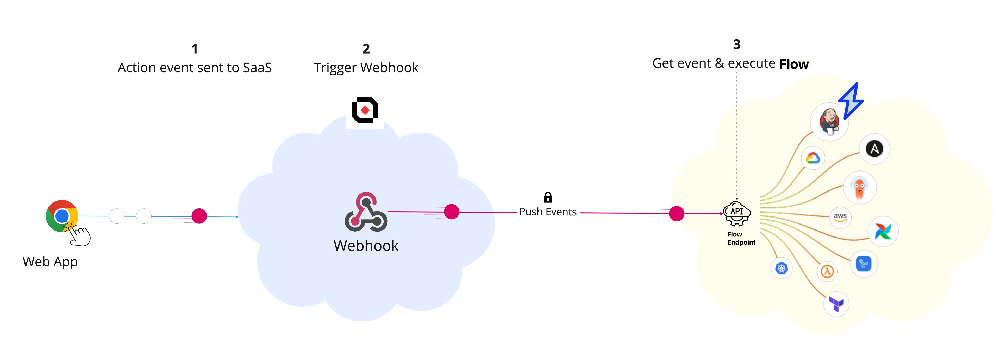
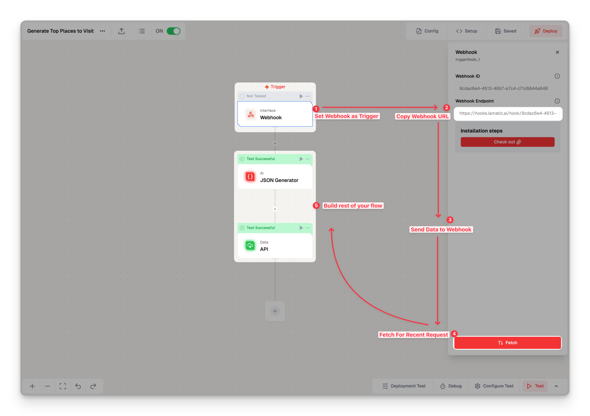

# Webhook Integration Guide

Webhooks are user-defined HTTP callbacks that trigger events in external systems. They allow you to automate workflows by sending real-time notifications when specific events occur.

Webhooks enable asynchronous automation in [Lamatic.ai](http://Lamatic.ai), providing high-performance triggers to integrate with your applications or third-party services easily.

## Webhooks Overview

Webhooks facilitate seamless communication between systems in Lamatic. Here’s a quick breakdown of how they function:

- **Unique Identifier**: Each webhook-triggered flow has a distinct webhook ID.
- **Request Handling**: Incoming requests to this ID initiate the configured flow.
- **Flow Execution**: The flow runs predefined actions based on your setup.

## Setting Up Webhooks

Follow these steps to configure a webhook in Lamatic:

1. **Create a New Flow**  
   Begin by creating a new flow within your Lamatic dashboard.

2. **Add Webhook Node**  
   In the "Nodes" section, search for "webhook" and add it to your flow.

3. **Configure Endpoint**  
   Copy the generated webhook endpoint and select "Fetch" to activate it.

4. **Test the Webhook**  
   Send a sample payload or event to the endpoint to verify functionality.

5. **Build Your Flow Logic**  
   Once the test payload is received, continue developing your flow logic based on your automation needs.

## Accessing Automatic Documentation

Lamatic automatically provides webhook documentation to streamline integration:

- **Locate Documentation**  
  Go to the "Install Steps" or "Setup" section in your Lamatic dashboard.

- **Review Instructions**  
  Use the provided documentation for step-by-step integration guidance.

## Deploying and Utilizing Webhooks

After configuring your flow, activate and start using your webhook:

1. **Deploy the Flow**  
   This step finalizes your webhook setup within the project.

2. **Send Requests**  
   Begin sending requests to your webhook endpoint to trigger the flow.

3. **Monitor Activity**  
   Check the "Logs" section to review incoming requests and troubleshoot as needed.

Lamatic’s webhook capabilities allow you to build robust, event-driven workflows that seamlessly integrate with your systems, creating efficient automation possibilities.