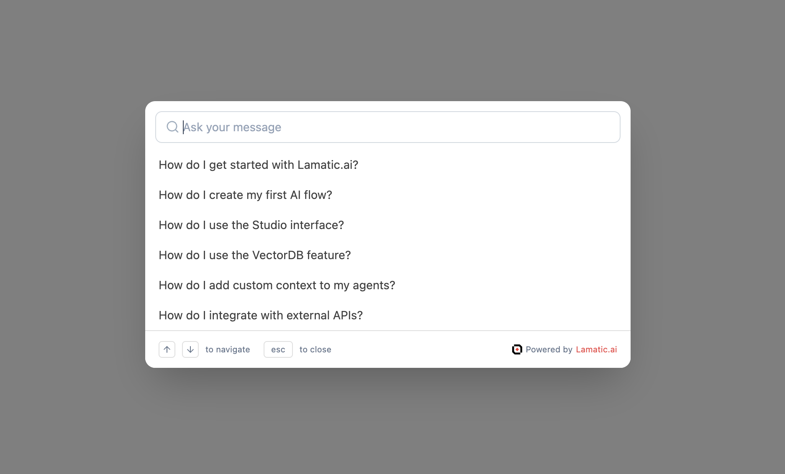
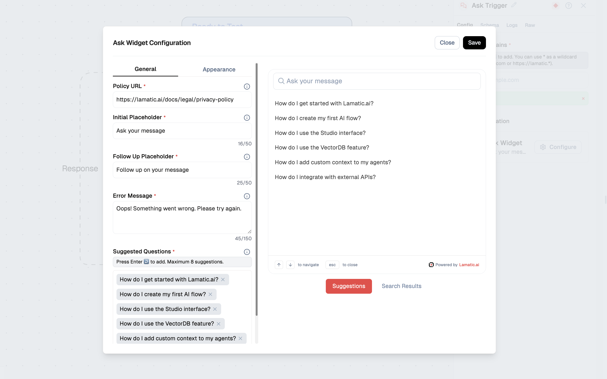
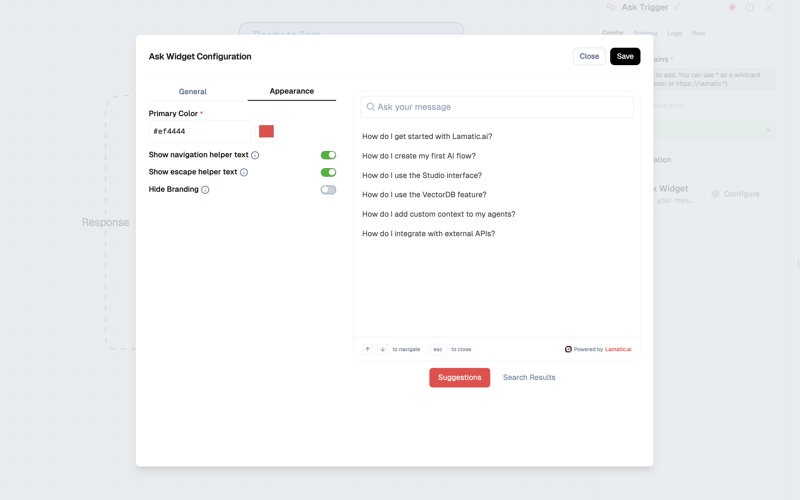

# Ask Widget

Integrate the Ask Widget into your website using the Ask Trigger node. This widget provides an AI-powered Q&A experience where users can type questions, pick from suggested prompts, and get answers with the option to follow up. You can embed this conversational interface directly on your site.

<br />



## Steps to Integrate the Ask Widget

Follow these steps to integrate the Ask Widget into your site using the provided CDN script:

### 1. Whitelist Your Domains

To use the Ask Widget, you need to whitelist the domains where you will deploy the widget. This ensures that the widget is only used on approved domains.

- **Update your `askTrigger` settings** to include the domains you plan to use (e.g. in the trigger node’s `domains` field).
- This configuration is typically done through your flow’s Ask Trigger node or admin panel.

### 2. Configure the Ask Widget

Click the Configure button in the Ask Trigger node to customize the widget: suggested questions, placeholders, policy URL, appearance, and helper text.



## General Configuration

#### General configuration fields

| Field                  | Description                                                                                                                                                | Example                                                                      |
| ---------------------- | ---------------------------------------------------------------------------------------------------------------------------------------------------------- | ---------------------------------------------------------------------------- |
| `suggestions`          | List of suggested questions shown when the widget opens. Users can click one to send it as their first message. Press Enter to add; maximum 8 suggestions. | "How do I get started with Lamatic.ai?", "How do I create my first AI flow?" |
| `initialPlaceholder`   | Placeholder text in the input field before the user types or selects a suggestion.                                                                         | `Ask your message`                                                           |
| `followUpPlaceholder`  | Placeholder text in the input field after a message has been sent, for follow-up questions.                                                                | `Follow up on your message`                                                  |
| `errorMessage`         | Message shown when the request fails or an error occurs.                                                                                                   | `Oops! Something went wrong. Please try again.`                              |
| `policyUrl`            | URL to your privacy policy, linked from the widget (e.g. in the footer). Required.                                                                         | `https://lamatic.ai/docs/legal/privacy-policy`                               |
| `showNavHelperText`    | Shows "↑↓ to navigate" for keyboard navigation.                                                                                                            | Toggle on/off                                                                |
| `showEscapeHelperText` | Shows "esc to close".                                                                                                                                      | Toggle on/off                                                                |
| `hideBranding`         | When `false`, shows the "Powered by Lamatic.ai" badge; when `true`, hides it.                                                                              | Toggle on/off                                                                |

---

#### 🎨 Appearance Configuration



##### 1. Primary Color

- **Field:** `primaryColor`
- **Purpose:** Main accent color for highlights, icons, and interactive elements (e.g. the query indicator and branding).
- **Example Value:** `#ef4444` (Red)

##### Preview

The widget shows an initial view with the input and suggestions, and after a question is sent, a conversation view with the query, response area, and follow-up input.

---

#### Saving Your Settings

- After configuring your widget, click **Save** (e.g. top-right in the flow editor) to apply changes.

### 3. Include the CDN Script and Configure the Widget

Add the CDN script to your HTML and point it to your project and flow.

```html
<script async>
  (function () {
    // Wait for DOM to be fully loaded
    document.addEventListener("DOMContentLoaded", function () {
      const PROJECT_ID = "PROJECT_ID";
      const FLOW_ID = "FLOW_ID";
      const API_URL = "https://xxxxx.lamatic.dev";

      // Create the root element
      const root = document.createElement("div");
      root.id = "lamatic-ask-root";
      root.dataset.apiUrl = API_URL;
      root.dataset.flowId = FLOW_ID;
      root.dataset.projectId = PROJECT_ID;
      document.body.appendChild(root);

      // Load the script
      const script = document.createElement("script");
      script.type = "module";
      script.src = `https://widget.lamatic.ai/ask?projectId=${PROJECT_ID}`;
      document.body.appendChild(script);
    });
  })();
</script>
```

### Props

| Parameter               | Type     | Description                                                                       |
| ----------------------- | -------- | --------------------------------------------------------------------------------- |
| `PROJECT_ID` (required) | `string` | The project ID where the Ask Widget is deployed. Required for the widget to work. |
| `FLOW_ID` (required)    | `string` | The workflow ID that contains your Ask Trigger configuration. Required.           |
| `API_URL` (required)    | `string` | The base URL of your project endpoint. Required for the widget to work.           |

### Trigger node schema (Ask Trigger)

The Ask Trigger node is configured in your flow. Example structure:

```yaml
triggerNode:
  nodeId: triggerNode_1
  nodeType: askTriggerNode
  nodeName: Ask Trigger
  values:
    domains:
      - "*" # or list specific domains
    askConfig:
      suggestions:
        - How do I get started with Lamatic.ai?
        - How do I create my first AI flow?
        - How do I use the Studio interface?
        - How do I use the VectorDB feature?
        - How do I add custom context to my agents?
        - How do I integrate with external APIs?
      primaryColor: "#ef4444"
      errorMessage: Oops! Something went wrong. Please try again.
      policyUrl: https://lamatic.ai/docs/legal/privacy-policy
      initialPlaceholder: Ask your message
      followUpPlaceholder: Follow up on your message
      hideBranding: false
      showNavHelperText: true
      showEscapeHelperText: true
```

### Schema

The Ask Widget sends the user’s message (and any follow-ups) to your flow. Input parameters typically include:

```json
{
  "message": "string",
  "conversationId": "string (optional)"
}
```

The flow’s response is then rendered in the widget (e.g. as the AI reply and optional follow-up context).
