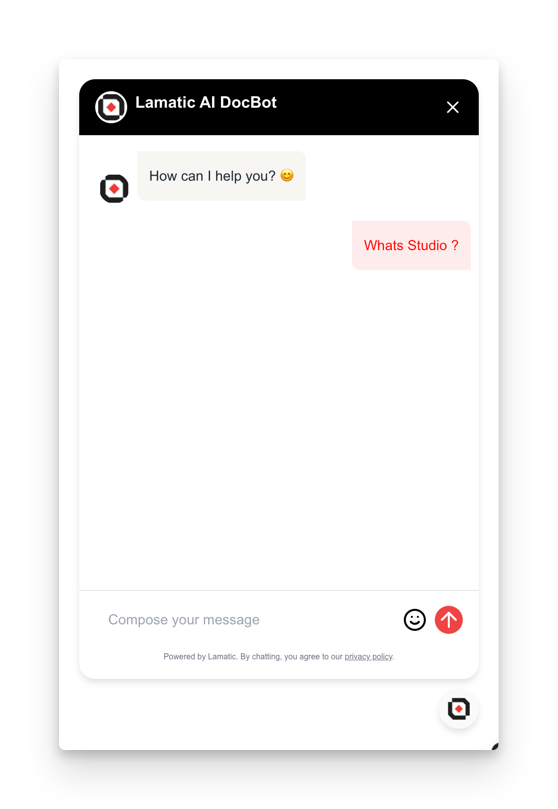

# Chat Widget

Integrate our powerful chat widget into your website using the chat nodes. This widget leverages AI-driven conversation technology to provide interactive and context-aware responses to user queries. Now, you can offer this advanced chat functionality directly on your site.



## Steps to Integrate the Chat Widget

Follow these steps to integrate the chat widget into your site using the provided CDN script:

### 1. Whitelist Your Domains

To use the Chat Widget, you need to whitelist the domains where you will deploy the widget. This ensures that the widget is only used on approved domains.

- **Update your `chatTrigger` settings** to include the domains you plan to use.
- This configuration is typically done through your admin panel or server settings.

### 2. Include the CDN Script and Configure the Widget

Add the CDN script to your HTML file and configure the widget using the provided options.

Here's how to include the CDN script and configure the widget:

```html
<script
  async
  src="https://widget.lamatic.ai/chat/index.js"
  onload="loadChatDialog()"
></script>
<script>
  // Set Lamatic config
  var CHAT_DIALOG_CONFIG = {
    apiUrl: "${podURL()}", // mandatory
    workflowId: "${workflowId}", // mandatory
    projectId: '${projectId}', // mandatory
    floatingButtonId: "your-custom-button-id", // optional
    chatHeaderBgColor: "white", // optional
    imageUrl: "https://your-new-image-url.com", // mandatory
    userMessageBgColor: "#E0F7FA", // optional
    userMessageTextColor: "blue", // optional
    agentMessageBgColor: "#F1F8E9", // optional
    agentMessageTextColor: "#1B5E20", // optional
    position: "right", // left or right only if no floatingButtonId passed
    floatingButtonIcon: "💬|| your-new-icon-url", // only if no floatingButtonId passed
    userId: "your-new-user-id", // optional any userId which you use to identify the user
  };
  // Load Lamatic dialog
  function loadChatDialog() {
    new ChatDialog(CHAT_DIALOG_CONFIG);
  }
</script>
```

### Props

Below is the detailed documentation for the props used in the chat widget configuration:

| Parameter              | Type     | Description                                                                                                                                                        |
|------------------------|----------|--------------------------------------------------------------------------------------------------------------------------------------------------------------------|
| `apiUrl` (required)    | `string` | The base URL of your project endpoint. This is mandatory for the widget to function correctly.                                                                    |
| `workflowId` (required)| `string` | The workflow ID where you have set up your chat configuration. This is also mandatory.                                                                            |
| `floatingButtonId`     | `string` | The ID of a custom button that triggers the chat dialog. This prop is optional, and if not provided, the default floating button will be used.                   |
| `chatHeaderBgColor`    | `string` | The background color for the chat header. Accepts any valid CSS color value. If not specified, a default color will be used.                                     |
| `imageUrl` (required)  | `string` | The URL of the image to be displayed in the chat widget. This is mandatory and typically represents the bot or company logo.                                     |
| `userMessageBgColor`   | `string` | The background color for user messages in the chat. Accepts any valid CSS color value.                                                                           |
| `userMessageTextColor` | `string` | The text color for user messages in the chat. Accepts any valid CSS color value.                                                                                 |
| `agentMessageBgColor`  | `string` | The background color for agent (bot) messages in the chat. Accepts any valid CSS color value.                                                                    |
| `agentMessageTextColor`| `string` | The text color for agent (bot) messages in the chat. Accepts any valid CSS color value.                                                                          |
| `position`             | `string` | Determines the position of the chat widget on the screen. Accepts either "left" or "right". This prop is only applicable if no `floatingButtonId` is provided.   |
| `floatingButtonIcon`   | `string` | The icon to be displayed on the floating button. Can be an emoji (e.g., "💬") or a URL to an image. This prop is only used if no `floatingButtonId` is provided. |
| `userId`               | `string` | An optional identifier for the user. This can be used to maintain user context across sessions or for analytics purposes.                                        |

### 3. Testing

If you're using a payload, pass the `chatMessage` parameter.

Otherwise, click on the chat widget located at the

### 4. Troubleshooting

- Ensure the `apiUrl` is correctly set to your pod URL.
- Verify that the `workflowId` matches your workflow ID.
- Check the console for any errors related to script loading or widget initialization.

This documentation provides a comprehensive guide to integrating the chat widget, including all necessary configurations and troubleshooting tips.
