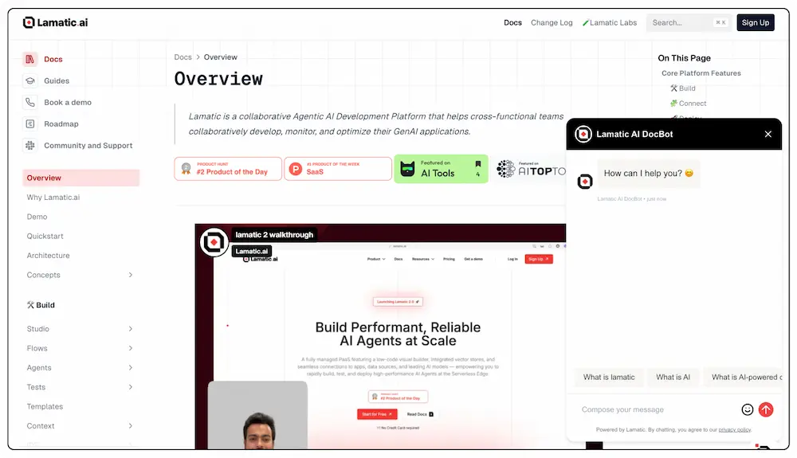
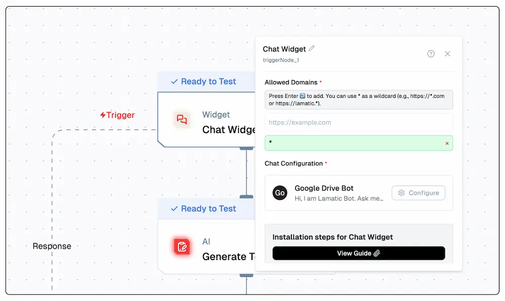

# Chat Widget

Integrate our powerful chat widget into your website using the chat nodes. This widget leverages AI-driven conversation technology to provide interactive and context-aware responses to user queries. Now, you can offer this advanced chat functionality directly on your site.



## Steps to Integrate the Chat Widget

Follow these steps to integrate the chat widget into your site using the provided CDN script:

### 1. Whitelist Your Domains

To use the Chat Widget, you need to whitelist the domains where you will deploy the widget. This ensures that the widget is only used on approved domains.

- **Update your `chatTrigger` settings** to include the domains you plan to use.
- This configuration is typically done through your admin panel or server settings.

### 2. Configure the Chat Widget


Click the Configure button in the chat widget to customize settings such as the bot name, position, image, policy URL, appearance, and messages.

#### 1. General Settings

| Field                | Description |
|---------------------|-------------|
| **Bot Name**         | Sets the name displayed on the chat header. <br/> _Example: `Google Drive Bot`_ |
| **Position**         | Determines which side of the screen the widget appears. <br/> _Options: `Left`, `Right`_ |
| **Bot Image**        | Upload a custom avatar for your bot. |
| **Policy URL**       | Link to your privacy policy, shown in the footer. <br/> _Example: `https://lamatic.ai/docs/legal/privacy-policy`_ |
| **Show Powered by Lamatic** | Toggle to display or hide the "Powered by Lamatic" branding. |

---

#### 2. Appearance Settings

Customize the color scheme of your chat widget:

| Element                  | Example Value | Description |
|--------------------------|---------------|-------------|
| **Primary Color**         | `#251d1d`      | Primary UI accents and theme color. |
| **Header Background**     | `#14aadB`      | Background color of the chat header. |
| **Header Text**           | `#FFFFFF`      | Text color for the bot name in the header. |
| **User Message Background** | `#1f0ea0`   | Background for messages sent by the user. |
| **User Message Text**     | `#FFFFFF`      | Text color inside user messages. |
| **Agent Message Background** | `#f1f5f9`  | Background color of bot responses. |
| **Agent Message Text**    | `#2c343f`      | Text color of bot messages. |
| **Suggestion Background** | `#f1f5f9`      | Background color of quick reply suggestions. |
| **Suggestion Text**       | `#334155`      | Text color for suggestion buttons. |

---

#### 3. Messages Configuration

Configure default messages and placeholder texts:

| Field                | Description |
|---------------------|-------------|
| **Greeting Message** | Message shown when the bot first appears. <br/> _Example: `Hi, I am Lamatic Bot. Ask me anything about Lamatic`_ |
| **Error Message**    | Displayed when something goes wrong. <br/> _Example: `Oops! Something went wrong. Please try again.`_ |
| **Input Placeholder**| Placeholder in the input text box. <br/> _Example: `Compose your message`_ |
| **Suggested Questions** | Add up to 3 quick-start suggestions. <br/> _Examples: `What is lamatic?`, `How do I add data to my chatbot?`_ |

---

#### 4. Preview Panel

A live preview panel is available on the right side to visualize real-time changes across all tabs.

---

#### ✅ Final Step

After customizing, don't forget to click **Save** to apply your changes.


### 3. Include the CDN Script and Configure the Widget

Add the CDN script to your HTML file and configure the widget using the provided options.

Here's how to include the CDN script and configure the widget:

```html
<script async>
    (function () {
        // Wait for DOM to be fully loaded
        document.addEventListener("DOMContentLoaded", function () {
            const PROJECT_ID = '42*********************************c';
            const FLOW_ID = '73*********************************b';
            const API_URL = 'https://***.lamatic.ai';
            
            // Create the root element
            const root = document.createElement("div");
            root.id = "lamatic-chat-root";
            root.dataset.apiUrl = API_URL;
            root.dataset.flowId = FLOW_ID;
            root.dataset.projectId = PROJECT_ID;
            document.body.appendChild(root);

            // Load the script
            const script = document.createElement("script");
            script.type = "module";
            script.src = `https://widget.lamatic.ai/chat-v2?projectId=${PROJECT_ID}`;
            document.body.appendChild(script);
        });
    })();
</script>
```

### Props

Below is the detailed documentation for the props used in the chat widget configuration:

| Parameter              | Type     | Description                                                                                                                                                        |
|------------------------|----------|--------------------------------------------------------------------------------------------------------------------------------------------------------------------|
| `PROJECT_ID` (required) | `string` | The project ID where the chat widget is deployed. This is mandatory for the widget to function correctly.                                                          |
| `FLOW_ID` (required)| `string` | The workflow ID where you have set up your chat configuration. This is also mandatory.                                                                            |
| `API_URL` (required)    | `string` | The base URL of your project endpoint. This is mandatory for the widget to function correctly.                                                                    |

### 4. Testing

If you're using a payload, it would take the following input parameters : 

```json
{
  "userId": string,
  "sessionId": string,
  "chatMessage": string,
  "chatHistory": [
    {
      "content": string,
      "role": string,
      "timestamp": string,
      "sessionId": string,
    }
  ]
}
```
<br/>
The output will be given as follows : 

```json
{
  "output": {
    "content": string,
    "attachments": [],
    "timestamp": string,
    "type": string
  }
}
```
Otherwise, click on the chat widget located at the bottom right corner of your screen to start a conversation. The widget will open, allowing you to interact with it.

### 5. Chat Widget CSS IDs Documentation 
<Callout type="error" emoji="⚠️">
    **PRO Feature** <br/>
    The following CSS IDs are available only in the Pro version of the chat widget. If you are using the free version, these IDs will not be present, and you will not be able to apply custom styles using them.
</Callout>

| ID                                 | Description                                                 |
| ---------------------------------- | ----------------------------------------------------------- |
| `lam-chat-header`                  | Main header container with logo, title, and close button    |
| `lam-chat-header-logo`             | Bot avatar/logo image in the header                         |
| `lam-chat-header-title`            | Bot name/title text in the header                           |
| `lam-chat-header-close-button`     | Close button (X) in the header                              |
| `lam-chat-body`                    | Main chat messages container with scrollable area           |
| `lam-chat-message-*`               | Individual message container (user or bot)                  |
| `lam-chat-message-avatar-*`        | Bot avatar image for each bot message                       |
| `lam-chat-message-container-*`     | Message content wrapper including bubble and timestamp      |
| `lam-chat-message-bubble-*`        | Message bubble container with background and styling        |
| `lam-chat-user-message-content-*`  | User message text content area                              |
| `lam-chat-bot-message-content-*`   | Bot message content area with markdown rendering            |
| `lam-chat-message-file-*`          | File attachment container within a message                  |
| `lam-chat-message-timestamp-*`     | Timestamp text below each message                           |
| `lam-chat-typing-indicator`        | Container for the typing animation indicator                |
| `lam-chat-typing-avatar`           | Bot avatar in the typing indicator                          |
| `lam-chat-typing-bubble`           | Typing animation bubble with dots                           |
| `lam-chat-image-attachment`        | Image attachment container with click-to-zoom functionality |
| `lam-chat-image-skeleton`          | Loading skeleton placeholder for images                     |
| `lam-chat-image-content`           | Actual image content that replaces the skeleton             |
| `lam-chat-file-attachment`         | Non-image file attachment container                         |
| `lam-chat-file-download-link`      | Download link for file attachments                          |
| `lam-chat-references-container`    | Container for source references/sources section             |
| `lam-chat-references-label`        | "Sources:" label text                                       |
| `lam-chat-references-list`         | List container for all reference items                      |
| `lam-chat-reference-*`             | Individual reference item container                         |
| `lam-chat-reference-title-*`       | Reference title text                                        |
| `lam-chat-reference-description-*` | Reference description text                                  |
| `lam-chat-reference-icon-*`        | External link icon for references                           |
| `lam-chat-citation-*`              | Citation link in markdown content                           |
| `lam-chat-citation-badge-*`        | Citation number badge styling                               |
| `lam-chat-markdown-link`           | Regular markdown links in bot messages                      |
| `lam-chat-table-container`         | Table wrapper with horizontal scroll                        |
| `lam-chat-table`                   | Markdown table element                                      |
| `lam-chat-table-header`            | Table header cells                                          |
| `lam-chat-table-cell`              | Table data cells                                            |
| `lam-chat-footer`                  | Main footer container with input and suggestions            |
| `lam-chat-suggestions-container`   | Container for quick suggestion buttons                      |
| `lam-chat-suggestion-*`            | Individual suggestion button                                |
| `lam-chat-input-container`         | Input area container with border                            |
| `lam-chat-message-input`           | Text input field for typing messages                        |
| `lam-chat-input-actions`           | Container for emoji and send buttons                        |
| `lam-chat-emoji-section`           | Emoji picker button container                               |
| `lam-chat-emoji-button`            | Emoji picker toggle button                                  |
| `lam-chat-send-section`            | Send button container                                       |
| `lam-chat-send-button`             | Send message button                                         |

> **Note:** The asterisk (\*) in the IDs represents a dynamic index that gets assigned to each element. For example, `lam-chat-message-0`, `lam-chat-message-1`, etc.

### Usage Examples

Here are examples of how to use these CSS IDs as selectors:

**Plain selector (targeting all elements of that type):**

```css
#lam-chat-message-bubble-* {
  border-radius: 12px;
  padding: 12px 16px;
}
```

**Specific index selector (targeting a specific element):**

```css
#lam-chat-message-bubble-0 {
  background-color: #e3f2fd;
  border-left: 4px solid #2196f3;
}
```

### 6. Troubleshooting

- Ensure the `apiUrl` is correctly set to your pod URL.
- Verify that the `workflowId` matches your workflow ID.
- Check the console for any errors related to script loading or widget initialization.

## Common Issues

### Chat Input Not Focusing When Using Material UI Drawer

If you're using Material UI's Drawer component alongside the chat widget, you might encounter an issue where the chat input cannot be focused when the Drawer is open. This happens because the Drawer's Modal behavior enforces focus within itself.

**Solution:**

Add the `disableEnforceFocus` prop to the Drawer's ModalProps:

```jsx
// Option 1: Apply to a specific Drawer instance
<Drawer
  anchor="right"
  open={drawerOpen}
  onClose={toggleDrawer}
  ModalProps={{
    disableEnforceFocus: true,
  }}
>
  {/* Drawer content */}
</Drawer>

// Option 2: Apply globally using a custom theme
const theme = createTheme({
  components: {
    MuiDrawer: {
      defaultProps: {
        ModalProps: {
          disableEnforceFocus: true,
        },
      },
    },
  },
});
```

This allows the chat widget input to properly receive focus even when the Drawer is open, without affecting the overall functionality of your drawer.

This documentation provides a comprehensive guide to integrating the chat widget, including all necessary configurations and troubleshooting tips.
