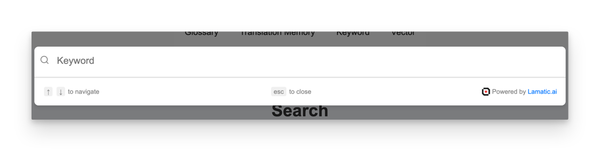

# Search Widget

Integrate our powerful search widget into your website using the search nodes. This widget leverages AI driven search technology to provide more accurate and relevant search results by understanding the context and meaning of the queries rather than just matching keywords. Now, you can offer this advanced search functionality directly on your site.
<br />



## Steps to Integrate the Search Widget

Follow these steps to integrate the search widget into your site using the provided CDN script:

### 1. Whitelist Your Domains

To use the Search Widget, you need to whitelist the domains where you will deploy the widget. This ensures that the widget is only used on approved domains.

- **Update your `searchTrigger` settings** to include the domains you plan to use.
- This configuration is typically done through your admin panel or server settings.

### 2. Include the CDN Script and Configure the Widget

Add the CDN script to your HTML file and configure the widget using the provided options.

Here’s how to include the CDN script and configure the widget:

```html
<script async>
    (function () {
        // Wait for DOM to be fully loaded
        document.addEventListener("DOMContentLoaded", function () {
            const PROJECT_ID = '42*********************************c';
            const FLOW_ID = 'bf*********************************c';
            const API_URL = 'https://***.lamatic.workers.dev';
            
            // Create the root element
            const root = document.createElement("div");
            root.id = "lamatic-search-root";
            root.dataset.apiUrl = API_URL;
            root.dataset.flowId = FLOW_ID;
            root.dataset.projectId = PROJECT_ID;
            document.body.appendChild(root);

            // Load the script
            const script = document.createElement("script");
            script.type = "module";
            script.src = `https://lamatic-cf-widgets-dev.lamatic.workers.dev/search-v2?projectId=${PROJECT_ID}`;
            document.body.appendChild(script);
        });
    })();
</script>
```

### Props

Below is the documentation for the props used in the search widget configuration:

| Parameter               | Type     | Description                                                                                                                                                        |
|-------------------------|----------|--------------------------------------------------------------------------------------------------------------------------------------------------------------------|
| `PROJECT_ID` (required) | `string` | The project ID where the chat widget is deployed. This is mandatory for the widget to function correctly.                                                          |
| `FLOW_ID` (required)| `string` | The workflow ID where you have set up your chat configuration. This is also mandatory.                                                                            |
| `API_URL` (required)    | `string` | The base URL of your project endpoint. This is mandatory for the widget to function correctly.                                                                    |