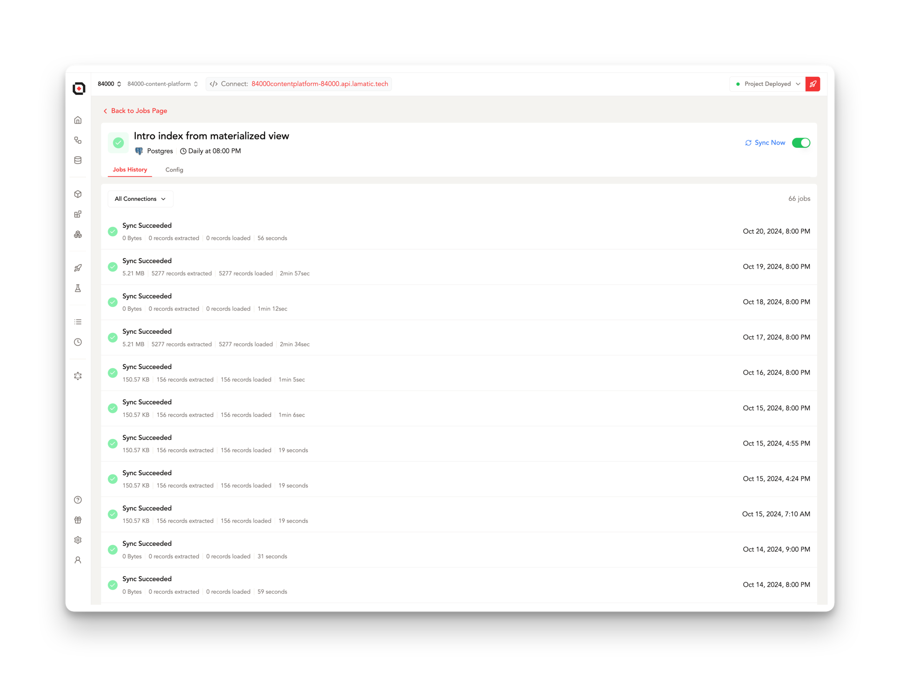

# **Automated Data Synchronization and Scheduled Processes in Flows**

Explore the automated data synchronization and scheduled process configuration within the flows. Our system provides a comprehensive view of these automated operations, allowing you to monitor and manage your data flows efficiently.

Jobs are automatically generated when you configure a **Batch Trigger** node within a flow. This automation streamlines the process of setting up recurring tasks, ensuring that your data operations run smoothly without manual intervention.

### Available Batch Triggers

    <iframe
        className="absolute top-0 left-0 w-full h-full overflow-x-hidden"
        src="https://hub.lamatic.ai/embeds/available-integrations"
        allowFullScreen
    ></iframe>

---

## **Connections**

Each Job is uniquely represented as a distinct setup, identified by its corresponding flow name. This organization allows for easy management and customization of your data processes. You have the flexibility to activate or deactivate these jobs directly, and then deploy the project to implement these changes across your system.

---

### **Job History**

Access a comprehensive historical record of all job executions. This feature provides valuable insights into the performance and consistency of your data operations over time.

- **Size**: The total volume of all records processed in batch requests, giving you an overview of the data throughput.
- **Records extracted**: The quantity of records successfully retrieved from the source, indicating the effectiveness of your data extraction process.
- **Records loaded**: The number of records successfully processed and loaded as individual requests, showing the efficiency of your data loading mechanism.
- **Time**: The duration required to complete the job execution, helping you monitor and optimize performance.

> ⚠️ **Important**: The job time differs from the complete execution time of the entire batch. The total execution duration depends on the completion of all requests within the batch, which may vary based on complexity and volume.

---

### **Config**

Configure the settings for your job to align with your specific requirements and operational needs.

- **Schedule Type**: This parameter determines the triggering mechanism for your data synchronizations, allowing you to set up the most suitable timing for your operations.
- **Cron Expression**: A CRON-formatted schedule to define when the job should run, providing precise control over the timing of your data processes.

    | **Cron String** | **Sync Timing** |
        | --- | --- |
    | 0 0 * * * ? | Every hour, at 0 minutes past the hour |
    | 0 0 15 * * ? | At 15:00 every day |
    | 0 0 15 * * MON,TUE | At 15:00, only on Monday and Tuesday |
    | 0 0 0,2,4,6 * * ? | At 12:00 AM, 02:00 AM, 04:00 AM, and 06:00 AM every day |
    | 0 0 _/15 _ * ? | At 0 minutes past the hour, every 15 hours |

- **Timezone**: Specify the timezone for your sync to ensure that jobs run at the appropriate local time, regardless of server location.

---

### **Force Sync**

For situations requiring immediate action, you can manually initiate a job using the **force sync** option. This feature instantly triggers the job execution, allowing you to run data synchronizations on-demand outside of the scheduled times.

> ⚠️ **Note**: When operating in **Incremental Sync Mode** (which only loads new and updated records), force syncing will not process records from failed requests. This limitation is in place to maintain data integrity and prevent potential duplications.

To address records in failed requests, you should adjust the Sync Mode to **Full Refresh** and execute a complete synchronization. It's crucial to ensure that a **primary key attribute** is properly configured in the Index Node setup to facilitate accurate record matching and updating during this process.