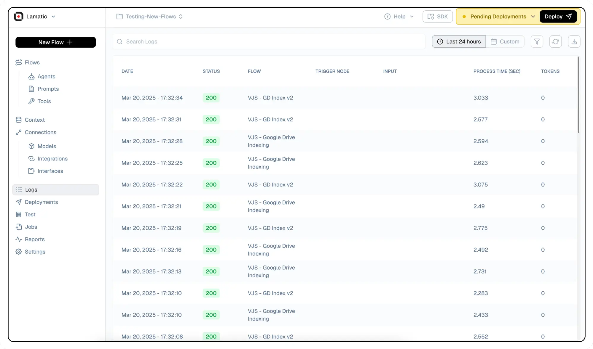
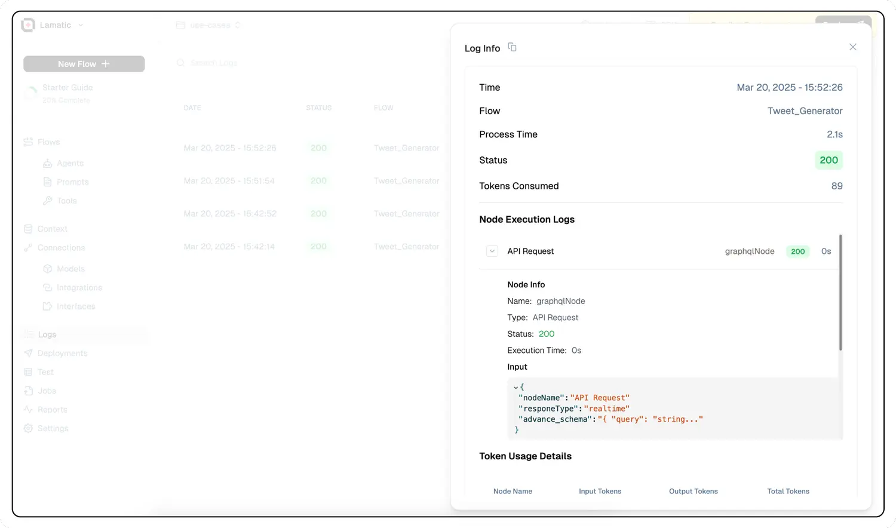
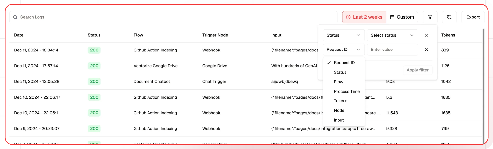

# **Logs: Monitoring and Analyzing Requests in Real Time**

Logs provide an invaluable way to monitor and analyze requests to your project in real-time, offering deep insights into your application's performance and behavior. This powerful feature allows you to track and troubleshoot issues efficiently, ensuring optimal functionality of your system.

---

The Log Dashboard provides a centralized view of workflow executions, showing details about each trigger, flow, and execution status.

- **Date and Time**: Logs when each event occurred (Local & UTC).
- **Status**: Indicates the status code of the execution (e.g., 200 for success).
  | Status Code | Description |
  |-------------|--------------------------------------------------------------------------------------------------------------|
  | 200 | Success - Indicates that the request was processed successfully without any errors. |
  | 204 | Successful execution of retried request. |
  | 208 | Node has skipped its execution when retried the request. Applicable for retries triggered from a failed node.|
  | 303 | Fallback Model is used. |
  | 500 | Flow Error - Signifies that an error occurred during the request processing, requiring further investigation. |
  | 509 | Failed execution of retried request. |

- **Flow**: Unique FlowID associated with the request, enabling you to trace the entire lifecycle of a specific operation through your system..
- **Trigger Node**: The source of the trigger (e.g., API Request, Slack, Google Drive).
- **Input**: Inputs provided to the Flow (partial text is visible).
- **Process Time**: Total turnaround time of the requests, providing valuable insights into performance metrics and potential bottlenecks in your application..
- **Tokens**: Token usage in the Flow

---

## **Node Level Traces**

To gain a more granular understanding of your system's operations, you can examine the logs of individual nodes within a request.

1. Select any request of interest to open the complete request trace.
2. Navigate to the **Node Execution Logs** section.
3. Click on the specific node you wish to investigate.

This detailed view allows you to pinpoint exactly where issues occur in your processing pipeline, facilitating more efficient debugging and optimization.

---

## **Search and Filtering Logs**

To efficiently manage and analyze your log data, the system provides powerful search and filtering capabilities. These features enable you to quickly locate specific information and identify patterns or issues within your logs.

> 🔍 **Note**: The comprehensive search capability ensures that you can locate even the most specific details within your log data.

- **Search**: Offers deep, query-level results, allowing you to find any keyword in request inputs, outputs, or within individual node inputs and outputs.
- **Date Range**: The Date Range filter allows users to focus on logs generated within a specific time period.
- **Filter**: Filters refine the logs based on specific attributes such as Status, Flow, Process Time, and more.

You can reload the logs by clicking on the Refresh icon.

---

## **Exporting Logs**

The Export feature allows users to download the filtered or complete log data in a file format for external storage, sharing, or analysis.
