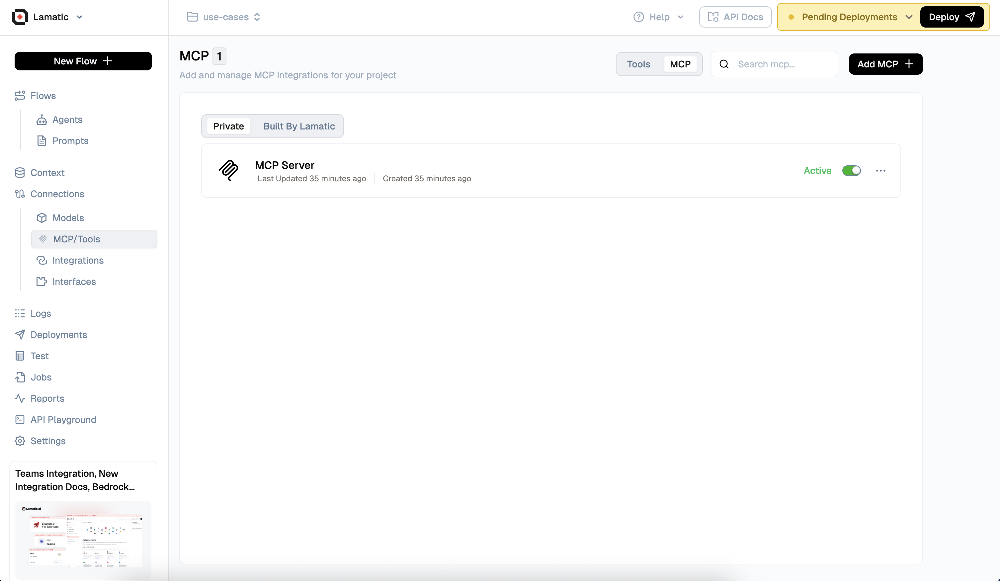
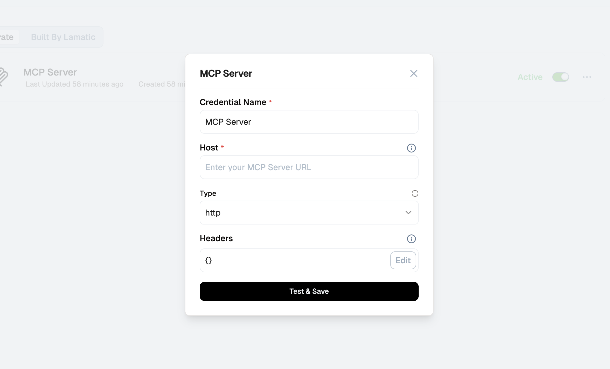

# Model Context Protocol (MCP)

Model Context Protocol (MCP) is a standardized protocol that enables AI models to securely access external data sources and tools through a structured interface. It provides a secure, efficient, and standardized way for AI applications to interact with external resources, databases, APIs, and tools without compromising security or performance.



<Callout>
MCP can be integrated with [**Text-Gen Node**](/docs/nodes/text-generate-node) and [**Multimodel Node**](/docs/nodes/multimodel-text-node) for enhanced AI capabilities
</Callout>
<br />

**MCP enables AI models to:**

1. **Secure Data Access** – Safely connect to external data sources and APIs
2. **Tool Integration** – Access and utilize external tools and functions
3. **Contextual Information** – Retrieve relevant information from various sources
4. **Real-time Updates** – Access live data and dynamic content
5. **Standardized Communication** – Use a consistent protocol for all external interactions

## What you can build with MCP

1. **Data-Driven AI Applications** – Connect AI models to databases, APIs, and external data sources
2. **Real-time Information Systems** – Access live data feeds, weather updates, stock prices, and more
3. **Document Processing** – Retrieve and analyze documents from various sources
4. **API Integration** – Seamlessly integrate with third-party services and APIs
5. **Custom Tool Ecosystems** – Build and deploy custom tools that AI models can access
6. **Multi-Source Intelligence** – Combine information from multiple sources for comprehensive insights

## How to Setup MCP



1. Go to Lamatic Studio
2. Navigate to MCP/Tools > MCP
3. Click on + Add MCP
4. Configure the MCP server with the following details:
   - **Credential Name**: Enter a descriptive name for your MCP server
   - **Host**: Provide the MCP server URL (required field)
   - **Type**: Select the protocol type (http or sse)
   - **Headers**: Configure authentication and custom headers
5. Click "Test & Save" to validate the connection and save your configuration

## MCP Configuration

### Credential Name
A descriptive name for your MCP server connection. This will be used to identify the server in your flows.

Example: `MCP Server`

### Host
The endpoint URL where your MCP server is hosted. This is a required field that specifies the server address.

Example: `https://api.weatherapi.com/v1`

### Type
The protocol type for your MCP server connection. Choose between:
- **http**: Standard HTTP protocol for most API connections
- **sse**: Server-Sent Events for real-time data streaming

### Headers
Custom HTTP headers for authentication and configuration. You can add headers like:
- **Authorization**: For API key or bearer token authentication
- **Content-Type**: Specify the content type for requests
- **Custom Headers**: Any additional headers required by your MCP server

Click the "Edit" button to configure headers in JSON format:
```json
{
  "Authorization": "Bearer your-api-key",
  "Content-Type": "application/json"
}
```


## How to Use MCP in Flows

<Callout>
MCP can be integrated with [**Text-Gen Node**](/docs/nodes/text-generate-node) and [**Multimodel Node**](/docs/nodes/multimodel-text-node)
</Callout>
<br/>

To integrate MCP into your flow, follow these steps:

1. **Select Your Flow** – Choose the flow where you want to use MCP
2. **Add MCP Node** – Add an MCP node to your flow
3. **Configure MCP Server** – Select the MCP server you want to connect to
4. **Choose Resources/Tools** – Select the specific resources or tools you need
5. **Handle Responses** – Configure how MCP responses are processed in your flow

### MCP Node Configuration

The MCP node allows you to:
- **Select MCP Server**: Choose from your configured MCP servers
- **Access Tools**: Use tools and resources provided by the MCP server
- **Process Data**: Handle responses and integrate with other nodes in your flow

## MCP Best Practices

### Security
- Always use secure connections (HTTPS) for MCP servers
- Implement proper authentication and authorization
- Regularly rotate API keys and tokens
- Monitor and log all MCP interactions

### Performance
- Implement caching for frequently accessed data
- Use connection pooling for better performance
- Set appropriate timeouts and retry policies
- Monitor response times and optimize slow queries

### Error Handling
- Implement robust error handling for network failures
- Provide fallback mechanisms for critical data
- Log errors for debugging and monitoring
- Gracefully handle rate limiting and quota exceeded scenarios

## Troubleshooting

### Common Issues

| **Problem** | **Solution** |
|-------------|--------------|
| **Connection Timeout** | Check network connectivity and increase timeout settings |
| **Authentication Errors** | Verify API keys and authentication credentials |
| **Rate Limiting** | Implement proper rate limiting and retry logic |
| **Data Format Issues** | Ensure MCP server returns data in expected format |

### Debugging

1. **Check MCP Server Logs** – Review server-side logs for connection issues
2. **Verify Configuration** – Ensure all connection parameters are correct
3. **Test Connectivity** – Use simple test calls to verify server accessibility
4. **Monitor Performance** – Track response times and identify bottlenecks
